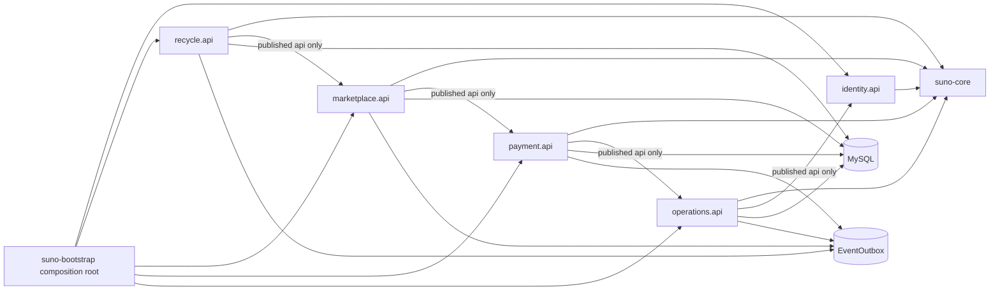

# 模块架构

允许箭头只有 feature 模块到 `suno-core`，bootstrap 到各模块公开 `api`，以及经受控公开 API 的显式跨模块依赖。禁止 feature 依赖 bootstrap、另一个模块的 `internal`/persistence 包，或直接构造其实体。bootstrap 是唯一 composition root，负责 Spring wiring、配置和边界 adapter；它不拥有业务规则。

每个模块的公开 API 包含稳定 command/query port 和 `api.event` 事件类型。跨模块事件必须实现 `DomainEvent`/`DocumentedDomainEvent` 并带 `@UseCaseId`、`@EventVersion`；事件与状态变化在拥有模块的本地事务内写入 outbox，由异步 publisher 投递。消费者以 eventId 幂等，不能以任意 DTO 规避 API 边界。

遗留迁移按阶段进行：先在旧服务旁加公开端口和契约测试，再把一个垂直切片移入拥有模块；短期 adapter 可委托旧实现，但新调用不得扩散 legacy 包依赖。每次迁移保留当前流程和目标差距，只有端口、数据、事件和测试全部迁完才删除 adapter。
