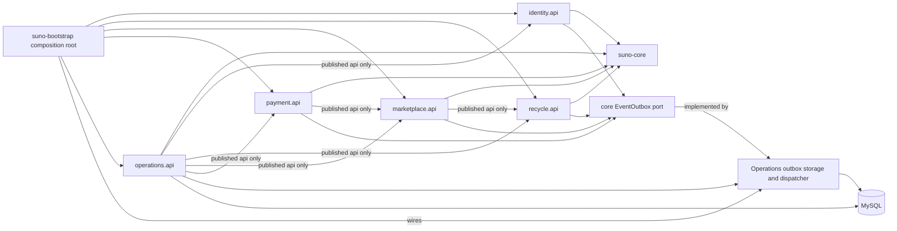

# 模块架构

允许箭头只有 feature 模块到 `suno-core`，bootstrap 到所有运行时 feature 模块的公开 `api`，以及 POM 已声明的受控公开依赖：Marketplace → Recycle、Payment → Marketplace、Operations → Identity/Recycle/Marketplace/Payment。箭头总是从依赖者指向其依赖。禁止 feature 依赖 bootstrap、另一个模块的 `internal`/persistence 包，或直接构造其实体。bootstrap 是唯一 composition root，负责 Spring wiring、配置和边界 adapter；它不拥有业务规则。

Feature 模块拥有聚合和 `api.event` 事件语义；跨模块事件必须实现 `DomainEvent`/`DocumentedDomainEvent` 并带 `@UseCaseId`、`@EventVersion`。它们在本地事务中只依赖 `suno-core` 的 `EventOutbox` port，不能直接写物理 outbox 表。Operations 拥有该 port 的数据库存储和 dispatcher 实现，bootstrap 负责把实现接入所有 feature 模块；消费者以 eventId 幂等，不能以任意 DTO 规避 API 边界。

遗留迁移按阶段进行：先在旧服务旁加公开端口和契约测试，再把一个垂直切片移入拥有模块；短期 adapter 可委托旧实现，但新调用不得扩散 legacy 包依赖。每次迁移保留当前流程和目标差距，只有端口、数据、事件和测试全部迁完才删除 adapter。
