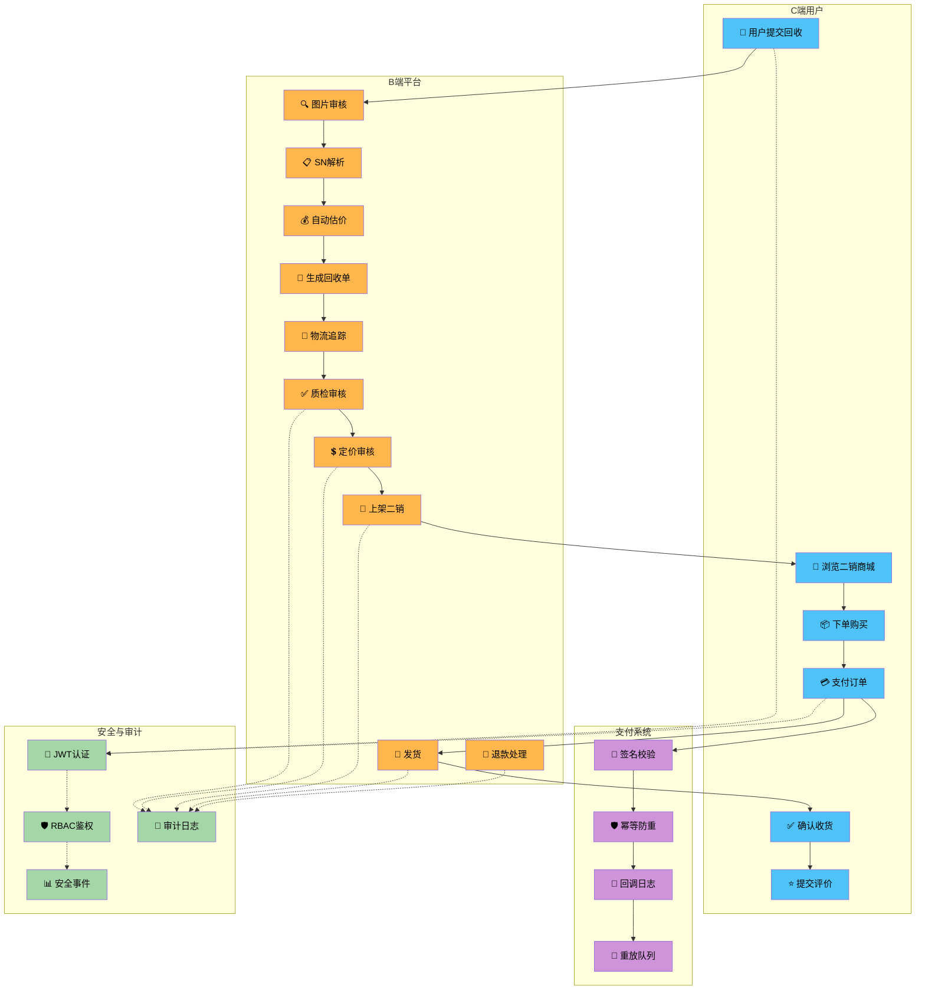
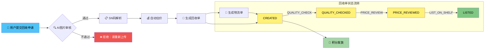
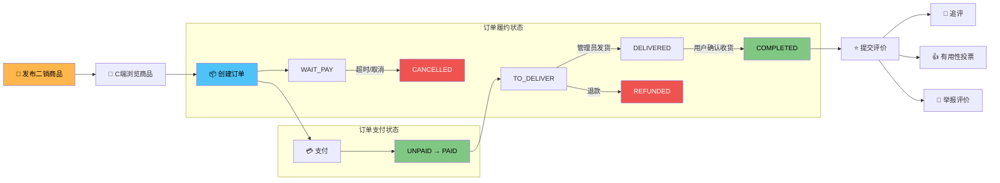
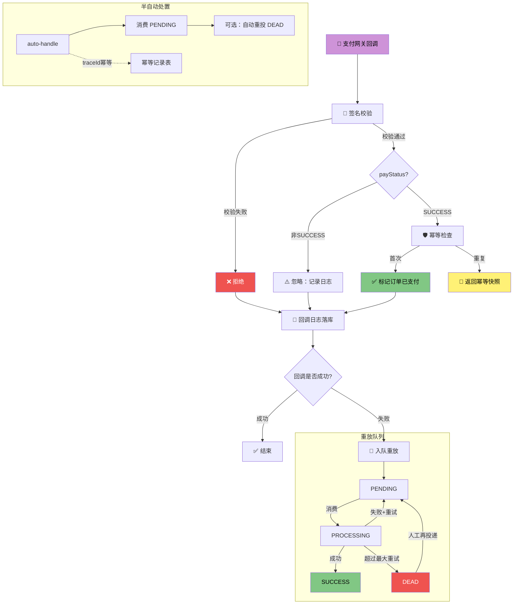
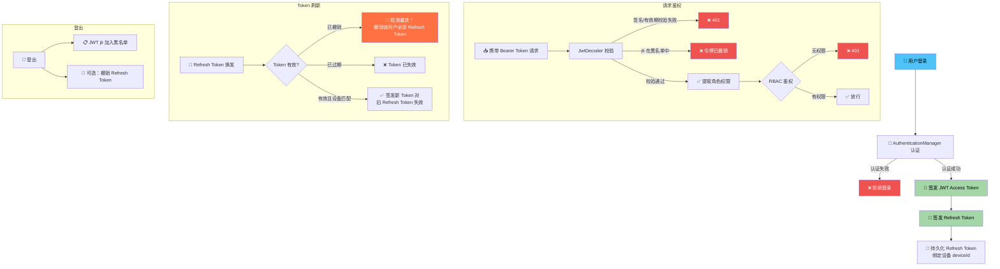
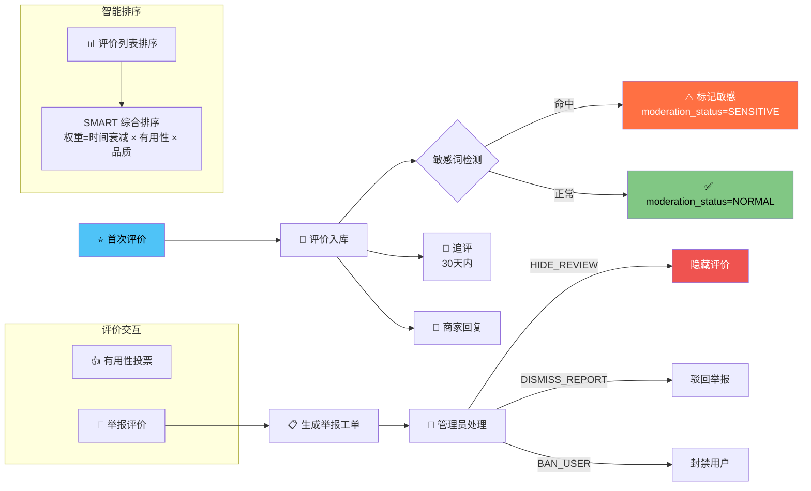
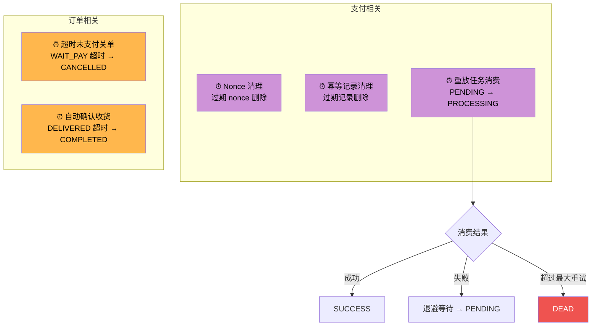

# Recycle Mall 业务流程图

## 全链路业务总览



---

## 1. C2B 回收流程



### 回收单状态机

| 当前状态 | 动作 | 下一状态 | 说明 |
|----------|------|----------|------|
| `CREATED` | `QUALITY_CHECK` | `QUALITY_CHECKED` | 质检通过 |
| `QUALITY_CHECKED` | `PRICE_REVIEW` | `PRICE_REVIEWED` | 定价审核 |
| `PRICE_REVIEWED` | `LIST_ON_SHELF` | `LISTED` | 上架二销 |

### 估价算法

```
输入：品牌 + 型号 + 生产日期 + 磨损分
  ↓
规则表匹配（优先级：精确 > 通配 > 兜底）
  ↓
输出：品阶（GOOD/MEDIUM/UNQUALIFIED）+ 估价
```

---

### 2. B2C 二销商城流程



### 二销订单状态机

**支付状态流转：**

| 当前状态 | 触发事件 | 下一状态 |
|----------|----------|----------|
| `UNPAID` | 支付成功 | `PAID` |

**履约状态流转：**

| 当前状态 | 触发事件 | 下一状态 |
|----------|----------|----------|
| `WAIT_PAY` | 支付成功 | `TO_DELIVER` |
| `WAIT_PAY` | 取消订单 | `CANCELLED`（恢复库存） |
| `TO_DELIVER` | 管理员发货 | `DELIVERED` |
| `DELIVERED` | 用户确认收货 | `COMPLETED` |
| `TO_DELIVER` | 退款 | `REFUNDED` |

---

## 3. 支付回调与重放流程



### 重放退避策略

```
backoff = min(base × 2^(retry-1), max)
默认：base=5s, max=300s, maxRetry=3
```

---

## 4. 认证鉴权流程



### RBAC 权限矩阵

| 路径模式 | 所需权限 |
|----------|----------|
| `POST /api/auth/login` | 公开 |
| `POST /api/auth/refresh` | 公开 |
| `POST /api/payment/callback` | 公开 |
| `/products/**` | 公开 |
| `/api/admin/**` | `ROLE_ADMIN` |
| `/api/recycle/**` | 已登录 |
| `/api/mall/**` | 已登录 |
| `/api/auth/me`, `/logout`, `/sessions/**` | 已登录 |

---

## 5. 评价系统流程



---

## 6. 配置中心流程

```mermaid
flowchart LR
    A[📱 前端启动] --> B[GET /bundle<br/>拉取聚合配置包]
    B --> C[缓存本地 digest]

    A --> D[GET /modules<br/>获取模块摘要]
    D --> E[POST /module-diff<br/>比对本地与服务端差异]
    E -->|有差异| F[GET /module/{name}<br/>按需拉取变化模块]
    E -->|无差异| G[✅ 使用本地缓存]

    subgraph 热更新
        H[POST /review-strategy/update<br/>热更新评价策略]
        I[POST /alert-noise-rules/update<br/>热更新降噪规则]
    end

    subgraph ETag缓存协商
        J[If-None-Match] -->|匹配| K[304 Not Modified]
        J -->|不匹配| L[200 + 新 ETag]
    end

    style A fill:#4FC3F7,color:#000
    style F fill:#81C784,color:#000
    style G fill:#A5D6A7,color:#000
    style K fill:#FFF176,color:#000
```

---

## 7. 定时任务



---

## 数据实体关系

```mermaid
erDiagram
    user_account ||--o{ recycle_order : "创建"
    user_account ||--o{ resale_order : "购买"
    user_account ||--o{ points_ledger : "积分流水"
    user_account ||--o{ resale_favorite : "收藏"
    user_account ||--o{ resale_review : "评价"
    user_account ||--o{ resale_review_vote : "投票"
    user_account ||--o{ resale_review_report : "举报"
    user_account ||--o{ auth_refresh_token : "会话"

    product ||--o{ recycle_order : "回收"
    product ||--o{ resale_listing : "二销"

    recycle_order ||--o{ logistics_track : "物流"
    recycle_order ||--o{ resale_listing : "上架"

    resale_listing ||--o{ resale_order : "下单"
    resale_listing ||--o{ resale_favorite : "收藏"
    resale_listing ||--o{ resale_review : "评价"

    resale_order ||--o| resale_review : "评价"
    resale_order ||--o| payment_idempotency : "幂等"

    resale_review ||--o{ resale_review_vote : "投票"
    resale_review ||--o{ resale_review_report : "举报"

    payment_callback_log ||--o{ payment_replay_task : "重放"

    user_account {
        BIGINT id PK
        VARCHAR username UK
        VARCHAR password_hash
        VARCHAR role_code
        VARCHAR account_status
        VARCHAR level
        INT points
    }

    recycle_order {
        BIGINT id PK
        VARCHAR order_no UK
        BIGINT user_id FK
        BIGINT product_id FK
        DECIMAL estimated_price
        VARCHAR grade
        VARCHAR status
    }

    resale_listing {
        BIGINT id PK
        BIGINT recycle_order_id FK
        BIGINT product_id FK
        DECIMAL sale_price
        INT stock
        VARCHAR status
        BIGINT version
    }

    resale_order {
        BIGINT id PK
        VARCHAR order_no UK
        BIGINT buyer_user_id FK
        BIGINT listing_id FK
        DECIMAL amount
        VARCHAR pay_status
        VARCHAR fulfill_status
    }
