# 开发生命周期

每个变更从 `docs/requirements/use-cases.yaml` 中分配唯一用例 ID 开始；路由、调度器和公开事件只能有一个目录所有者。先更新需求不变量、错误码和两张流程图，再以该 ID 写一个会失败的测试并确认失败原因是功能尚未实现。

```mermaid
flowchart LR
  UseCase["Allocate use-case ID"] --> Red["Write failing test"]
  Red --> Domain["Model invariants and ports"]
  Domain --> Migration["Add forward migration"]
  Migration --> Implement["Implement smallest vertical slice"]
  Implement --> Review["Security, concurrency, API review"]
  Review --> Verify["./mvnw verify"]
  Verify --> Docs["Update both flow diagrams"]
  Docs --> Release["Release with rollback evidence"]
```

1. 领域设计先定义聚合不变量、授权主体、事务范围、端口和事件；禁止以 controller DTO 越过模块 API。
2. 需要结构或数据变化时，先增加可重复执行的前向 Flyway migration；在本地 H2 和有 Docker 的 MySQL 验证。
3. 实现只覆盖令测试变绿的最小垂直切片。重构只在测试全绿后进行。
4. 审查必须覆盖认证/授权、资源所有权、敏感数据、错误码、并发条件更新、幂等键、超时、事件/outbox 与 API 兼容性。
5. 合并前执行 `./mvnw verify`、`./scripts/verify-repository.sh`、`./scripts/verify-docs.sh`；提交同时包含代码、测试、迁移、catalog、需求流程图与受影响 ADR。
6. 发布说明记录 migration 版本、健康/验证查询、指标和回退证据。发生回退时仅通过补偿 migration 和兼容代码回退，不能修改已执行 migration。

文档更新不是收尾任务：任何接口、调度、事件或事务边界变化，必须在同一提交更新 catalog 的 currentSymbols、当前流程、目标流程（若尚有差距）和测试映射。
