# 身份认证需求流

本文件覆盖 Task 9 的 Identity HTTP 与事件契约。所有 HTTP 响应沿用 `ApiResponse`；受保护的认证路由缺失或失效 JWT 为 `AUTH_UNAUTHORIZED`，管理员路由非 ADMIN 为 `AUTH_FORBIDDEN`。每节的“当前开发流”只列出 catalog 的 `currentSymbols`；实现测试是现有 `DocumentationCatalogCoverageTest#catalogOwnsTheExactApplicationRoutesSchedulersEventsAndTasks`，计划测试均为 **Phase 1**。

## IDN-001 登录

匿名用户提交 username、password、可选 deviceId 并取得 Bearer access/refresh token；账户必须可认证且 ACTIVE。同设备旧 refresh token 会撤销；登录成功写安全审计，认证失败由安全层拒绝。当前令牌签发、会话写入和审计在 `@AuthTransactional` 内原子完成；错误为认证失败或 `BUSINESS_ERROR`。实现测试：`DocumentationCatalogCoverageTest#catalogOwnsTheExactApplicationRoutesSchedulersEventsAndTasks`；计划测试（Phase 1）：`IdentityUseCaseWebTest#documentsIdentityUseCase`。

### Requirement flow {#idn-001}
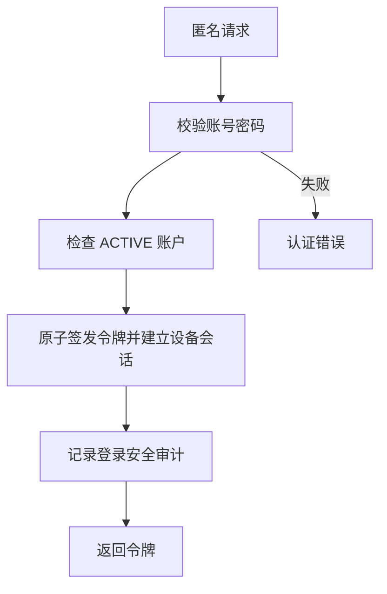
### Current development flow {#idn-001-dev}
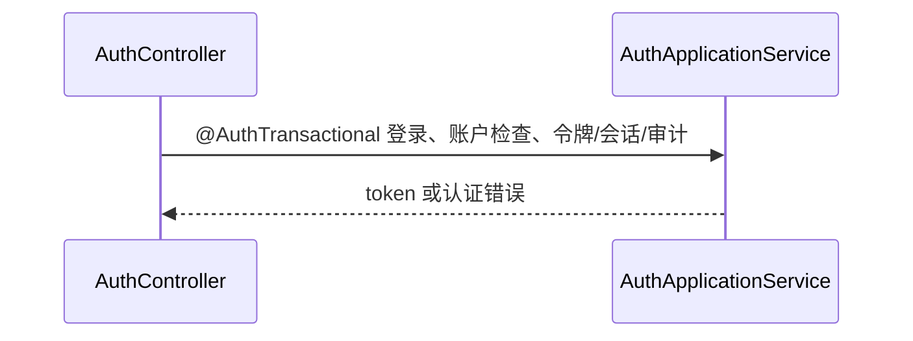
### Target architecture flow
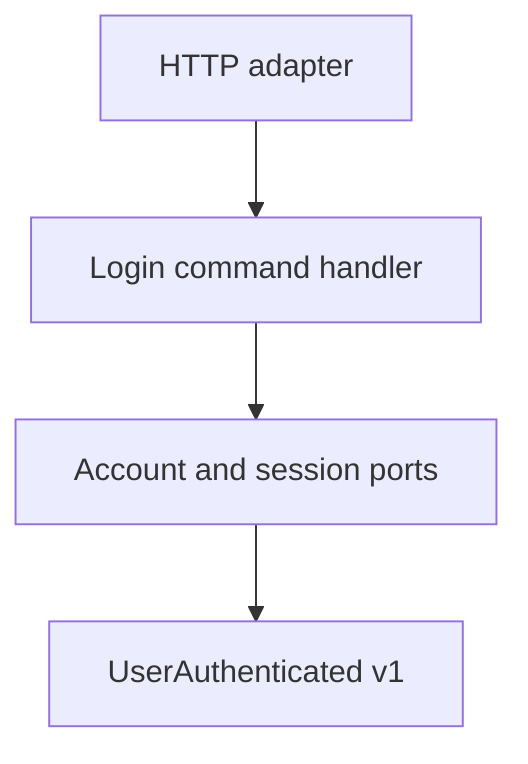
### Gaps
- targetPhase: 1；现有服务直接编排认证、令牌和审计，尚无命令处理器、端口或公开事件发布边界。

## IDN-002 当前用户

已认证用户用 JWT 查询自身 userId、用户名、角色、账户状态和 token 过期时间；JWT subject 找不到账户为当前实现错误。当前为 READ_COMMITTED、只读、30 秒事务，不创建会话或审计记录。实现测试：`DocumentationCatalogCoverageTest#catalogOwnsTheExactApplicationRoutesSchedulersEventsAndTasks`；计划测试（Phase 1）：`IdentityUseCaseWebTest#documentsIdentityUseCase`。

### Requirement flow {#idn-002}
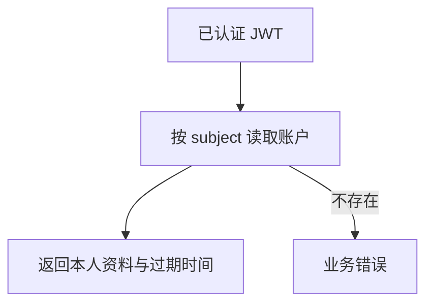
### Current development flow {#idn-002-dev}
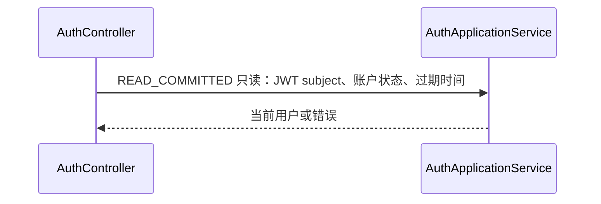
### Target architecture flow
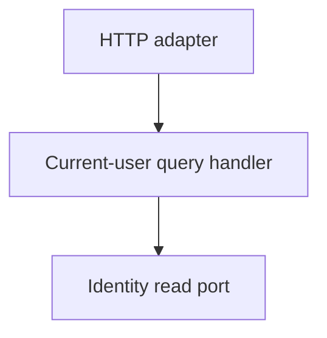
### Gaps
- targetPhase: 1；当前控制器/服务直接查询，尚无独立查询处理器与读端口。

## IDN-003 我的活动会话

已认证用户从 JWT subject 查询未撤销 refresh 会话，返回设备、创建和过期信息；只能读取本人会话。当前为 READ_COMMITTED 只读事务，无令牌变更或审计；认证失败由安全过滤器返回。实现测试：`DocumentationCatalogCoverageTest#catalogOwnsTheExactApplicationRoutesSchedulersEventsAndTasks`；计划测试（Phase 1）：`IdentityUseCaseWebTest#documentsIdentityUseCase`。

### Requirement flow {#idn-003}
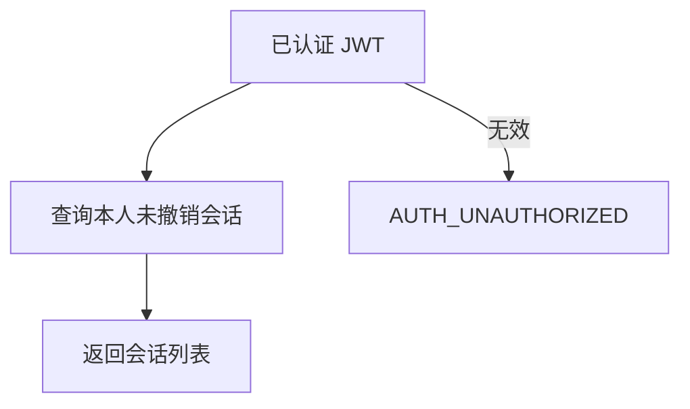
### Current development flow {#idn-003-dev}
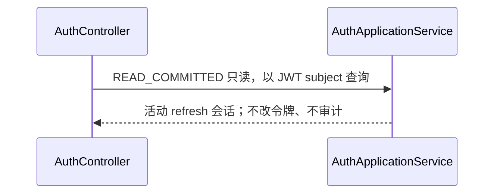
### Target architecture flow
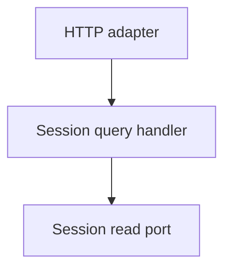
### Gaps
- targetPhase: 1；会话读取仍由现有服务委托，尚未隔离查询端口。

## IDN-004 撤销本设备会话

已认证用户提交 deviceId，只撤销本人同设备的未撤销 refresh token，并记录设备撤销安全审计；JWT access token 不在此接口加入黑名单。输入空白被校验；认证失败为 `AUTH_UNAUTHORIZED`。当前撤销和审计在 `@AuthTransactional` 内。实现测试：`DocumentationCatalogCoverageTest#catalogOwnsTheExactApplicationRoutesSchedulersEventsAndTasks`；计划测试（Phase 1）：`IdentityUseCaseWebTest#documentsIdentityUseCase`。

### Requirement flow {#idn-004}
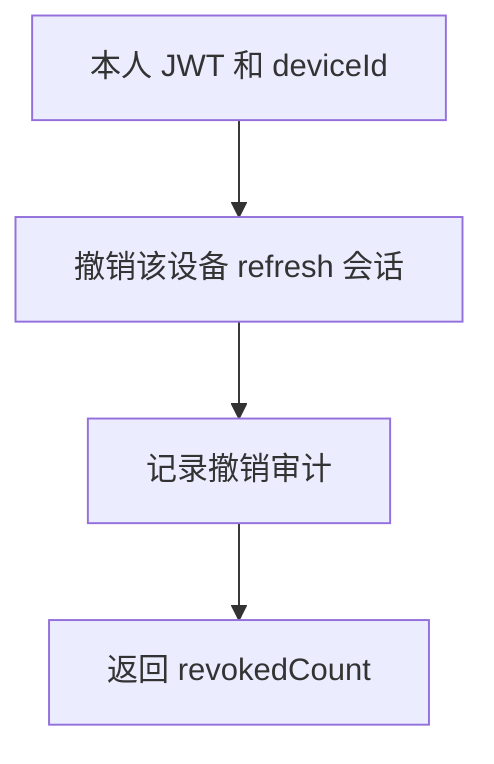
### Current development flow {#idn-004-dev}
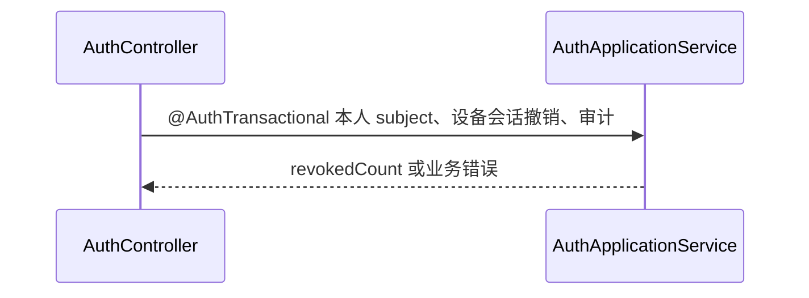
### Target architecture flow
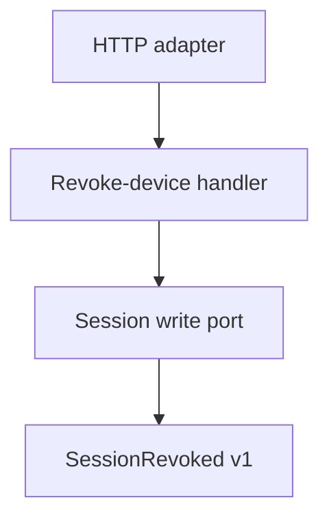
### Gaps
- targetPhase: 1；当前无会话撤销事件和端口化写模型。

## IDN-005 撤销我的全部会话

已认证用户撤销其全部未撤销 refresh token，记录全会话撤销审计并返回计数；当前 access token 不会因本操作立即进入黑名单。认证失败为 `AUTH_UNAUTHORIZED`，写入与审计在 `@AuthTransactional` 内。实现测试：`DocumentationCatalogCoverageTest#catalogOwnsTheExactApplicationRoutesSchedulersEventsAndTasks`；计划测试（Phase 1）：`IdentityUseCaseWebTest#documentsIdentityUseCase`。

### Requirement flow {#idn-005}
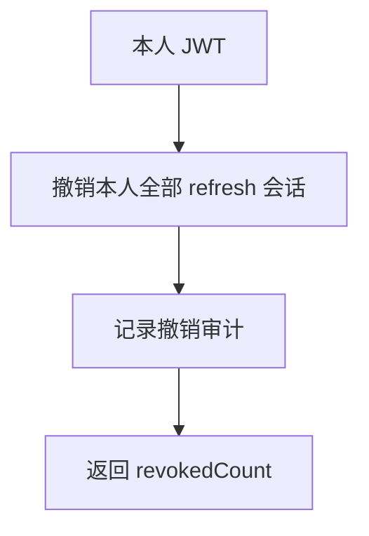
### Current development flow {#idn-005-dev}
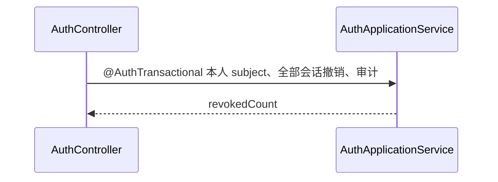
### Target architecture flow
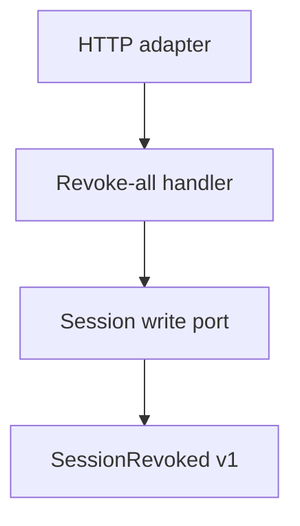
### Gaps
- targetPhase: 1；当前没有按领域事实发布会话撤销事件。

## IDN-006 登出

已认证用户登出；当前 JWT 有 jti 和过期时间时写黑名单，可选 refreshToken 被撤销，过期黑名单被清理并记录登出审计。请求主体缺失/无效由安全层拒绝；写操作在 `@AuthTransactional` 内。实现测试：`DocumentationCatalogCoverageTest#catalogOwnsTheExactApplicationRoutesSchedulersEventsAndTasks`；计划测试（Phase 1）：`IdentityUseCaseWebTest#documentsIdentityUseCase`。

### Requirement flow {#idn-006}
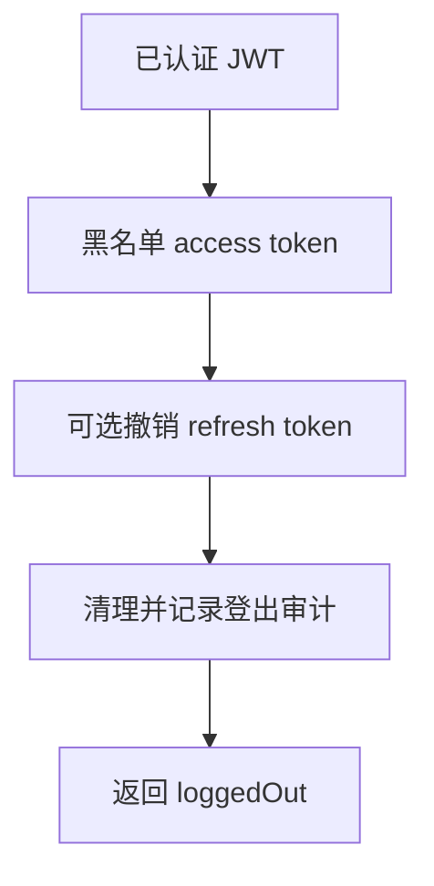
### Current development flow {#idn-006-dev}
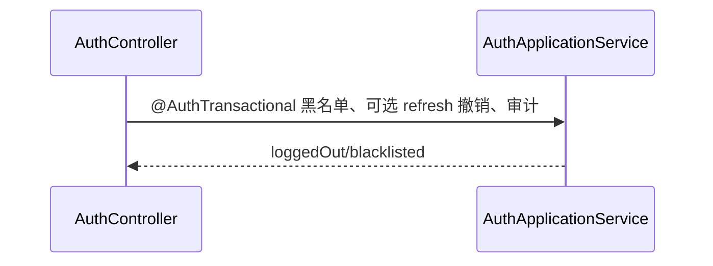
### Target architecture flow
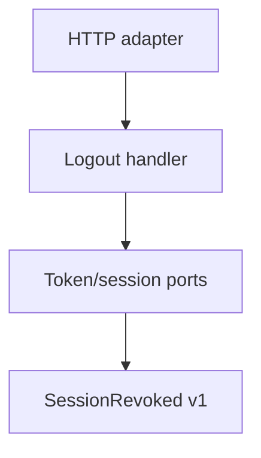
### Gaps
- targetPhase: 1；当前缺少独立登出命令及对外会话撤销事件。

## IDN-007 刷新令牌轮换

匿名刷新请求必须提供 refreshToken；服务清理过期 token，校验 token 存在、未撤销、未过期且设备匹配，先撤销旧 token 再创建新令牌/同设备会话并审计。发现重放会撤销该用户全部活动 refresh token 并记录安全事件；错误包括 `PARAM_INVALID`、`AUTH_REFRESH_TOKEN_INVALID`、`AUTH_REFRESH_TOKEN_EXPIRED`、`AUTH_REFRESH_TOKEN_DEVICE_MISMATCH`、`AUTH_REFRESH_REPLAY_BLOCKED`。所有变更在 `@AuthTransactional` 内。实现测试：`DocumentationCatalogCoverageTest#catalogOwnsTheExactApplicationRoutesSchedulersEventsAndTasks`；计划测试（Phase 1）：`IdentityUseCaseWebTest#documentsIdentityUseCase`。

### Requirement flow {#idn-007}
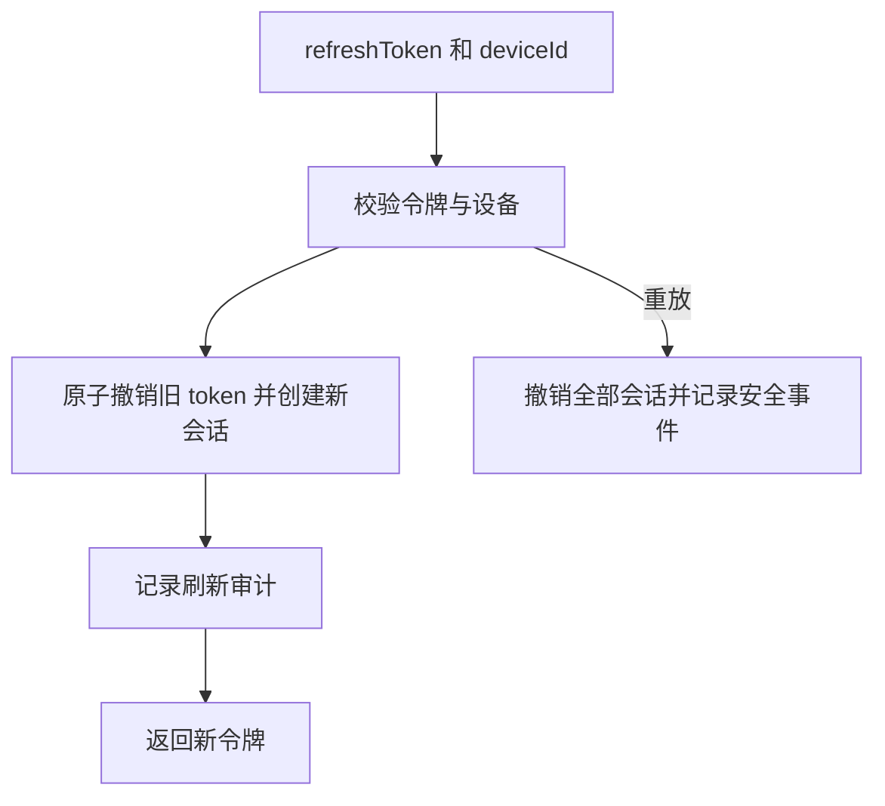
### Current development flow {#idn-007-dev}
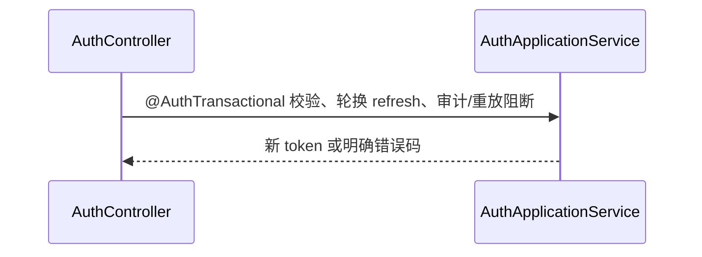
### Target architecture flow
```mermaid
flowchart TD
  C[HTTP adapter] --> H[Refresh command handler]
  H --> P[Refresh-session port]
  P --> E[RefreshSessionRotated v1]
```
### Gaps
- targetPhase: 1；当前轮换和重放审计已存在，但没有公开的刷新/安全事件边界。

## IDN-101 管理员查询用户会话

管理员以 username 查询目标用户未撤销 refresh 会话；路由由 ADMIN 角色保护。当前查询会记录 `AUTH_ADMIN_SESSION_QUERY` 审计，使用 READ_COMMITTED 只读事务；不存在账户不会预先校验而是返回空会话集合。非管理员为 `AUTH_FORBIDDEN`。实现测试：`DocumentationCatalogCoverageTest#catalogOwnsTheExactApplicationRoutesSchedulersEventsAndTasks`；计划测试（Phase 1）：`IdentityUseCaseWebTest#documentsIdentityUseCase`。

### Requirement flow {#idn-101}
```mermaid
flowchart TD
  A[ADMIN 和 username] --> Q[读取目标活动会话]
  Q --> L[记录管理员查询审计]
  L --> R[返回会话列表]
```
### Current development flow {#idn-101-dev}
```mermaid
sequenceDiagram
  participant C as AdminAuthController#listUserSessions
  participant A as AuthApplicationService#adminListUserSessions
  C->>A: ADMIN 路由，READ_COMMITTED 只读，查询并审计
  A-->>C: 目标用户会话列表
```
### Target architecture flow
```mermaid
flowchart TD
  C[Admin HTTP adapter] --> H[Admin session-query handler]
  H --> P[Session read/audit ports]
```
### Gaps
- targetPhase: 1；当前管理员授权仅在路由层，查询与审计未拆分为用例边界。

## IDN-102 管理员撤销用户设备会话

管理员提交 username 和 deviceId，撤销目标用户该设备活动 refresh token，记录管理员撤销审计并返回计数；路由要求 ADMIN。请求字段为空触发校验，非管理员为 `AUTH_FORBIDDEN`；写入及审计位于 `@AuthTransactional`。实现测试：`DocumentationCatalogCoverageTest#catalogOwnsTheExactApplicationRoutesSchedulersEventsAndTasks`；计划测试（Phase 1）：`IdentityUseCaseWebTest#documentsIdentityUseCase`。

### Requirement flow {#idn-102}
```mermaid
flowchart TD
  A[ADMIN、username、deviceId] --> R[撤销目标设备会话]
  R --> L[记录管理员撤销审计]
  L --> O[返回 revokedCount]
```
### Current development flow {#idn-102-dev}
```mermaid
sequenceDiagram
  participant C as AdminAuthController#revokeUserDevice
  participant A as AuthApplicationService#adminRevokeUserDeviceSession
  C->>A: ADMIN 路由，@AuthTransactional 撤销目标设备并审计
  A-->>C: revokedCount
```
### Target architecture flow
```mermaid
flowchart TD
  C[Admin HTTP adapter] --> H[Admin revoke-device handler]
  H --> P[Session write/audit ports]
  P --> E[SessionRevoked v1]
```
### Gaps
- targetPhase: 1；现有实现不发布管理员撤销产生的领域事件。

## IDN-103 管理员撤销用户全部会话

管理员提交 username，撤销目标用户全部活动 refresh token，记录管理员全会话撤销审计并返回数量；路由要求 ADMIN。字段校验失败为业务错误，非管理员为 `AUTH_FORBIDDEN`；写操作及审计在 `@AuthTransactional` 内。实现测试：`DocumentationCatalogCoverageTest#catalogOwnsTheExactApplicationRoutesSchedulersEventsAndTasks`；计划测试（Phase 1）：`IdentityUseCaseWebTest#documentsIdentityUseCase`。

### Requirement flow {#idn-103}
```mermaid
flowchart TD
  A[ADMIN 和 username] --> R[撤销目标全部 refresh 会话]
  R --> L[记录管理员撤销审计]
  L --> O[返回 revokedCount]
```
### Current development flow {#idn-103-dev}
```mermaid
sequenceDiagram
  participant C as AdminAuthController#revokeUserAll
  participant A as AuthApplicationService#adminRevokeUserAllSessions
  C->>A: ADMIN 路由，@AuthTransactional 全部撤销并审计
  A-->>C: revokedCount
```
### Target architecture flow
```mermaid
flowchart TD
  C[Admin HTTP adapter] --> H[Admin revoke-all handler]
  H --> P[Session write/audit ports]
  P --> E[SessionRevoked v1]
```
### Gaps
- targetPhase: 1；当前管理员动作未形成端口化的跨用户会话用例。

## IDN-E001 UserAuthenticated v1

系统在认证成功后应发布版本 1 的 `UserAuthenticated`，供内部订阅方消费；权限为 internal，投递失败应可重试。当前登录会写令牌/会话和登录审计，但没有该事件发布或提交后投递事务。实现测试：`DocumentationCatalogCoverageTest#catalogOwnsTheExactApplicationRoutesSchedulersEventsAndTasks`；计划测试（Phase 1）：`IdentityEventContractTest#documentsIdentityEvent`。

### Requirement flow {#idn-e001}
```mermaid
flowchart TD
  A[认证成功] --> E[发布 UserAuthenticated v1]
  E --> D[可重试内部投递]
```
### Current development flow {#idn-e001-dev}
```mermaid
flowchart TD
  C[AuthApplicationService#login] --> N[当前登录审计；没有 UserAuthenticated 发布]
```
### Target architecture flow
```mermaid
flowchart TD
  F[认证领域事实] --> O[Outbox]
  O --> E[UserAuthenticated v1]
```
### Gaps
- targetPhase: 1；IDN-E001 为 absent，缺少事件类型、outbox、发布器和投递测试。

## IDN-E002 RefreshSessionRotated v1

系统在 refresh 原子轮换完成后应发布版本 1 的 `RefreshSessionRotated`；只能在提交成功后投递，失败可重试。当前没有该事件或发布事务。实现测试：`DocumentationCatalogCoverageTest#catalogOwnsTheExactApplicationRoutesSchedulersEventsAndTasks`；计划测试（Phase 1）：`IdentityEventContractTest#documentsIdentityEvent`。

### Requirement flow {#idn-e002}
```mermaid
flowchart TD
  R[refresh 会话轮换完成] --> E[发布 RefreshSessionRotated v1]
  E --> D[可重试内部投递]
```
### Current development flow {#idn-e002-dev}
```mermaid
flowchart TD
  C[AuthApplicationService#refresh] --> N[当前轮换/审计；没有 RefreshSessionRotated 发布]
```
### Target architecture flow
```mermaid
flowchart TD
  F[轮换领域事实] --> O[Outbox] --> E[RefreshSessionRotated v1]
```
### Gaps
- targetPhase: 1；IDN-E002 为 absent，缺少提交后发布与可重试投递。

## IDN-E003 SessionRevoked v1

系统在本人或管理员撤销 refresh 会话后应发布版本 1 的 `SessionRevoked`，包含可追踪的撤销事实；内部投递失败可重试。当前没有该公共事件或事务性发布。实现测试：`DocumentationCatalogCoverageTest#catalogOwnsTheExactApplicationRoutesSchedulersEventsAndTasks`；计划测试（Phase 1）：`IdentityEventContractTest#documentsIdentityEvent`。

### Requirement flow {#idn-e003}
```mermaid
flowchart TD
  R[会话撤销完成] --> E[发布 SessionRevoked v1]
  E --> D[可重试内部投递]
```
### Current development flow {#idn-e003-dev}
```mermaid
flowchart TD
  C[AuthApplicationService#revokeAllSessions] --> N[当前撤销/审计；没有 SessionRevoked 发布]
```
### Target architecture flow
```mermaid
flowchart TD
  F[撤销领域事实] --> O[Outbox] --> E[SessionRevoked v1]
```
### Gaps
- targetPhase: 1；IDN-E003 为 absent，尚未把撤销审计转化为公开领域事件。

## IDN-E004 SecurityIncidentRaised v1

系统在安全事件（例如 refresh 重放阻断）成立后应发布版本 1 的 `SecurityIncidentRaised`，供内部风险处理订阅；投递失败可重试。当前安全审计会记录部分事件，但没有对应公共事件、投递边界或事务。实现测试：`DocumentationCatalogCoverageTest#catalogOwnsTheExactApplicationRoutesSchedulersEventsAndTasks`；计划测试（Phase 1）：`IdentityEventContractTest#documentsIdentityEvent`。

### Requirement flow {#idn-e004}
```mermaid
flowchart TD
  I[安全事件成立] --> E[发布 SecurityIncidentRaised v1]
  E --> D[可重试内部投递]
```
### Current development flow {#idn-e004-dev}
```mermaid
flowchart TD
  C[AuthApplicationService#refresh] --> N[当前重放阻断审计；没有 SecurityIncidentRaised 发布]
```
### Target architecture flow
```mermaid
flowchart TD
  F[安全领域事实] --> O[Outbox] --> E[SecurityIncidentRaised v1]
```
### Gaps
- targetPhase: 1；IDN-E004 为 absent，审计记录尚未成为版本化公共安全事件。
