# 商城、订单、收藏与评价需求流

本文件覆盖 Task 12 的 33 个 Marketplace HTTP、2 个调度器与 6 个公共事件。当前实现处于 Phase 0：请求常携带 userId，商城服务通过 `RecycleApplicationService` 进入遗留服务；这不是资源所有权或管理员授权的目标边界。每节的实现测试均为现有目录校验 `DocumentationCatalogCoverageTest#catalogOwnsTheExactApplicationRoutesSchedulersEventsAndTasks`，计划测试均为 **Phase 3**。

## 订单状态机与共享不变量

目标状态机把支付状态和履约状态作为一个不可回退的组合：`UNPAID/WAIT_PAY → PAID/TO_DELIVER → PAID/DELIVERED → PAID/COMPLETED`；取消只允许 `UNPAID/WAIT_PAY → UNPAID/CANCELLED`，退款只允许未退款的 `PAID/* → REFUNDED/REFUNDED`。`CANCELLED`、`AUTO_CLOSED`、`REFUNDED`、`COMPLETED` 都不得被晚到支付或重复操作改回进行中状态。每个订单的库存释放至多一次；以订单状态转换和库存预留/释放记录的唯一键共同保证。晚到支付必须返回 `ORDER_STATUS_CONFLICT`，而不是把取消或超时订单改为已支付。退款按退款业务键幂等：首次退款释放库存，重放返回同一退款结果而不二次加库存。

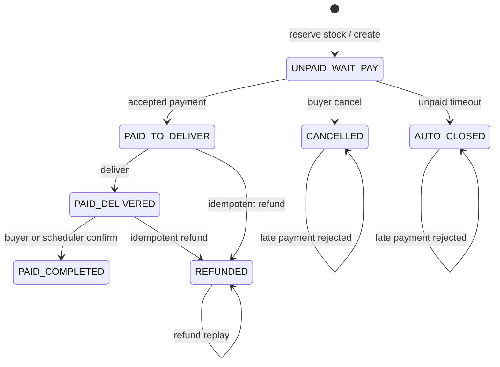

数据库目标唯一约束包括：`recycle_order_id` 对 listing、`order_no` 对订单、`(user_id, listing_id)` 对收藏、`(order_id, user_id)` 对评价、`(review_id, user_id)` 对有用投票和 `(review_id, reporter_user_id)` 对举报；还需要订单库存释放与退款业务键的唯一记录。评价仅由订单购买者在 `COMPLETED` 后创建一次；追加评价受窗口和一次性限制。目标中所有取消、查询履约、收藏、评价操作均从认证主体取得资源所有者，传入的用户标识不能越权；商家回复仅允许 ADMIN。

## MKT-001 商品详情页

公开访问者查看商品页。当前仅将路径参数放入模板模型，演示价格和成色不是 listing 快照；目标应读取可售且公开的 listing 投影。实现测试：`DocumentationCatalogCoverageTest#catalogOwnsTheExactApplicationRoutesSchedulersEventsAndTasks`；计划测试（Phase 3）：`MarketplaceUseCaseWebTest#documentsMarketplaceUseCase`。

### Requirement flow {#mkt-001}
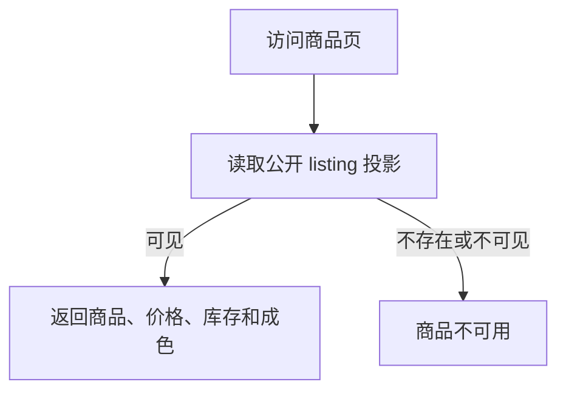
### Current development flow {#mkt-001-dev}
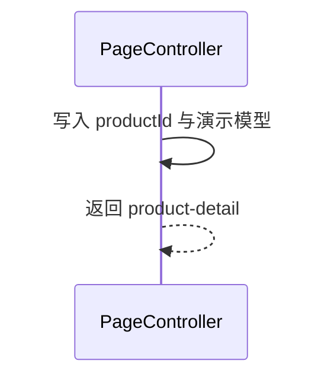
### Target architecture flow
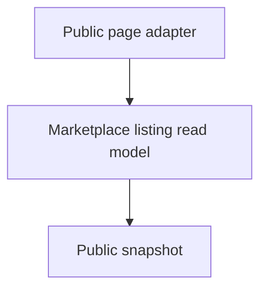
### Gaps
- targetPhase: 3；当前没有公开 listing 读取边界、可见性判断或真实库存快照。

## MKT-002 发布二销 listing

调用方提交回收单号、售价和库存以发布 listing。目标仅消费 Recycle 的已审核上架事实，且同一回收单最多一个 listing；重复消费返回既有资源。当前只检查 `LISTED` 并直接插入，数据库已有 `recycle_order_id` 唯一约束但未转换冲突。实现测试：`DocumentationCatalogCoverageTest#catalogOwnsTheExactApplicationRoutesSchedulersEventsAndTasks`；计划测试（Phase 3）：`MarketplaceUseCaseWebTest#documentsMarketplaceUseCase`。

### Requirement flow {#mkt-002}
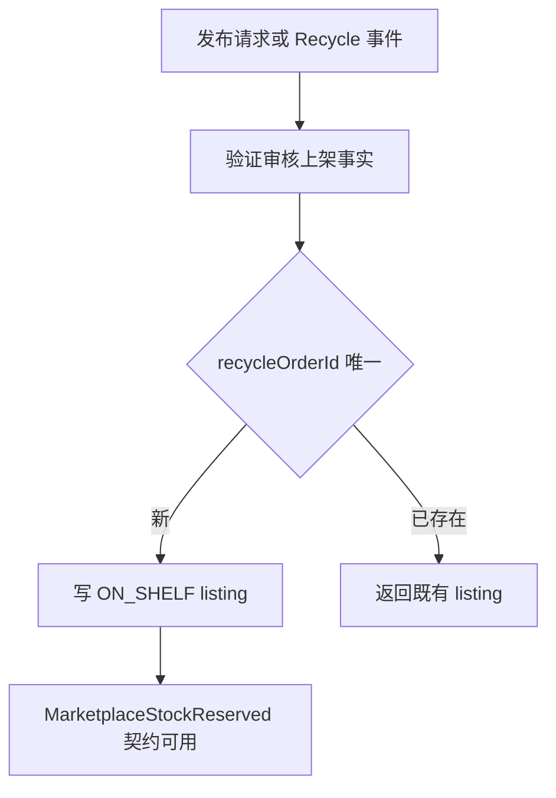
### Current development flow {#mkt-002-dev}
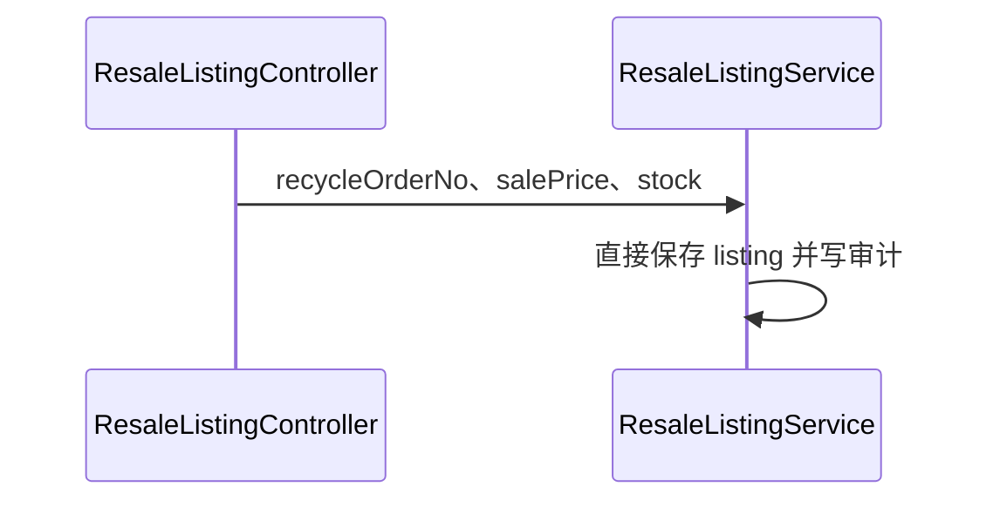
### Target architecture flow
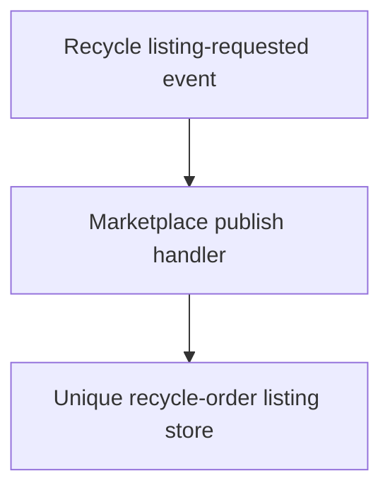
### Gaps
- targetPhase: 3；当前 HTTP 直接发布，未消费 Recycle 事件、未把唯一键冲突稳定为幂等结果，也未发布 outbox 事件。

## MKT-003 二销 listing 列表

客户按成色、排序和最小库存浏览 listing。目标仅展示公开可售资源并定义稳定分页；当前读取服务已筛选/排序但没有认证或分页契约。实现测试：`DocumentationCatalogCoverageTest#catalogOwnsTheExactApplicationRoutesSchedulersEventsAndTasks`；计划测试（Phase 3）：`MarketplaceUseCaseWebTest#documentsMarketplaceUseCase`。

### Requirement flow {#mkt-003}
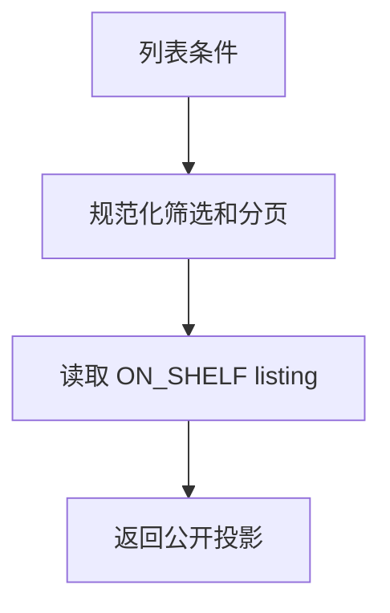
### Current development flow {#mkt-003-dev}
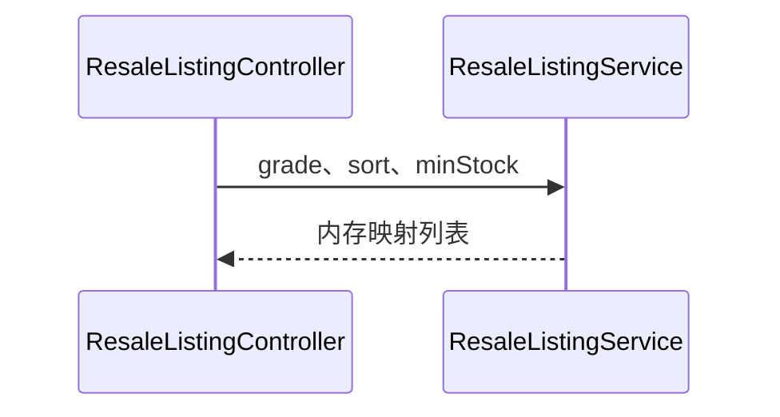
### Target architecture flow
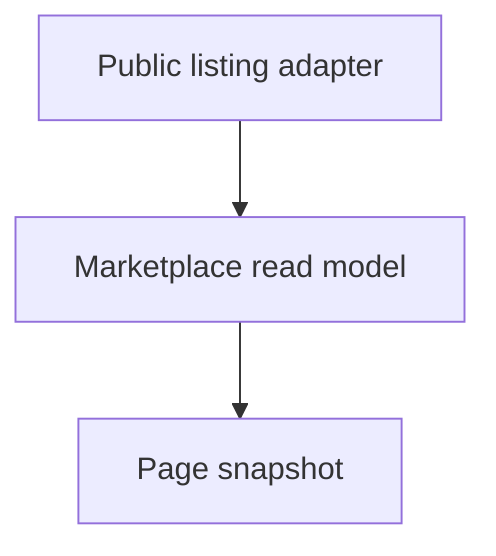
### Gaps
- targetPhase: 3；当前没有统一分页、公开投影版本或稳定缓存失效契约。

## MKT-004 已售罄 listing 列表

客户可查询售罄 listing；目标仅用于公开浏览，不能成为库存恢复或下单入口。当前按服务方法返回售罄项。实现测试：`DocumentationCatalogCoverageTest#catalogOwnsTheExactApplicationRoutesSchedulersEventsAndTasks`；计划测试（Phase 3）：`MarketplaceUseCaseWebTest#documentsMarketplaceUseCase`。

### Requirement flow {#mkt-004}
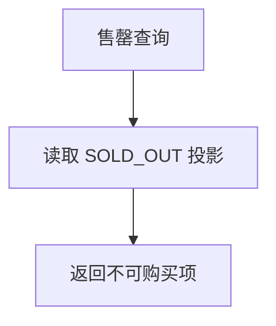
### Current development flow {#mkt-004-dev}
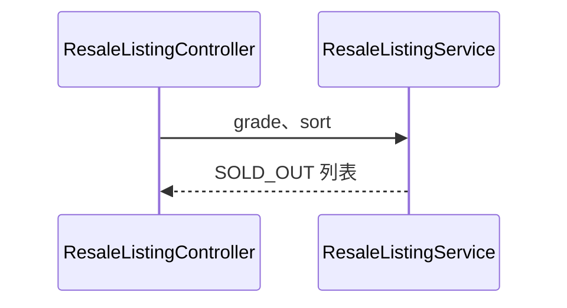
### Target architecture flow
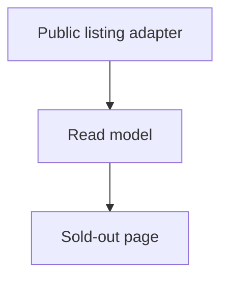
### Gaps
- targetPhase: 3；当前没有明确公开可见性、分页或与库存预留一致的读模型。

## MKT-005 手工减少库存

受控后台库存动作只能在在售 listing 上执行正数量扣减，并受乐观版本保护。目标将它与订单预留区分，不能绕过库存账本；库存为零转为 `SOLD_OUT`。实现测试：`DocumentationCatalogCoverageTest#catalogOwnsTheExactApplicationRoutesSchedulersEventsAndTasks`；计划测试（Phase 3）：`MarketplaceUseCaseWebTest#documentsMarketplaceUseCase`。

### Requirement flow {#mkt-005}
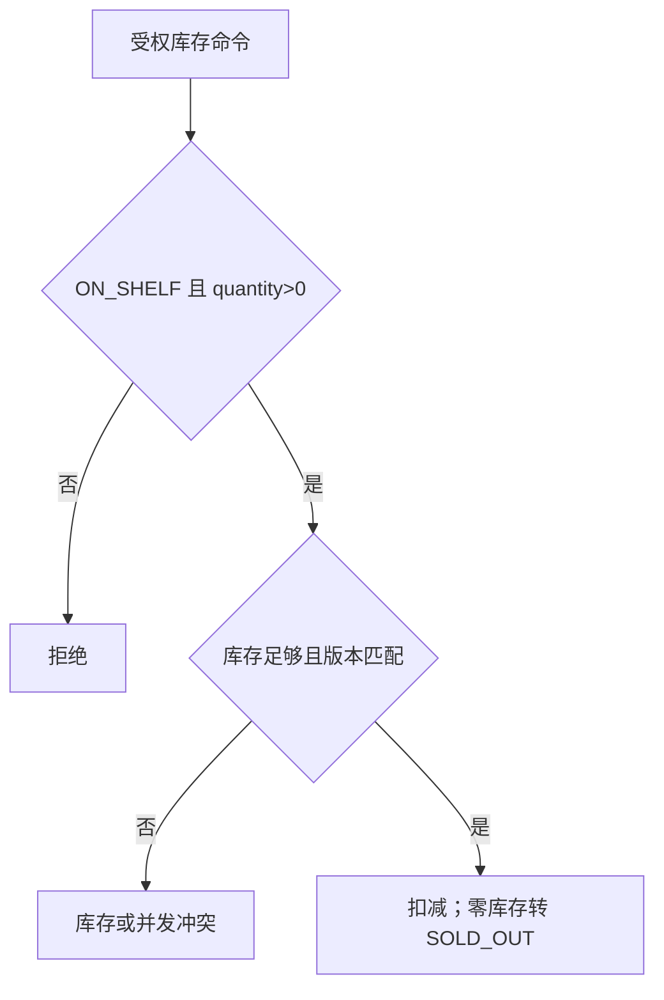
### Current development flow {#mkt-005-dev}
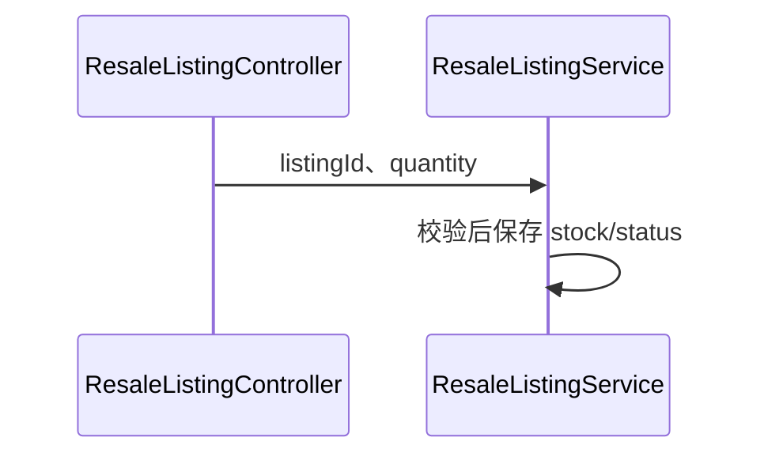
### Target architecture flow
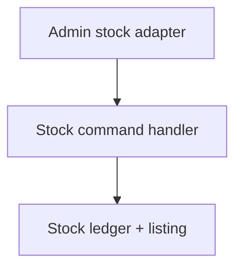
### Gaps
- targetPhase: 3；当前路由没有管理员资源授权，也没有独立库存账本或命令幂等键。

## MKT-006 添加收藏

用户只能收藏自己可见的在售 listing；重复添加成功重放。目标从认证主体取得用户，数据库 `(user_id, listing_id)` 唯一约束处理并发重复。实现测试：`DocumentationCatalogCoverageTest#catalogOwnsTheExactApplicationRoutesSchedulersEventsAndTasks`；计划测试（Phase 3）：`MarketplaceUseCaseWebTest#documentsMarketplaceUseCase`。

### Requirement flow {#mkt-006}
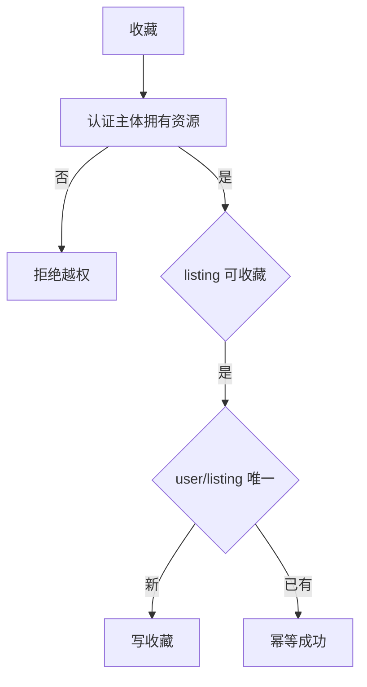
### Current development flow {#mkt-006-dev}
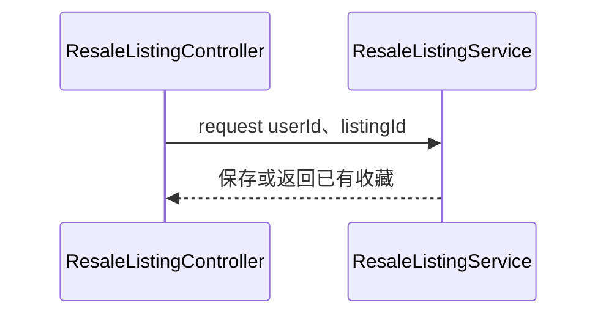
### Target architecture flow
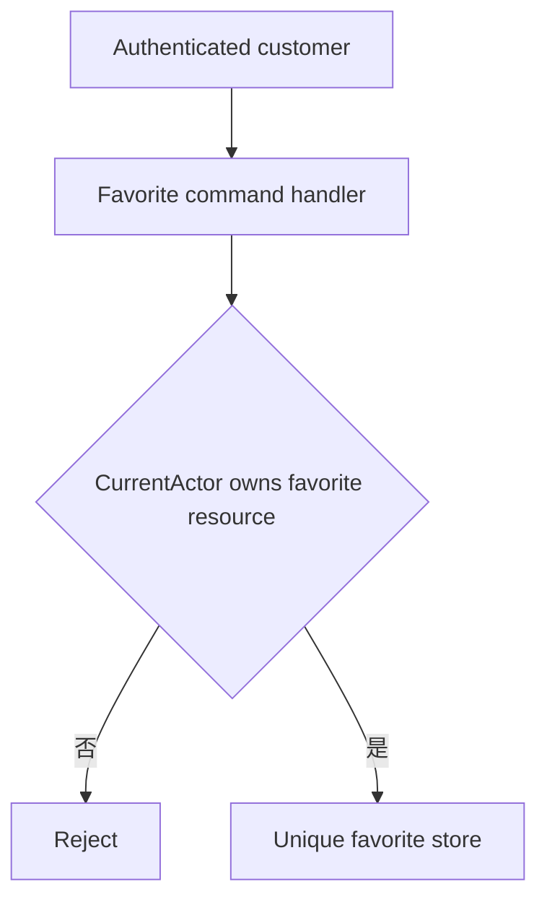
### Gaps
- targetPhase: 3；当前信任 request userId，未以认证主体拒绝资源所有权不匹配。

## MKT-007 取消收藏

用户只能删除自己的收藏；不存在的收藏按目标幂等返回未收藏状态。当前以请求 userId 查询并在缺失时抛异常。实现测试：`DocumentationCatalogCoverageTest#catalogOwnsTheExactApplicationRoutesSchedulersEventsAndTasks`；计划测试（Phase 3）：`MarketplaceUseCaseWebTest#documentsMarketplaceUseCase`。

### Requirement flow {#mkt-007}
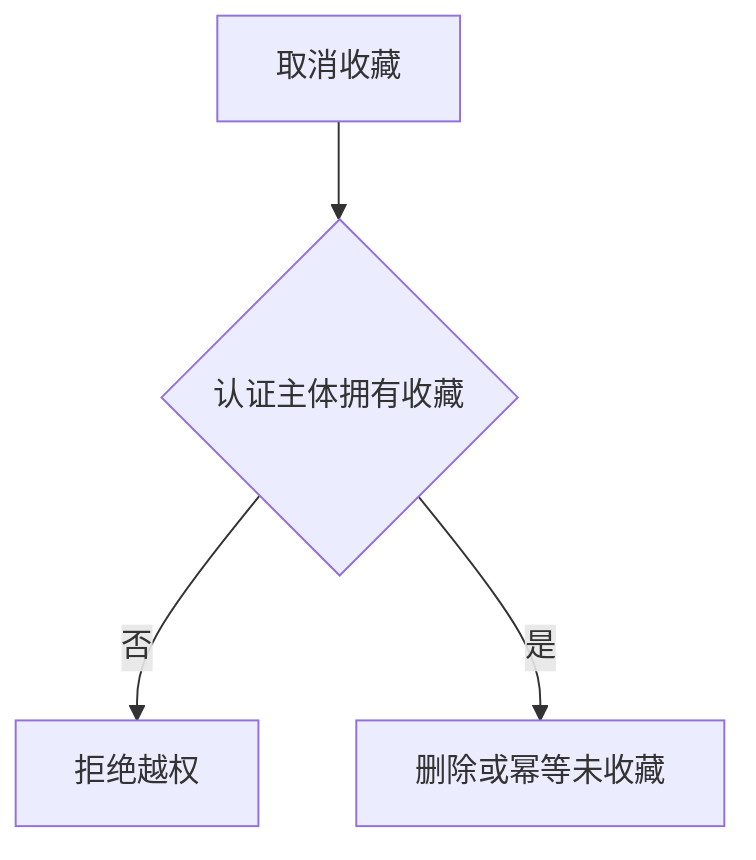
### Current development flow {#mkt-007-dev}
```mermaid
sequenceDiagram
  participant C as ResaleListingController#removeFavorite
  participant S as ResaleListingService#removeFavoriteListing
  C->>S: request userId、listingId
  S->>S: 查找后删除
```
### Target architecture flow
```mermaid
flowchart TD
  CurrentActor[Authenticated customer] --> A[Favorite command handler]
  A --> O{CurrentActor owns favorite resource}
  O -->|否| X[Reject]
  O -->|是| D[Idempotent delete]
```
### Gaps
- targetPhase: 3；当前缺少认证主体所有权校验，删除重放不是稳定幂等结果。

## MKT-008 收藏 listing 列表

用户读取自己的收藏，目标从认证主体限定 owner，且不泄露他人收藏。当前请求传入 userId。实现测试：`DocumentationCatalogCoverageTest#catalogOwnsTheExactApplicationRoutesSchedulersEventsAndTasks`；计划测试（Phase 3）：`MarketplaceUseCaseWebTest#documentsMarketplaceUseCase`。

### Requirement flow {#mkt-008}
```mermaid
flowchart TD
  C[收藏查询] --> O{认证主体拥有查询资源}
  O -->|否| X[拒绝越权]
  O -->|是| Q[按创建时间读取本人收藏] --> R[返回 listing 投影]
```
### Current development flow {#mkt-008-dev}
```mermaid
sequenceDiagram
  participant C as ResaleListingController#listFavorites
  participant S as ResaleListingService#listFavoriteListings
  C->>S: request userId
  S-->>C: 收藏列表
```
### Target architecture flow
```mermaid
flowchart TD
  CurrentActor[Authenticated customer] --> Q[Favorite read model]
  Q --> O{CurrentActor owns favorite resource}
  O -->|否| X[Reject]
  O -->|是| R[Own favorites]
```
### Gaps
- targetPhase: 3；当前以请求 userId 定位资源，缺少认证主体所有权拒绝。

## MKT-020 商城 listing 列表

商城端按筛选浏览可售 listing。当前读取遗留服务；目标以 Marketplace 读模型提供分页和库存一致快照。实现测试：`DocumentationCatalogCoverageTest#catalogOwnsTheExactApplicationRoutesSchedulersEventsAndTasks`；计划测试（Phase 3）：`MarketplaceUseCaseWebTest#documentsMarketplaceUseCase`。

### Requirement flow {#mkt-020}
```mermaid
flowchart TD
  C[商城筛选] --> Q[读取可售 listing 投影] --> R[分页响应]
```
### Current development flow {#mkt-020-dev}
```mermaid
sequenceDiagram
  participant C as ResaleMallController#listListings
  participant A as RecycleApplicationService#listResaleListings
  participant S as ResaleListingService#listResaleListings
  C->>A: 筛选条件
  A->>S: 委托读取
```
### Target architecture flow
```mermaid
flowchart TD
  C[Mall adapter] --> Q[Marketplace listing read model] --> R[Versioned page]
```
### Gaps
- targetPhase: 3；当前依赖遗留应用服务，没有 Marketplace 读模型或分页版本。

## MKT-021 买家订单列表

买家按支付/履约状态查看自己的订单，目标只读当前主体订单。当前请求传 buyerUserId，虽然服务过滤该 ID，未验证认证所有权。实现测试：`DocumentationCatalogCoverageTest#catalogOwnsTheExactApplicationRoutesSchedulersEventsAndTasks`；计划测试（Phase 3）：`MarketplaceUseCaseWebTest#documentsMarketplaceUseCase`。

### Requirement flow {#mkt-021}
```mermaid
flowchart TD
  C[订单查询] --> O{认证主体拥有订单集合}
  O -->|否| X[拒绝越权]
  O -->|是| Q[按状态/分页读取] --> R[订单快照]
```
### Current development flow {#mkt-021-dev}
```mermaid
sequenceDiagram
  participant C as ResaleMallController#listBuyerOrders
  participant A as RecycleApplicationService#listBuyerResaleOrders
  participant S as ResaleOrderService#listBuyerResaleOrders
  C->>A: request buyerUserId、筛选
  A->>S: 委托读取
```
### Target architecture flow
```mermaid
flowchart TD
  CurrentActor[Authenticated buyer] --> Q[Order read model]
  Q --> O{CurrentActor owns order collection}
  O -->|否| X[Reject]
  O -->|是| R[Own orders]
```
### Gaps
- targetPhase: 3；当前 client-supplied buyerUserId 可查询其他人的订单。

## MKT-022 订单状态字典

商城读取支付和履约状态字典；目标字典与状态机同步版本化。当前生成 ETag 响应但仍依赖遗留服务。实现测试：`DocumentationCatalogCoverageTest#catalogOwnsTheExactApplicationRoutesSchedulersEventsAndTasks`；计划测试（Phase 3）：`MarketplaceUseCaseWebTest#documentsMarketplaceUseCase`。

### Requirement flow {#mkt-022}
```mermaid
flowchart TD
  C[状态字典请求] --> Q[读取版本化状态机字典] --> R[ETag 响应]
```
### Current development flow {#mkt-022-dev}
```mermaid
sequenceDiagram
  participant C as ResaleMallController#getOrderStatusDictionary
  participant A as RecycleApplicationService#getResaleOrderStatusDictionary
  participant S as ResaleOrderService#getResaleOrderStatusDictionary
  C->>A: 读取字典
  A->>S: 委托
```
### Target architecture flow
```mermaid
flowchart TD
  C[Mall adapter] --> D[Marketplace state-machine dictionary] --> R[Versioned ETag]
```
### Gaps
- targetPhase: 3；当前字典不是由显式状态机模型发布。

## MKT-023 买家订单摘要

买家读取自己窗口内的订单摘要；目标由认证主体限定并使用可审计聚合。当前接受 buyerUserId 和 lookbackDays。实现测试：`DocumentationCatalogCoverageTest#catalogOwnsTheExactApplicationRoutesSchedulersEventsAndTasks`；计划测试（Phase 3）：`MarketplaceUseCaseWebTest#documentsMarketplaceUseCase`。

### Requirement flow {#mkt-023}
```mermaid
flowchart TD
  C[摘要请求] --> O{认证主体拥有订单集合}
  O -->|否| X[拒绝越权]
  O -->|是| Q[窗口聚合] --> R[摘要]
```
### Current development flow {#mkt-023-dev}
```mermaid
sequenceDiagram
  participant C as ResaleMallController#summarizeBuyerOrders
  participant A as RecycleApplicationService#summarizeBuyerResaleOrders
  participant S as ResaleOrderService#summarizeBuyerResaleOrders
  C->>A: request buyerUserId、lookbackDays
  A->>S: 委托聚合
```
### Target architecture flow
```mermaid
flowchart TD
  CurrentActor[Authenticated buyer] --> Q[Order summary read model]
  Q --> O{CurrentActor owns order collection}
  O -->|否| X[Reject]
  O -->|是| R[Own summary]
```
### Gaps
- targetPhase: 3；当前信任请求 buyerUserId，摘要缺少 owner 授权边界。

## MKT-024 创建商城订单

买家为在售 listing 下单。目标在短事务内以乐观版本预留一件库存、写 `UNPAID/WAIT_PAY` 订单和 outbox；库存不足/并发冲突稳定失败。订单与库存预留唯一关联，后续只由一次释放动作恢复库存。当前执行扣库存、保存订单和审计，但请求传 buyerUserId。实现测试：`ResaleOrderServiceTest#testCreateResaleOrder`、`DocumentationCatalogCoverageTest#catalogOwnsTheExactApplicationRoutesSchedulersEventsAndTasks`；计划测试（Phase 3）：`MarketplaceUseCaseWebTest#documentsMarketplaceUseCase`。

### Requirement flow {#mkt-024}
```mermaid
flowchart TD
  C[下单] --> O[认证主体作为买家]
  O --> L{listing ON_SHELF 且库存>0}
  L -->|否| E[ORDER_LISTING_UNAVAILABLE 或 ORDER_STOCK_INSUFFICIENT]
  L -->|是| V{版本匹配}
  V -->|否| X[ORDER_CONCURRENT_CONFLICT]
  V -->|是| W[短事务：预留库存、订单 UNPAID/WAIT_PAY、outbox]
  W --> E2[MarketplaceStockReserved v1]
  W --> E3[MarketplaceOrderCreated v1]
```
### Current development flow {#mkt-024-dev}
```mermaid
sequenceDiagram
  participant C as ResaleMallController#createOrder
  participant A as RecycleApplicationService#createResaleOrder
  participant S as ResaleOrderService#createResaleOrder
  C->>A: request buyerUserId、listingId
  A->>S: @RecycleTransactional
  S->>S: 扣库存、写 UNPAID/WAIT_PAY 订单和审计
```
### Target architecture flow
```mermaid
flowchart TD
  CurrentActor[Authenticated buyer] --> H[Order command handler]
  H --> T[Order + stock reservation + outbox transaction]
  T --> E[Marketplace order events]
```
### Gaps
- targetPhase: 3；当前 client-supplied buyerUserId 未绑定认证主体，且没有库存预留记录/outbox。
- targetPhase: 3；当前只有 listing 乐观锁；目标需使订单预留、单次释放和事件在同一资源边界可恢复。

## MKT-026 取消未支付订单

买家只能取消自己的 `UNPAID/WAIT_PAY` 订单。目标在状态 CAS 成功时仅释放一次库存并写审计/outbox；取消后到达的支付必须被拒绝，不能回归 `PAID`。当前不传 buyerUserId，且直接恢复库存。实现测试：`DocumentationCatalogCoverageTest#catalogOwnsTheExactApplicationRoutesSchedulersEventsAndTasks`；计划测试（Phase 3）：`MarketplaceUseCaseWebTest#documentsMarketplaceUseCase`。

### Requirement flow {#mkt-026}
```mermaid
flowchart TD
  C[取消请求] --> O{认证主体拥有订单}
  O -->|否| X[ORDER_NOT_OWNER]
  O -->|是| S{UNPAID/WAIT_PAY 且未释放}
  S -->|否| E[ORDER_STATUS_CONFLICT]
  S -->|是| W[CAS 写 CANCELLED + 单次库存释放]
  W --> L[MarketplaceStockReleased v1]
  L --> P[晚到支付拒绝，不回归]
```
### Current development flow {#mkt-026-dev}
```mermaid
sequenceDiagram
  participant C as ResaleMallController#cancelOrder
  participant A as RecycleApplicationService#cancelUnpaidResaleOrder
  participant S as ResaleOrderService#cancelUnpaidResaleOrder
  C->>A: orderNo
  A->>S: @RecycleTransactional
  S->>S: CANCELLED 后直接恢复 listing 库存
```
### Target architecture flow
```mermaid
flowchart TD
  CurrentActor[Authenticated buyer] --> H[Cancel order handler]
  H --> O{CurrentActor owns order}
  O -->|否| X[Reject]
  O -->|是| T[CAS state + release ledger + outbox]
```
### Gaps
- targetPhase: 3；当前取消没有买家所有权校验、单次释放记录或晚到支付隔离。

## MKT-027 确认收货

买家只能确认自己的 `PAID/DELIVERED` 订单；重复确认或其它状态为冲突。目标用状态 CAS 保证不回退，提交 `MarketplaceFulfillmentCompleted`。当前已校验请求 buyerUserId 与订单买家，但端点仍不从认证主体取得身份。实现测试：`DocumentationCatalogCoverageTest#catalogOwnsTheExactApplicationRoutesSchedulersEventsAndTasks`；计划测试（Phase 3）：`MarketplaceUseCaseWebTest#documentsMarketplaceUseCase`。

### Requirement flow {#mkt-027}
```mermaid
flowchart TD
  C[确认收货] --> O{认证主体拥有订单}
  O -->|否| X[ORDER_NOT_OWNER]
  O -->|是| S{PAID/DELIVERED}
  S -->|否| E[ORDER_STATUS_CONFLICT]
  S -->|是| W[CAS 写 PAID/COMPLETED]
  W --> F[MarketplaceFulfillmentCompleted v1]
```
### Current development flow {#mkt-027-dev}
```mermaid
sequenceDiagram
  participant C as ResaleMallController#confirmReceipt
  participant A as RecycleApplicationService#confirmResaleOrderReceipt
  participant S as ResaleOrderService#confirmResaleOrderReceipt
  C->>A: orderNo、request buyerUserId
  A->>S: 委托状态校验和保存
```
### Target architecture flow
```mermaid
flowchart TD
  CurrentActor[Authenticated buyer] --> H[Receipt handler]
  H --> O{CurrentActor owns order}
  O -->|否| X[Reject]
  O -->|是| T[CAS completion + outbox]
```
### Gaps
- targetPhase: 3；当前所有权以客户端 buyerUserId 表达，完成事件没有 outbox。

## MKT-028 查询订单履约轨迹

买家只能读取自己的订单轨迹和评价资格。评价资格为订单 `COMPLETED`、本人未评价；追加还必须在窗口内且未追加过。当前服务有这些大部分计算，但端点接受 buyerUserId。实现测试：`DocumentationCatalogCoverageTest#catalogOwnsTheExactApplicationRoutesSchedulersEventsAndTasks`；计划测试（Phase 3）：`MarketplaceUseCaseWebTest#documentsMarketplaceUseCase`。

### Requirement flow {#mkt-028}
```mermaid
flowchart TD
  C[轨迹查询] --> O{认证主体拥有订单}
  O -->|否| X[ORDER_NOT_OWNER]
  O -->|是| Q[读取履约审计和评价资格]
  Q --> E{COMPLETED 且未评价}
  E -->|是| R[canCreateReview]
  E -->|否| A[检查追加窗口和一次性追加]
```
### Current development flow {#mkt-028-dev}
```mermaid
sequenceDiagram
  participant C as ResaleMallController#queryOrderTrack
  participant A as RecycleApplicationService#queryResaleOrderTrack
  participant S as ResaleOrderService#queryResaleOrderTrack
  C->>A: orderNo、request buyerUserId
  A->>S: 读取订单、审计和评价资格
```
### Target architecture flow
```mermaid
flowchart TD
  CurrentActor[Authenticated buyer] --> Q[Order timeline read model]
  Q --> O{CurrentActor owns order}
  O -->|否| X[Reject]
  O -->|是| R[Timeline + review eligibility]
```
### Gaps
- targetPhase: 3；当前资源所有权依赖请求参数，资格和审计未封装为稳定读模型。

## MKT-029 商城添加收藏

商城端添加收藏的语义与 MKT-006 相同：认证主体只能写自己的唯一收藏，重复请求幂等成功。当前路由信任 body userId。实现测试：`DocumentationCatalogCoverageTest#catalogOwnsTheExactApplicationRoutesSchedulersEventsAndTasks`；计划测试（Phase 3）：`MarketplaceUseCaseWebTest#documentsMarketplaceUseCase`。

### Requirement flow {#mkt-029}
```mermaid
flowchart TD
  C[添加收藏] --> O{认证主体拥有收藏}
  O -->|否| X[拒绝越权]
  O -->|是| U[(user,listing) 唯一]
  U -->|新| W[写收藏]
  U -->|已有| I[幂等成功]
```
### Current development flow {#mkt-029-dev}
```mermaid
sequenceDiagram
  participant C as ResaleMallController#addFavorite
  participant A as RecycleApplicationService#addFavoriteListing
  participant S as ResaleListingService#addFavoriteListing
  C->>A: request userId、listingId
  A->>S: 委托写入
```
### Target architecture flow
```mermaid
flowchart TD
  CurrentActor[Authenticated customer] --> H[Favorite handler]
  H --> O{CurrentActor owns favorite resource}
  O -->|否| X[Reject]
  O -->|是| U[Unique favorite store]
```
### Gaps
- targetPhase: 3；当前 client-supplied userId 可越权创建收藏。

## MKT-030 商城移除收藏

商城端只能移除认证主体自己的收藏；目标对不存在记录返回幂等未收藏。当前会以 request userId 查询并抛缺失异常。实现测试：`DocumentationCatalogCoverageTest#catalogOwnsTheExactApplicationRoutesSchedulersEventsAndTasks`；计划测试（Phase 3）：`MarketplaceUseCaseWebTest#documentsMarketplaceUseCase`。

### Requirement flow {#mkt-030}
```mermaid
flowchart TD
  C[移除收藏] --> O{认证主体拥有收藏}
  O -->|否| X[拒绝越权]
  O -->|是| D[删除或幂等未收藏]
```
### Current development flow {#mkt-030-dev}
```mermaid
sequenceDiagram
  participant C as ResaleMallController#removeFavorite
  participant A as RecycleApplicationService#removeFavoriteListing
  participant S as ResaleListingService#removeFavoriteListing
  C->>A: request userId、listingId
  A->>S: 查找并删除
```
### Target architecture flow
```mermaid
flowchart TD
  CurrentActor[Authenticated customer] --> H[Favorite handler]
  H --> O{CurrentActor owns favorite resource}
  O -->|否| X[Reject]
  O -->|是| D[Idempotent delete]
```
### Gaps
- targetPhase: 3；当前没有认证所有权或稳定删除重放语义。

## MKT-031 商城收藏列表

商城端读取认证主体自己的收藏列表。当前服务按请求 userId 查询并返回 listing 字段。实现测试：`DocumentationCatalogCoverageTest#catalogOwnsTheExactApplicationRoutesSchedulersEventsAndTasks`；计划测试（Phase 3）：`MarketplaceUseCaseWebTest#documentsMarketplaceUseCase`。

### Requirement flow {#mkt-031}
```mermaid
flowchart TD
  C[收藏列表] --> O{认证主体拥有查询资源}
  O -->|否| X[拒绝越权]
  O -->|是| Q[读取本人收藏] --> R[listing 投影]
```
### Current development flow {#mkt-031-dev}
```mermaid
sequenceDiagram
  participant C as ResaleMallController#listFavorites
  participant A as RecycleApplicationService#listFavoriteListings
  participant S as ResaleListingService#listFavoriteListings
  C->>A: request userId
  A->>S: 委托读取
```
### Target architecture flow
```mermaid
flowchart TD
  CurrentActor[Authenticated customer] --> Q[Favorite read model]
  Q --> O{CurrentActor owns favorite resource}
  O -->|否| X[Reject]
  O -->|是| R[Own favorites]
```
### Gaps
- targetPhase: 3；当前没有从认证主体推导 owner。

## MKT-032 创建评价

已完成订单的购买者仅能创建一次评价；唯一约束 `(order_id,user_id)` 防止并发重复。目标检查认证主体、订单 owner 和 `COMPLETED`，在订单/评价短事务后发布事件。当前 `ResaleReviewService#createResaleReview` 抛出未注入订单仓储的 `UnsupportedOperationException`，因此并未实现资格规则。实现测试：`DocumentationCatalogCoverageTest#catalogOwnsTheExactApplicationRoutesSchedulersEventsAndTasks`；计划测试（Phase 3）：`MarketplaceUseCaseWebTest#documentsMarketplaceUseCase`。

### Requirement flow {#mkt-032}
```mermaid
flowchart TD
  C[创建评价] --> O{认证主体拥有订单}
  O -->|否| X[ORDER_NOT_OWNER]
  O -->|是| E{PAID/COMPLETED 且未评价}
  E -->|否| F[ORDER_STATUS_CONFLICT]
  E -->|是| U{order/user 唯一}
  U -->|冲突| I[返回既有或拒绝重复]
  U -->|新| W[写评价]
```
### Current development flow {#mkt-032-dev}
```mermaid
sequenceDiagram
  participant C as ResaleMallController#createReview
  participant A as RecycleApplicationService#createResaleReview
  participant S as ResaleReviewService#createResaleReview
  C->>A: orderNo、request buyerUserId、内容
  A->>S: 委托
  S-->>C: 当前抛未完成实现异常
```
### Target architecture flow
```mermaid
flowchart TD
  CurrentActor[Authenticated buyer] --> H[Review command handler]
  H --> O{CurrentActor owns completed order}
  O -->|否| X[Reject]
  O -->|是| T[Eligibility + unique review transaction]
```
### Gaps
- targetPhase: 3；当前创建评价未实现，缺少订单资格、所有权、唯一冲突和事件边界。

## MKT-033 追加评价

购买者只能为自己的已完成订单追加一次，并必须在完成时间后的配置窗口内。当前查评价、检查 append 空值和窗口，但不重新校验订单 owner/完成状态。实现测试：`DocumentationCatalogCoverageTest#catalogOwnsTheExactApplicationRoutesSchedulersEventsAndTasks`；计划测试（Phase 3）：`MarketplaceUseCaseWebTest#documentsMarketplaceUseCase`。

### Requirement flow {#mkt-033}
```mermaid
flowchart TD
  C[追加评价] --> O{认证主体拥有订单/评价}
  O -->|否| X[拒绝越权]
  O -->|是| E{COMPLETED、已评价、未追加且窗口内}
  E -->|否| F[ORDER_STATUS_CONFLICT]
  E -->|是| W[写一次 appendContent]
```
### Current development flow {#mkt-033-dev}
```mermaid
sequenceDiagram
  participant C as ResaleMallController#appendReview
  participant A as RecycleApplicationService#appendResaleReview
  participant S as ResaleReviewService#appendResaleReview
  C->>A: orderNo、request buyerUserId、appendContent
  A->>S: 查评价并保存追加
```
### Target architecture flow
```mermaid
flowchart TD
  CurrentActor[Authenticated buyer] --> H[Append-review handler]
  H --> O{CurrentActor owns completed order}
  O -->|否| X[Reject]
  O -->|是| W[One-time windowed append]
```
### Gaps
- targetPhase: 3；当前追加评价没有完整订单所有权和完成状态边界。

## MKT-034 商家回复评价

商家回复必须仅由 ADMIN 执行，并记录操作人、审计和一次性/可编辑策略。当前 public mall 路由传入任意 operator，服务没有角色判断。实现测试：`DocumentationCatalogCoverageTest#catalogOwnsTheExactApplicationRoutesSchedulersEventsAndTasks`；计划测试（Phase 3）：`MarketplaceUseCaseWebTest#documentsMarketplaceUseCase`。

### Requirement flow {#mkt-034}
```mermaid
flowchart TD
  C[回复评价] --> A{ADMIN}
  A -->|否| X[AUTH_FORBIDDEN]
  A -->|是| R[读取评价]
  R -->|不存在| N[拒绝]
  R -->|存在| W[写商家回复、操作人和审计]
```
### Current development flow {#mkt-034-dev}
```mermaid
sequenceDiagram
  participant C as ResaleMallController#replyReview
  participant A as RecycleApplicationService#replyResaleReview
  participant S as ResaleReviewService#replyResaleReview
  C->>A: orderNo、merchantReply、request operator
  A->>S: 直接保存回复
```
### Target architecture flow
```mermaid
flowchart TD
  CurrentActor[Authenticated administrator] --> H[Merchant-reply handler]
  H --> A{CurrentActor is ADMIN}
  A -->|否| X[Reject]
  A -->|是| W[Reply + immutable audit]
```
### Gaps
- targetPhase: 3；当前商家回复在客户商城路由可调用，operator 可伪造，缺少 ADMIN 授权和审计身份绑定。

## MKT-035 评价列表

客户按 listing 读取已公开评价和排序；目标隐藏被审核屏蔽内容，管理员另有受权视图。当前可由 `includeHidden` 请求参数控制，可能暴露隐藏评价。实现测试：`DocumentationCatalogCoverageTest#catalogOwnsTheExactApplicationRoutesSchedulersEventsAndTasks`；计划测试（Phase 3）：`MarketplaceUseCaseWebTest#documentsMarketplaceUseCase`。

### Requirement flow {#mkt-035}
```mermaid
flowchart TD
  C[评价列表] --> Q[读取公开评价]
  Q --> H[过滤隐藏/审核内容]
  H --> R[按策略排序返回]
```
### Current development flow {#mkt-035-dev}
```mermaid
sequenceDiagram
  participant C as ResaleMallController#listReviews
  participant A as RecycleApplicationService#listResaleReviews
  participant S as ResaleReviewService#listResaleReviews
  C->>A: listingId、sort、includeHidden
  A->>S: 委托读取和排序
```
### Target architecture flow
```mermaid
flowchart TD
  C[Public review adapter] --> Q[Public review read model] --> H[Moderation filter]
```
### Gaps
- targetPhase: 3；当前 public 请求可传 includeHidden，未在授权读模型中区分管理员视图。

## MKT-036 评价有用投票

用户对同一评价最多投一次，唯一约束 `(review_id,user_id)` 保证并发去重；重复投票返回当前计数。目标从认证主体取 voter。当前使用 request voterUserId。实现测试：`DocumentationCatalogCoverageTest#catalogOwnsTheExactApplicationRoutesSchedulersEventsAndTasks`；计划测试（Phase 3）：`MarketplaceUseCaseWebTest#documentsMarketplaceUseCase`。

### Requirement flow {#mkt-036}
```mermaid
flowchart TD
  C[有用投票] --> V[认证主体]
  V --> U{review/user 唯一}
  U -->|新| W[写投票并返回计数]
  U -->|已有| I[幂等返回计数]
```
### Current development flow {#mkt-036-dev}
```mermaid
sequenceDiagram
  participant C as ResaleMallController#voteReviewUseful
  participant A as RecycleApplicationService#voteResaleReviewUseful
  participant S as ResaleReviewService#voteResaleReviewUseful
  C->>A: orderNo、request voterUserId
  A->>S: 查重后写 vote
```
### Target architecture flow
```mermaid
flowchart TD
  CurrentActor[Authenticated customer] --> H[Review-vote handler]
  H --> U[Unique review/user vote store]
```
### Gaps
- targetPhase: 3；当前投票人由请求指定，未与认证主体绑定。

## MKT-037 举报评价

用户对同一评价最多举报一次；唯一约束 `(review_id,reporter_user_id)` 保证去重。目标在写举报后发布 `MarketplaceReviewReported v1` 并以 outbox 可重试投递。当前只直接保存举报。实现测试：`DocumentationCatalogCoverageTest#catalogOwnsTheExactApplicationRoutesSchedulersEventsAndTasks`；计划测试（Phase 3）：`MarketplaceUseCaseWebTest#documentsMarketplaceUseCase`。

### Requirement flow {#mkt-037}
```mermaid
flowchart TD
  C[举报评价] --> V[认证主体]
  V --> U{review/reporter 唯一}
  U -->|已有| I[幂等返回计数]
  U -->|新| W[写举报和 outbox]
  W --> E[MarketplaceReviewReported v1]
```
### Current development flow {#mkt-037-dev}
```mermaid
sequenceDiagram
  participant C as ResaleMallController#reportReview
  participant A as RecycleApplicationService#reportResaleReview
  participant S as ResaleReviewService#reportResaleReview
  C->>A: orderNo、request reporterUserId、reason
  A->>S: 查重后保存 report
```
### Target architecture flow
```mermaid
flowchart TD
  CurrentActor[Authenticated customer] --> H[Review-report handler]
  H --> U[Unique report store + outbox]
  U --> E[MarketplaceReviewReported v1]
```
### Gaps
- targetPhase: 3；当前举报人由请求指定，缺少认证绑定和可重试事件 outbox。

## MKT-100 管理员发布 listing

管理员把已 `LISTED` 的回收订单发布为二销 listing。目标仅由 ADMIN 受权处理 Recycle `ResaleListingRequested` 事实，`recycle_order_id` 唯一冲突返回既有 listing；不能由普通用户直接发布。当前 `AdminRecycleController` 路由虽在 admin 前缀，服务没有把数据库唯一冲突转为幂等结果。实现测试：`DocumentationCatalogCoverageTest#catalogOwnsTheExactApplicationRoutesSchedulersEventsAndTasks`；计划测试（Phase 3）：`MarketplaceUseCaseWebTest#documentsMarketplaceUseCase`。

### Requirement flow {#mkt-100}
```mermaid
flowchart TD
  A[ADMIN 发布请求] --> Z{ADMIN}
  Z -->|否| X[AUTH_FORBIDDEN]
  Z -->|是| R[验证 Recycle LISTED 事实]
  R --> U{recycleOrderId 唯一}
  U -->|新| W[写 listing 与审计]
  U -->|已有| I[幂等返回]
```
### Current development flow {#mkt-100-dev}
```mermaid
sequenceDiagram
  participant C as AdminRecycleController#publishListing
  participant A as RecycleApplicationService#publishResaleListing
  participant S as ResaleListingService#publishResaleListing
  C->>A: recycleOrderNo、salePrice、stock
  A->>S: 直接创建 listing
```
### Target architecture flow
```mermaid
flowchart TD
  CurrentActor[Authenticated administrator] --> H[Listing publish handler]
  H --> A{CurrentActor is ADMIN}
  A -->|否| X[Reject]
  A -->|是| U[Unique listing store]
```
### Gaps
- targetPhase: 3；当前没有 Recycle 事件消费、唯一冲突幂等映射或独立 Marketplace 资源边界。

## MKT-101 管理员发货

管理员只能把 `PAID/TO_DELIVER` 订单发为 `PAID/DELIVERED`。目标以状态 CAS 防止重复或回归、写发货审计并发布履约事实。当前服务只检查支付 `PAID`，未限制当前履约状态，重复发货仍可保存。实现测试：`DocumentationCatalogCoverageTest#catalogOwnsTheExactApplicationRoutesSchedulersEventsAndTasks`；计划测试（Phase 3）：`MarketplaceUseCaseWebTest#documentsMarketplaceUseCase`。

### Requirement flow {#mkt-101}
```mermaid
flowchart TD
  A[ADMIN 发货] --> Z{ADMIN}
  Z -->|否| X[AUTH_FORBIDDEN]
  Z -->|是| S{PAID/TO_DELIVER}
  S -->|否| E[ORDER_STATUS_CONFLICT]
  S -->|是| W[CAS 写 PAID/DELIVERED + 审计]
```
### Current development flow {#mkt-101-dev}
```mermaid
sequenceDiagram
  participant C as AdminRecycleController#deliverResaleOrder
  participant A as RecycleApplicationService#deliverResaleOrder
  participant S as ResaleOrderService#deliverResaleOrder
  C->>A: orderNo、审计上下文
  A->>S: PAID 时置 DELIVERED
```
### Target architecture flow
```mermaid
flowchart TD
  CurrentActor[Authenticated administrator] --> H[Fulfillment handler]
  H --> A{CurrentActor is ADMIN}
  A -->|否| X[Reject]
  A -->|是| T[State CAS + audit + outbox]
```
### Gaps
- targetPhase: 3；当前发货未检查 `TO_DELIVER`，没有幂等状态机边界或履约事件 outbox。

## MKT-102 管理员退款

管理员为未退款的已支付订单退款。目标以退款业务键/订单退款唯一记录实现幂等：首次将订单置 `REFUNDED/REFUNDED` 并只释放一次库存，重复请求返回同一退款；不可退款状态稳定冲突。当前重复退款抛冲突，且恢复库存没有释放账本。实现测试：`DocumentationCatalogCoverageTest#catalogOwnsTheExactApplicationRoutesSchedulersEventsAndTasks`；计划测试（Phase 3）：`MarketplaceUseCaseWebTest#documentsMarketplaceUseCase`。

### Requirement flow {#mkt-102}
```mermaid
flowchart TD
  A[ADMIN 退款] --> Z{ADMIN}
  Z -->|否| X[AUTH_FORBIDDEN]
  Z -->|是| K{退款业务键已有结果}
  K -->|是| I[幂等返回原退款]
  K -->|否| S{订单 PAID 且未退款}
  S -->|否| E[ORDER_STATUS_CONFLICT]
  S -->|是| W[事务：REFUNDED、一次库存释放、退款记录]
```
### Current development flow {#mkt-102-dev}
```mermaid
sequenceDiagram
  participant C as AdminRecycleController#refundResaleOrder
  participant A as RecycleApplicationService#refundPaidResaleOrder
  participant S as ResaleOrderService#refundPaidResaleOrder
  C->>A: orderNo、审计上下文
  A->>S: 置 REFUNDED 并恢复库存
```
### Target architecture flow
```mermaid
flowchart TD
  CurrentActor[Authenticated administrator] --> H[Refund handler]
  H --> A{CurrentActor is ADMIN}
  A -->|否| X[Reject]
  A -->|是| T[Refund key + state CAS + release ledger]
```
### Gaps
- targetPhase: 3；当前退款重放不是幂等成功，且没有退款键与库存释放唯一记录防止二次加库存。

## MKT-103 管理员手工自动确认收货

管理员按阈值批量确认已送达且超过阈值的订单。目标只处理 `PAID/DELIVERED`，每项以 CAS 到 `PAID/COMPLETED`，返回批次结果并记录 ADMIN 审计。当前服务读取审计判断送达时间并逐条保存。实现测试：`DocumentationCatalogCoverageTest#catalogOwnsTheExactApplicationRoutesSchedulersEventsAndTasks`；计划测试（Phase 3）：`MarketplaceUseCaseWebTest#documentsMarketplaceUseCase`。

### Requirement flow {#mkt-103}
```mermaid
flowchart TD
  A[ADMIN 批量确认] --> Z{ADMIN}
  Z -->|否| X[AUTH_FORBIDDEN]
  Z -->|是| Q[选择超过阈值的 PAID/DELIVERED]
  Q --> W[逐项 CAS COMPLETED + 审计]
  W --> E[MarketplaceFulfillmentCompleted v1]
```
### Current development flow {#mkt-103-dev}
```mermaid
sequenceDiagram
  participant C as AdminRecycleController#autoConfirmResaleOrderReceipt
  participant A as RecycleApplicationService#autoConfirmDeliveredOrders
  participant S as ResaleOrderService#autoConfirmDeliveredOrders
  C->>A: threshold、batchSize、审计上下文
  A->>S: 循环确认 delivered 订单
```
### Target architecture flow
```mermaid
flowchart TD
  CurrentActor[Authenticated administrator] --> H[Batch confirmation handler]
  H --> A{CurrentActor is ADMIN}
  A -->|否| X[Reject]
  A -->|是| T[Bounded CAS batch + audit/outbox]
```
### Gaps
- targetPhase: 3；当前没有每项 CAS 结果、专属批处理边界或完成事件投递。

## MKT-110 管理员举报列表

管理员按状态读取评价举报。目标 ADMIN 授权、分页和脱敏审核投影；当前可全量/按状态读取。实现测试：`DocumentationCatalogCoverageTest#catalogOwnsTheExactApplicationRoutesSchedulersEventsAndTasks`；计划测试（Phase 3）：`MarketplaceUseCaseWebTest#documentsMarketplaceUseCase`。

### Requirement flow {#mkt-110}
```mermaid
flowchart TD
  A[ADMIN 举报列表] --> Z{ADMIN}
  Z -->|否| X[AUTH_FORBIDDEN]
  Z -->|是| Q[分页读取举报审核投影] --> R[列表]
```
### Current development flow {#mkt-110-dev}
```mermaid
sequenceDiagram
  participant C as AdminRecycleController#listReviewReports
  participant A as RecycleApplicationService#adminListReviewReports
  participant S as ResaleReviewService#adminListReviewReports
  C->>A: status
  A->>S: 读取报告
```
### Target architecture flow
```mermaid
flowchart TD
  CurrentActor[Authenticated administrator] --> Q[Moderation read model]
  Q --> A{CurrentActor is ADMIN}
  A -->|否| X[Reject]
  A -->|是| R[Paginated reports]
```
### Gaps
- targetPhase: 3；当前没有显式分页、稳定的管理员投影或独立审核资源边界。

## MKT-111 管理员举报详情

管理员读取单个举报及关联评价。目标拒绝非 ADMIN 和不存在资源，并可审计查看。当前按 reportId 直接读取。实现测试：`DocumentationCatalogCoverageTest#catalogOwnsTheExactApplicationRoutesSchedulersEventsAndTasks`；计划测试（Phase 3）：`MarketplaceUseCaseWebTest#documentsMarketplaceUseCase`。

### Requirement flow {#mkt-111}
```mermaid
flowchart TD
  A[ADMIN 举报详情] --> Z{ADMIN}
  Z -->|否| X[AUTH_FORBIDDEN]
  Z -->|是| Q{report 存在}
  Q -->|否| N[拒绝]
  Q -->|是| R[审核详情]
```
### Current development flow {#mkt-111-dev}
```mermaid
sequenceDiagram
  participant C as AdminRecycleController#getReviewReport
  participant A as RecycleApplicationService#adminGetReviewReport
  participant S as ResaleReviewService#adminGetReviewReport
  C->>A: reportId
  A->>S: 查询报告
```
### Target architecture flow
```mermaid
flowchart TD
  CurrentActor[Authenticated administrator] --> Q[Moderation read model]
  Q --> A{CurrentActor is ADMIN}
  A -->|否| X[Reject]
  A -->|是| R[Report detail]
```
### Gaps
- targetPhase: 3；当前没有查看审计或稳定审核详情契约。

## MKT-112 管理员处理举报

管理员对单个举报执行保留/隐藏等审核动作，原子更新举报状态、评价审核状态和审计；非法动作或已处理状态稳定拒绝。当前 operator 来自请求。实现测试：`DocumentationCatalogCoverageTest#catalogOwnsTheExactApplicationRoutesSchedulersEventsAndTasks`；计划测试（Phase 3）：`MarketplaceUseCaseWebTest#documentsMarketplaceUseCase`。

### Requirement flow {#mkt-112}
```mermaid
flowchart TD
  A[ADMIN 处理举报] --> Z{ADMIN}
  Z -->|否| X[AUTH_FORBIDDEN]
  Z -->|是| V{report PENDING 且 action 合法}
  V -->|否| E[状态冲突]
  V -->|是| W[事务写 report、review moderation、审计]
```
### Current development flow {#mkt-112-dev}
```mermaid
sequenceDiagram
  participant C as AdminRecycleController#processReviewReport
  participant A as RecycleApplicationService#adminProcessReviewReport
  participant S as ResaleReviewService#adminProcessReviewReport
  C->>A: reportId、action、request operator
  A->>S: 更新 report/review
```
### Target architecture flow
```mermaid
flowchart TD
  CurrentActor[Authenticated administrator] --> H[Moderation command handler]
  H --> A{CurrentActor is ADMIN}
  A -->|否| X[Reject]
  A -->|是| T[Atomic moderation + audit]
```
### Gaps
- targetPhase: 3；当前 operator 可伪造，审核动作未绑定认证管理员或可靠审核事件。

## MKT-113 管理员批量处理举报

管理员在受限批量中处理多个举报，返回逐项成功/失败；每项保持 MKT-112 的原子审核语义，不能因一个失败误报整批成功。当前循环调用单项处理。实现测试：`DocumentationCatalogCoverageTest#catalogOwnsTheExactApplicationRoutesSchedulersEventsAndTasks`；计划测试（Phase 3）：`MarketplaceUseCaseWebTest#documentsMarketplaceUseCase`。

### Requirement flow {#mkt-113}
```mermaid
flowchart TD
  A[ADMIN 批处理] --> Z{ADMIN}
  Z -->|否| X[AUTH_FORBIDDEN]
  Z -->|是| B[限量拆分 reportIds]
  B --> P[逐项原子审核]
  P --> R[返回 successItems 与 failedItems]
```
### Current development flow {#mkt-113-dev}
```mermaid
sequenceDiagram
  participant C as AdminRecycleController#processReviewReportsBatch
  participant A as RecycleApplicationService#adminBatchProcessReviewReports
  participant S as ResaleReviewService#adminBatchProcessReviewReports
  C->>A: reportIds、action、request operator
  A->>S: 循环单项处理
```
### Target architecture flow
```mermaid
flowchart TD
  CurrentActor[Authenticated administrator] --> H[Batch moderation handler]
  H --> A{CurrentActor is ADMIN}
  A -->|否| X[Reject]
  A -->|是| B[Bounded per-item transactions]
```
### Gaps
- targetPhase: 3；当前批量动作未绑定认证管理员，缺少批次上限和明确的逐项事务结果契约。

## MKT-S001 自动关闭超时未支付订单

调度器按 `mall.order.auto-close-fixed-delay-ms` 扫描超时 `UNPAID/WAIT_PAY` 订单。目标以条件状态更新关闭订单、写单次库存释放记录和 outbox；任何晚到支付必须因状态不再 `UNPAID/WAIT_PAY` 而被拒绝。当前循环查询、更新 `AUTO_CLOSED` 并恢复库存。实现测试：`DocumentationCatalogCoverageTest#catalogOwnsTheExactApplicationRoutesSchedulersEventsAndTasks`；计划测试（Phase 3）：`MarketplaceSchedulerTest#documentsMarketplaceScheduler`。

### Requirement flow {#mkt-s001}
```mermaid
flowchart TD
  T[fixed delay] --> Q[批量选择超时 UNPAID/WAIT_PAY]
  Q --> C{CAS 仍为 UNPAID/WAIT_PAY}
  C -->|否| S[跳过；不回归]
  C -->|是| W[AUTO_CLOSED + 单次库存释放]
  W --> E[MarketplaceStockReleased v1]
```
### Current development flow {#mkt-s001-dev}
```mermaid
sequenceDiagram
  participant C as ResaleOrderScheduler#autoCloseExpiredUnpaidOrders
  participant A as RecycleApplicationService#autoCloseExpiredUnpaidOrders
  participant S as ResaleOrderService#autoCloseExpiredUnpaidOrders
  C->>A: expireMinutes、batchSize
  A->>S: 循环关闭并恢复库存
```
### Target architecture flow
```mermaid
flowchart TD
  T[Marketplace timeout worker] --> H[Unpaid-close handler]
  H --> L[Conditional state + release ledger + outbox]
```
### Gaps
- targetPhase: 3；当前没有条件更新、释放唯一记录、outbox 或晚到支付与关闭操作的竞争隔离。

## MKT-S002 自动确认已送达订单

调度器按 `mall.order.auto-confirm-receipt-fixed-delay-ms` 确认送达超过阈值的 `PAID/DELIVERED` 订单。目标批次通过 CAS 只推进到 `PAID/COMPLETED`，不覆盖退款或其它终态。当前通过审计时间筛选后循环保存。实现测试：`DocumentationCatalogCoverageTest#catalogOwnsTheExactApplicationRoutesSchedulersEventsAndTasks`；计划测试（Phase 3）：`MarketplaceSchedulerTest#documentsMarketplaceScheduler`。

### Requirement flow {#mkt-s002}
```mermaid
flowchart TD
  T[fixed delay] --> Q[选择到期 PAID/DELIVERED]
  Q --> C{CAS 仍为 PAID/DELIVERED}
  C -->|否| S[跳过终态或竞争结果]
  C -->|是| W[写 PAID/COMPLETED 和审计]
  W --> E[MarketplaceFulfillmentCompleted v1]
```
### Current development flow {#mkt-s002-dev}
```mermaid
sequenceDiagram
  participant C as ResaleOrderScheduler#autoConfirmDeliveredOrders
  participant A as RecycleApplicationService#autoConfirmDeliveredOrders
  participant S as ResaleOrderService#autoConfirmDeliveredOrders
  C->>A: afterMinutes、batchSize
  A->>S: 读取审计时间并循环确认
```
### Target architecture flow
```mermaid
flowchart TD
  T[Marketplace confirmation worker] --> H[Delivered-confirm handler]
  H --> L[Conditional completion + audit/outbox]
```
### Gaps
- targetPhase: 3；当前没有条件更新或独立 worker 幂等边界，可能与退款/人工确认竞争。

## MKT-E001 MarketplaceStockReserved v1

订单库存预留提交后，Marketplace 发布版本 1 的 `MarketplaceStockReserved`，包含 eventId、orderNo、listingId、数量和版本；消费者按 eventId 幂等。当前下单只减少 listing 库存，不发布事件。实现测试：`DocumentationCatalogCoverageTest#catalogOwnsTheExactApplicationRoutesSchedulersEventsAndTasks`；计划测试（Phase 3）：`MarketplaceEventContractTest#documentsMarketplaceEvent`。

### Requirement flow {#mkt-e001}
```mermaid
flowchart TD
  T[订单/预留短事务] --> O[同事务写 outbox]
  O --> P[至少一次发布 v1]
  P --> C[消费者按 eventId 幂等]
```
### Current development flow {#mkt-e001-dev}
```mermaid
sequenceDiagram
  participant S as ResaleOrderService#createResaleOrder
  S->>S: 减库存、保存订单、写审计
  S-->>S: 当前没有 StockReserved outbox
```
### Target architecture flow
```mermaid
flowchart TD
  T[Reservation transaction] --> O[Outbox] --> E[MarketplaceStockReserved v1]
```
### Gaps
- targetPhase: 3；当前无 eventId、outbox、投递重试或消费者幂等边界。

## MKT-E002 MarketplaceOrderCreated v1

订单创建提交后发布版本 1 的订单事实，带 orderNo、买家引用、listing/金额和状态快照；仅在预留与订单同一事务成功后投递。当前没有该事件。实现测试：`DocumentationCatalogCoverageTest#catalogOwnsTheExactApplicationRoutesSchedulersEventsAndTasks`；计划测试（Phase 3）：`MarketplaceEventContractTest#documentsMarketplaceEvent`。

### Requirement flow {#mkt-e002}
```mermaid
flowchart TD
  T[订单创建事务] --> O[OrderCreated outbox] --> P[异步投递] --> C[eventId 幂等消费者]
```
### Current development flow {#mkt-e002-dev}
```mermaid
sequenceDiagram
  participant S as ResaleOrderService#createResaleOrder
  S->>S: 保存 UNPAID/WAIT_PAY 订单
  S-->>S: 当前没有 OrderCreated 发布
```
### Target architecture flow
```mermaid
flowchart TD
  T[Order transaction] --> O[Outbox] --> E[MarketplaceOrderCreated v1]
```
### Gaps
- targetPhase: 3；当前订单创建不具备可重试公共事件或提交后投递。

## MKT-E003 MarketplacePaymentAccepted v1

支付被接受且订单从 `UNPAID/WAIT_PAY` 原子转为 `PAID/TO_DELIVER` 后发布版本 1 事件。重复相同支付键仅返回快照；取消/超时/退款订单的晚到支付必须拒绝且不发布事件。当前支付实现有 idempotencyKey 记录，但状态规则由遗留服务维护。实现测试：`DocumentationCatalogCoverageTest#catalogOwnsTheExactApplicationRoutesSchedulersEventsAndTasks`；计划测试（Phase 3）：`MarketplaceEventContractTest#documentsMarketplaceEvent`。

### Requirement flow {#mkt-e003}
```mermaid
flowchart TD
  P[验签支付] --> K{同支付键}
  K -->|已完成| I[幂等快照；不重复事件]
  K -->|新| S{UNPAID/WAIT_PAY}
  S -->|否| X[ORDER_STATUS_CONFLICT；晚到支付拒绝]
  S -->|是| W[PAID/TO_DELIVER + idempotency + outbox]
  W --> E[MarketplacePaymentAccepted v1]
```
### Current development flow {#mkt-e003-dev}
```mermaid
sequenceDiagram
  participant S as ResaleOrderService#markResaleOrderPaidWithIdempotency
  S->>S: 查 payment idempotency
  S->>S: 调用支付状态更新并保存快照
  S-->>S: 当前没有 PaymentAccepted 事件
```
### Target architecture flow
```mermaid
flowchart TD
  P[Payment event consumer] --> T[State CAS + payment key + outbox] --> E[MarketplacePaymentAccepted v1]
```
### Gaps
- targetPhase: 3；当前没有状态/支付键/outbox 的统一原子边界，必须显式拒绝终态晚到支付。

## MKT-E004 MarketplaceStockReleased v1

取消、超时关闭或退款首次成功释放预留库存后发布版本 1 事件。每个订单只有一条释放记录；重复取消、退款或 worker 重放只返回既有结果，不能再次加库存。当前取消、退款、超时均可直接调用库存恢复，没有释放记录。实现测试：`DocumentationCatalogCoverageTest#catalogOwnsTheExactApplicationRoutesSchedulersEventsAndTasks`；计划测试（Phase 3）：`MarketplaceEventContractTest#documentsMarketplaceEvent`。

### Requirement flow {#mkt-e004}
```mermaid
flowchart TD
  C[取消/退款/超时] --> K{order release 唯一}
  K -->|已有| I[不再加库存]
  K -->|新| W[状态 CAS、释放库存、写 outbox]
  W --> E[MarketplaceStockReleased v1]
```
### Current development flow {#mkt-e004-dev}
```mermaid
sequenceDiagram
  participant S as ResaleOrderService#cancelUnpaidResaleOrder
  S->>S: 写 CANCELLED
  S->>S: 直接 restoreListingStock
  S-->>S: 当前没有释放记录或事件
```
### Target architecture flow
```mermaid
flowchart TD
  T[Terminal order transaction] --> L[Unique release ledger] --> E[MarketplaceStockReleased v1]
```
### Gaps
- targetPhase: 3；当前库存释放不是单次可证明动作，重复终态路径会有库存回归风险。

## MKT-E005 MarketplaceFulfillmentCompleted v1

买家/管理员/调度器将订单从 `PAID/DELIVERED` 成功推进到 `PAID/COMPLETED` 后发布版本 1 履约完成事实。重复确认不重复发布，退款/其它终态不回退。当前只保存状态和审计。实现测试：`DocumentationCatalogCoverageTest#catalogOwnsTheExactApplicationRoutesSchedulersEventsAndTasks`；计划测试（Phase 3）：`MarketplaceEventContractTest#documentsMarketplaceEvent`。

### Requirement flow {#mkt-e005}
```mermaid
flowchart TD
  C[确认收货] --> S{CAS PAID/DELIVERED}
  S -->|否| X[状态冲突或幂等既有完成]
  S -->|是| W[COMPLETED + outbox]
  W --> E[MarketplaceFulfillmentCompleted v1]
```
### Current development flow {#mkt-e005-dev}
```mermaid
sequenceDiagram
  participant S as ResaleOrderService#confirmResaleOrderReceipt
  S->>S: 校验后保存 COMPLETED 和审计
  S-->>S: 当前没有 FulfillmentCompleted 事件
```
### Target architecture flow
```mermaid
flowchart TD
  T[Completion transaction] --> O[Outbox] --> E[MarketplaceFulfillmentCompleted v1]
```
### Gaps
- targetPhase: 3；当前不同确认入口没有共享的 CAS/outbox 事件边界。

## MKT-E006 MarketplaceReviewReported v1

举报评价成功写入后发布版本 1 的举报事实，包含 eventId、review/report 标识、原因、举报人引用和时间；审核消费者按 eventId 幂等。当前保存报告并返回计数，没有事件。实现测试：`DocumentationCatalogCoverageTest#catalogOwnsTheExactApplicationRoutesSchedulersEventsAndTasks`；计划测试（Phase 3）：`MarketplaceEventContractTest#documentsMarketplaceEvent`。

### Requirement flow {#mkt-e006}
```mermaid
flowchart TD
  R[唯一举报写入] --> O[同事务 outbox]
  O --> P[至少一次发布]
  P --> C[审核消费者按 eventId 幂等]
```
### Current development flow {#mkt-e006-dev}
```mermaid
sequenceDiagram
  participant S as ResaleReviewService#reportResaleReview
  S->>S: 查重并保存举报
  S-->>S: 当前没有 ReviewReported 事件
```
### Target architecture flow
```mermaid
flowchart TD
  T[Review-report transaction] --> O[Outbox] --> E[MarketplaceReviewReported v1]
```
### Gaps
- targetPhase: 3；当前没有 outbox、eventId、发布重试或审核消费者幂等边界。
