# 安全运营需求流

本文件覆盖 Task 9 的 10 个安全运营 HTTP 用例与 1 个清理调度器。所有 HTTP 路由位于 `/api/admin/**`，当前均由 ADMIN 角色保护，未认证/无权分别由安全层返回 `AUTH_UNAUTHORIZED` / `AUTH_FORBIDDEN`。各节“当前开发流”仅引用 catalog `currentSymbols`；实现测试为 `DocumentationCatalogCoverageTest#catalogOwnsTheExactApplicationRoutesSchedulersEventsAndTasks`，计划测试均明确为 **Phase 1**。

## OPS-001 安全事件摘要

管理员以 lookbackMinutes 查询已登记安全动作的计数、总数和建议；非正数窗口归一为 60 分钟。当前只读 READ_COMMITTED、30 秒事务，从审计记录聚合，不改变 token、会话或审计记录；路由负责 ADMIN 授权。错误为 `BUSINESS_ERROR`。实现测试：`DocumentationCatalogCoverageTest#catalogOwnsTheExactApplicationRoutesSchedulersEventsAndTasks`；计划测试（Phase 1）：`OperationsSecurityWebTest#documentsSecurityOperation`。

### Requirement flow {#ops-001}
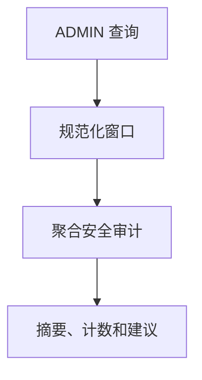
### Current development flow {#ops-001-dev}
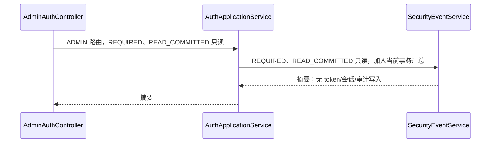
### Target architecture flow
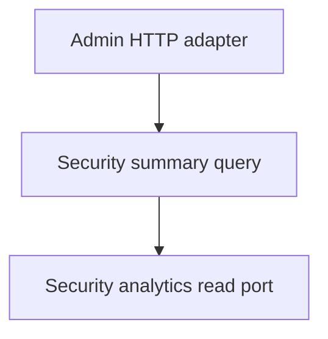
### Gaps
- targetPhase: 1；当前服务直连查询编排，尚无运营查询端口和独立用例。

## OPS-002 安全事件时间线

管理员按 lookbackMinutes 和可选 actionTypes 查询分钟级时间线；空/无效动作回退全部登记动作，非正窗口归一为 60。当前为 READ_COMMITTED 只读、30 秒事务，读取审计数据，不改令牌、会话或审计。实现测试：`DocumentationCatalogCoverageTest#catalogOwnsTheExactApplicationRoutesSchedulersEventsAndTasks`；计划测试（Phase 1）：`OperationsSecurityWebTest#documentsSecurityOperation`。

### Requirement flow {#ops-002}
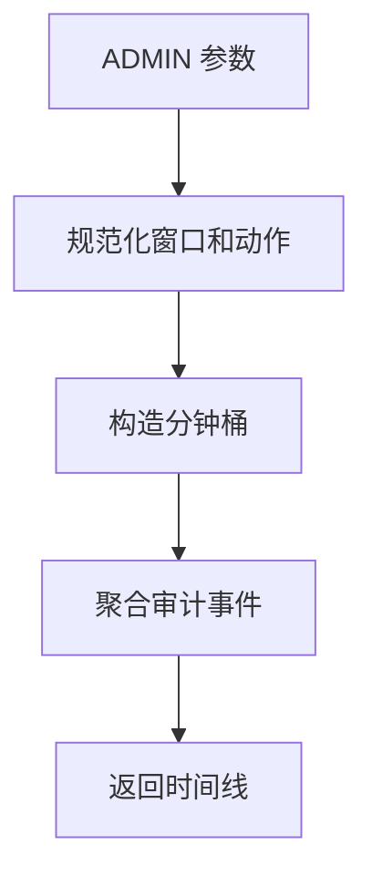
### Current development flow {#ops-002-dev}
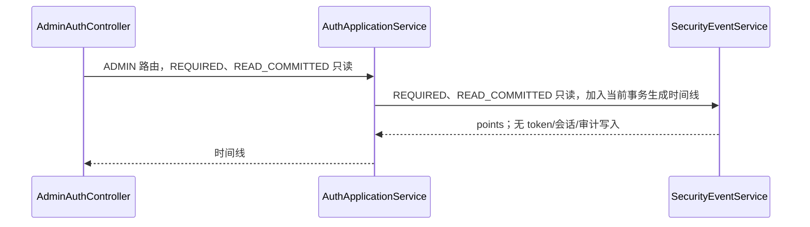
### Target architecture flow
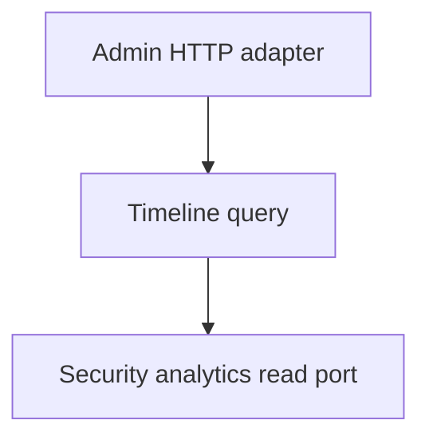
### Gaps
- targetPhase: 1；当前在应用服务中完成归一和聚合，未形成可替换读端口。

## OPS-003 高风险用户 TopN

管理员按窗口、TopN 和动作筛选风险用户；TopN 非正归一为 10，最大 100。当前为 READ_COMMITTED 只读、30 秒事务，从审计 targetId 聚合，返回 username/eventCount；不写会话、token 或审计。实现测试：`DocumentationCatalogCoverageTest#catalogOwnsTheExactApplicationRoutesSchedulersEventsAndTasks`；计划测试（Phase 1）：`OperationsSecurityWebTest#documentsSecurityOperation`。

### Requirement flow {#ops-003}
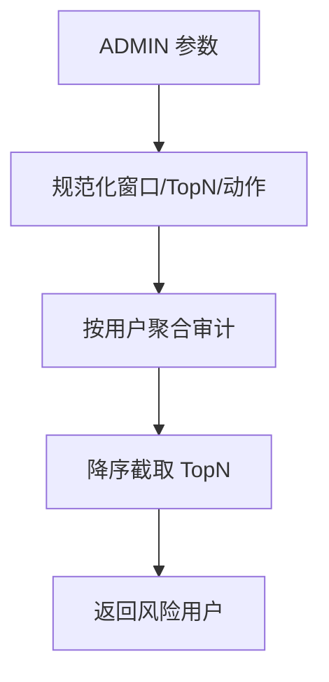
### Current development flow {#ops-003-dev}
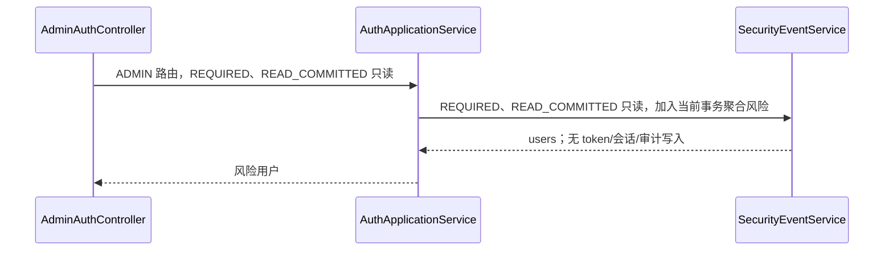
### Target architecture flow
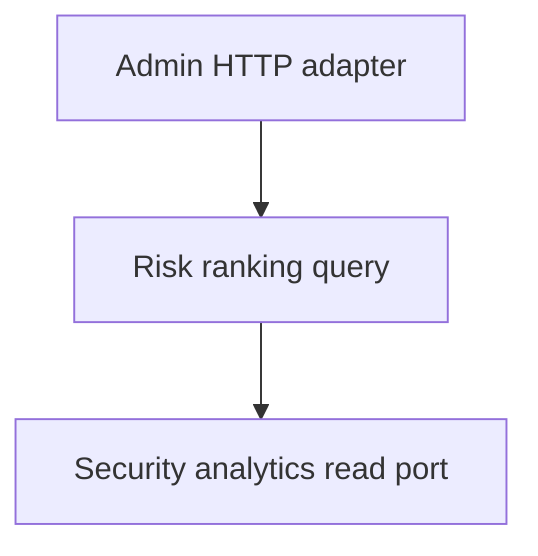
### Gaps
- targetPhase: 1；当前没有独立的风险计算模型、读端口或查询测试。

## OPS-004 同步旧版安全导出

管理员请求 type（summary/timeline/risk-users-top）、format 及过滤参数，直接生成内容并用下载响应返回；不支持 type 为 `PARAM_INVALID`。当前代码只在生成 payload 时校验 type；format 没有独立校验，只有大小写不敏感的 `csv` 输出 CSV，其余任何 format 均按 JSON 响应。摘要/时间线/风险聚合发生在只读调用中，渲染不声明事务；不创建导出任务、不改 token/会话，仅读取既有审计。实现测试：`DocumentationCatalogCoverageTest#catalogOwnsTheExactApplicationRoutesSchedulersEventsAndTasks`；计划测试（Phase 1）：`OperationsSecurityWebTest#documentsSecurityOperation`。

### Requirement flow {#ops-004}
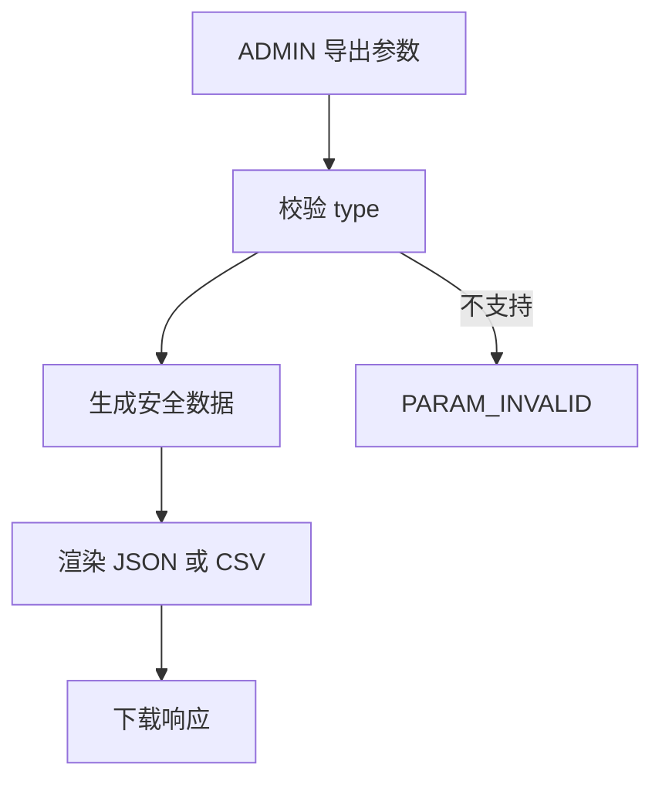
### Current development flow {#ops-004-dev}
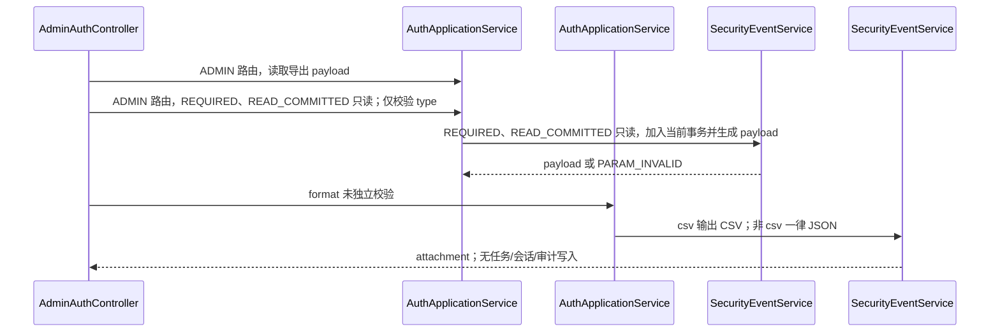
### Target architecture flow
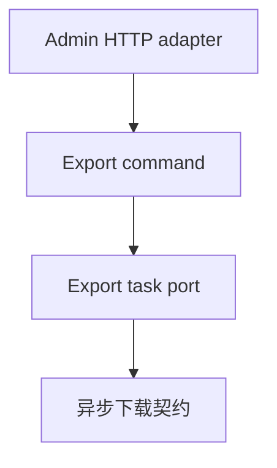
### Gaps
- targetPhase: 1；同步旧接口直接渲染，format 未形成受限契约（非 csv 均为 JSON），尚未迁移到可追踪的异步导出用例。

## OPS-005 创建安全导出任务

管理员提交 type、format、窗口、TopN、动作及可选幂等键；RUNNING/SUCCESS 相同键复用结果，超过运行上限返回 `SYS_INTERNAL_ERROR`。当前在 `@AuthTransactional` 中创建 RUNNING 任务、记录创建审计并同步执行，成功/失败会写任务状态和相应审计；不改认证 token 或会话。实现测试：`DocumentationCatalogCoverageTest#catalogOwnsTheExactApplicationRoutesSchedulersEventsAndTasks`；计划测试（Phase 1）：`OperationsSecurityWebTest#documentsSecurityOperation`。

### Requirement flow {#ops-005}
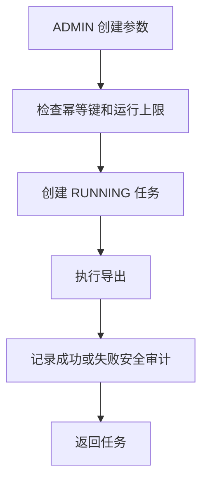
### Current development flow {#ops-005-dev}
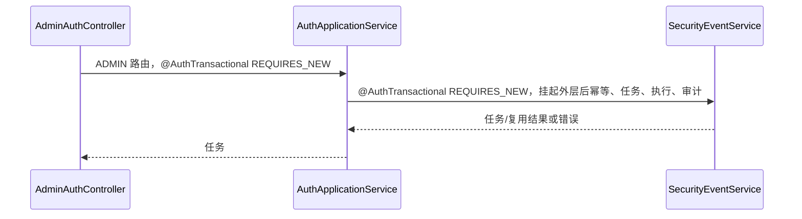
### Target architecture flow
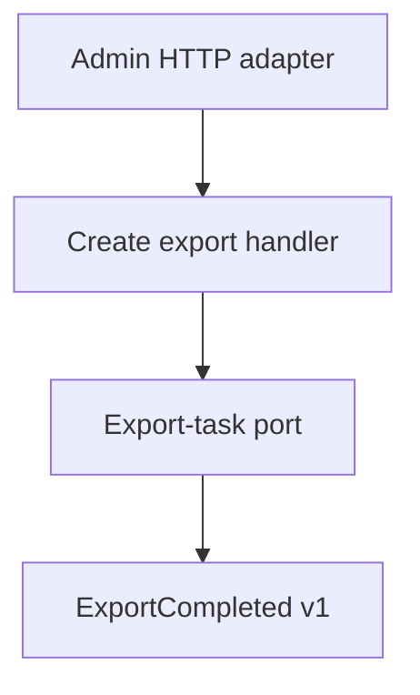
### Gaps
- targetPhase: 1；执行仍在请求事务内，尚无异步工作器、outbox 或公开完成事件。

## OPS-006 重试安全导出任务

管理员对 taskId 重试，任务不存在为 `ORDER_NOT_FOUND`，RUNNING 或超过 maxRetry 为 `ORDER_STATUS_CONFLICT`。当前 `@AuthTransactional` 中把任务置 RUNNING、增加 retryCount、记录重试审计并同步执行；结果再次读取返回，不改认证 token/会话。实现测试：`DocumentationCatalogCoverageTest#catalogOwnsTheExactApplicationRoutesSchedulersEventsAndTasks`；计划测试（Phase 1）：`OperationsSecurityWebTest#documentsSecurityOperation`。

### Requirement flow {#ops-006}
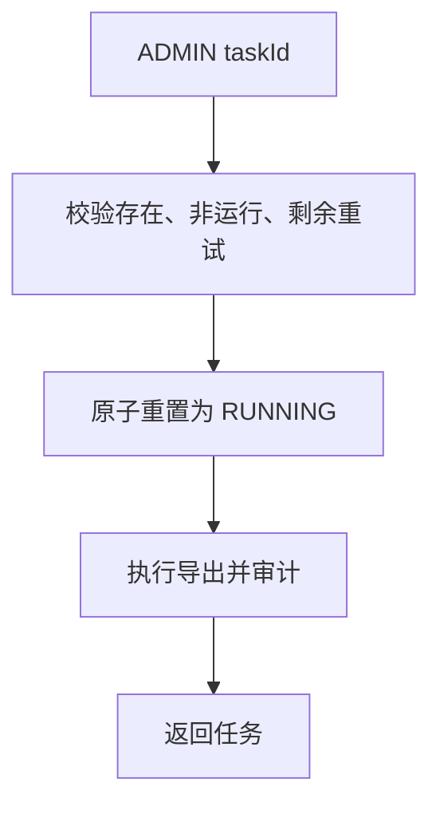
### Current development flow {#ops-006-dev}
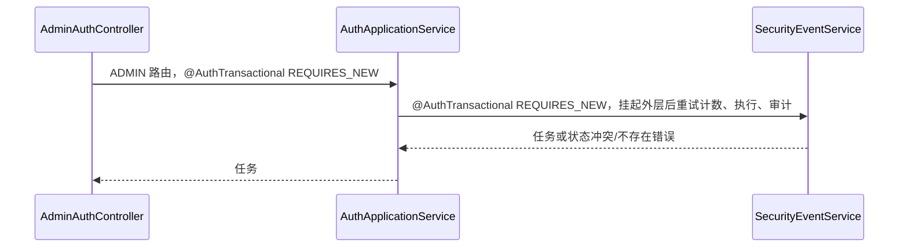
### Target architecture flow
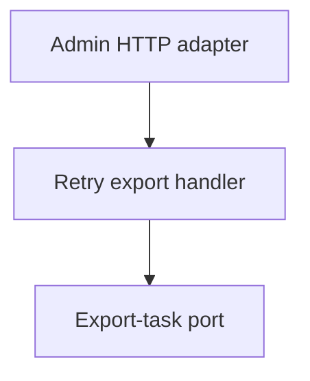
### Gaps
- targetPhase: 1；当前重试在 HTTP 请求内执行，尚无后台重试调度与并发控制边界。

## OPS-007 查询安全导出任务详情

管理员按 taskId 查询任务状态、重试信息、错误与文件名；不存在为 `ORDER_NOT_FOUND`。当前为 READ_COMMITTED 只读、30 秒事务，不改变 token、会话、任务或审计；ADMIN 路由是唯一授权检查。实现测试：`DocumentationCatalogCoverageTest#catalogOwnsTheExactApplicationRoutesSchedulersEventsAndTasks`；计划测试（Phase 1）：`OperationsSecurityWebTest#documentsSecurityOperation`。

### Requirement flow {#ops-007}
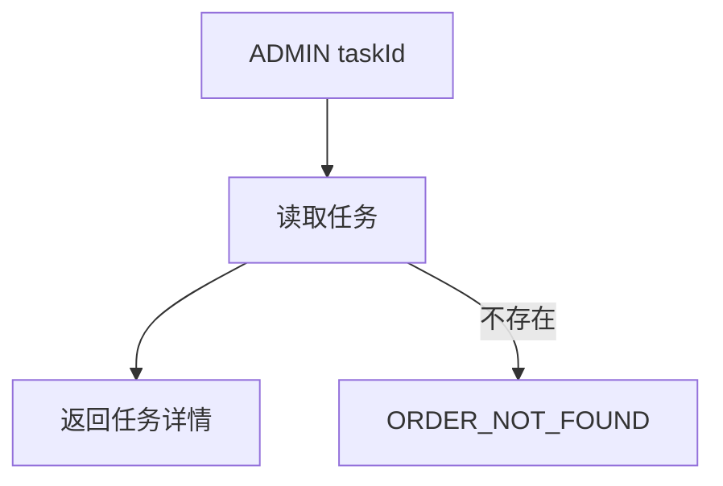
### Current development flow {#ops-007-dev}
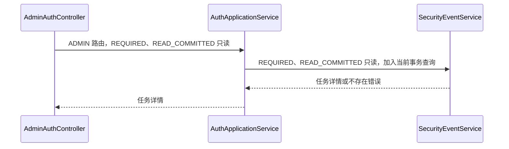
### Target architecture flow
```mermaid
flowchart TD
  C[Admin HTTP adapter] --> H[Export detail query] --> P[Export-task read port]
```
### Gaps
- targetPhase: 1；当前查询没有隔离读模型与运营授权策略。

## OPS-008 下载安全导出任务

管理员下载已 SUCCESS 的任务内容，响应按任务 format 选择 JSON/CSV 附件；任务不存在为 `ORDER_NOT_FOUND`，未完成为 `ORDER_STATUS_CONFLICT`。当前为 READ_COMMITTED 只读、30 秒事务，不改 token、会话、任务或审计。实现测试：`DocumentationCatalogCoverageTest#catalogOwnsTheExactApplicationRoutesSchedulersEventsAndTasks`；计划测试（Phase 1）：`OperationsSecurityWebTest#documentsSecurityOperation`。

### Requirement flow {#ops-008}
```mermaid
flowchart TD
  A[ADMIN taskId] --> Q[读取任务]
  Q --> V{SUCCESS}
  V -->|是| D[返回 JSON/CSV 附件]
  V -->|否| E[ORDER_STATUS_CONFLICT]
```
### Current development flow {#ops-008-dev}
```mermaid
sequenceDiagram
  participant C as AdminAuthController#downloadSecurityEventsExportTask
  participant A as AuthApplicationService#getSecurityExportTaskDownload
  participant S as SecurityEventService#getSecurityExportTaskDownload
  C->>A: ADMIN 路由，REQUIRED、READ_COMMITTED 只读
  A->>S: REQUIRED、READ_COMMITTED 只读，加入当前事务并验证 SUCCESS
  S-->>A: 内容或错误
  A-->>C: 内容附件
```
### Target architecture flow
```mermaid
flowchart TD
  C[Admin HTTP adapter] --> H[Download query] --> P[Export-content read port]
```
### Gaps
- targetPhase: 1；下载内容仍保存在现有任务记录，尚无受控文件存储端口。

## OPS-009 列出安全导出任务

管理员按 page、size、可选 status 分页查询任务；page 最小 0，size 非正归一 20、最大 200，status 转大写。当前为 READ_COMMITTED 只读、30 秒事务，按创建时间倒序返回；不写 token、会话或审计。实现测试：`DocumentationCatalogCoverageTest#catalogOwnsTheExactApplicationRoutesSchedulersEventsAndTasks`；计划测试（Phase 1）：`OperationsSecurityWebTest#documentsSecurityOperation`。

### Requirement flow {#ops-009}
```mermaid
flowchart TD
  A[ADMIN 分页参数] --> N[规范化 page/size/status]
  N --> Q[倒序查询任务页]
  Q --> R[返回 items 和分页元数据]
```
### Current development flow {#ops-009-dev}
```mermaid
sequenceDiagram
  participant C as AdminAuthController#listSecurityEventsExportTasks
  participant A as AuthApplicationService#listSecurityExportTasks
  participant S as SecurityEventService#listSecurityExportTasks
  C->>A: ADMIN 路由，REQUIRED、READ_COMMITTED 只读
  A->>S: REQUIRED、READ_COMMITTED 只读，加入当前事务分页
  S-->>A: items；无 token/会话/审计写入
  A-->>C: 分页结果
```
### Target architecture flow
```mermaid
flowchart TD
  C[Admin HTTP adapter] --> H[Export list query] --> P[Export-task read port]
```
### Gaps
- targetPhase: 1；当前过滤/分页规则尚未成为独立运营查询契约。

## OPS-010 清理安全导出任务

管理员可用 retainDays 手工清理已完成任务；请求缺失或非正 retainDays 使用配置默认保留天数。当前 `@AuthTransactional` 内删除截止时间前的完成任务，返回 retainDays/cutoff/deletedCount；不写安全审计，也不改 token/会话。实现测试：`DocumentationCatalogCoverageTest#catalogOwnsTheExactApplicationRoutesSchedulersEventsAndTasks`；计划测试（Phase 1）：`OperationsSecurityWebTest#documentsSecurityOperation`。

### Requirement flow {#ops-010}
```mermaid
flowchart TD
  A[ADMIN retainDays] --> N[解析保留期]
  N --> D[删除过期完成任务]
  D --> R[返回删除统计]
```
### Current development flow {#ops-010-dev}
```mermaid
sequenceDiagram
  participant C as AdminAuthController#cleanupSecurityEventsExportTasks
  participant A as AuthApplicationService#cleanupSecurityExportTasks
  participant S as SecurityEventService#cleanupSecurityExportTasks
  C->>A: ADMIN 路由，@AuthTransactional REQUIRES_NEW
  A->>S: @AuthTransactional REQUIRES_NEW，挂起外层后清理完成任务
  S-->>A: deletedCount；无 token/会话/审计写入
  A-->>C: 删除统计
```
### Target architecture flow
```mermaid
flowchart TD
  C[Admin HTTP adapter] --> H[Cleanup command] --> P[Export-task retention port]
```
### Gaps
- targetPhase: 1；当前删除没有运营审计、保留策略端口或清理结果事件。

## OPS-S001 安全导出任务定时清理

scheduler 按 `security.auth.export-task.cleanup-fixed-delay-ms`（默认 3600000ms）触发，无外部身份或 HTTP 授权；使用配置 retain-days 删除过期完成任务，并将超时 RUNNING 任务置 FAILED、写超时安全审计。整个调度方法为 `@AuthTransactional`。当前方法没有 catch、重试循环或错误码映射：若内部操作抛出异常，事务按异常回滚并由调度基础设施处理该次失败；该方法自身只会等待后续 fixed-delay 调度。实现测试：`DocumentationCatalogCoverageTest#catalogOwnsTheExactApplicationRoutesSchedulersEventsAndTasks`；计划测试（Phase 1）：`OperationsSchedulerTest#documentsOperationsScheduler`。

### Requirement flow {#ops-s001}
```mermaid
flowchart TD
  S[fixed-delay scheduler] --> C[清理过期完成任务]
  C --> T[标记超时 RUNNING 任务失败]
  T --> A[记录超时安全审计]
  A --> R[等待下一轮]
```
### Current development flow {#ops-s001-dev}
```mermaid
flowchart TD
  S[SecurityEventService#scheduledCleanupSecurityExportTasks] --> C[@AuthTransactional 清理完成任务]
  C --> T[标记超时任务并记录审计]
  C -->|异常| R[事务回滚；本方法无 catch/重试/错误码映射]
```
### Target architecture flow
```mermaid
flowchart TD
  S[Scheduler adapter] --> H[Retention handler] --> P[Task retention port]
  H --> E[Operational alert event]
```
### Gaps
- targetPhase: 1；当前调度逻辑直接完成清理和超时扫描，缺少独立策略、失败告警和可观测的执行记录。
