# 安全运营需求流

本文件覆盖 Task 9 的 10 个安全运营 HTTP 用例与 1 个清理调度器。所有 HTTP 路由位于 `/api/admin/**`，当前均由 ADMIN 角色保护，未认证/无权分别由安全层返回 `AUTH_UNAUTHORIZED` / `AUTH_FORBIDDEN`。各节“当前开发流”仅引用 catalog `currentSymbols`；实现测试为 `DocumentationCatalogCoverageTest#catalogOwnsTheExactApplicationRoutesSchedulersEventsAndTasks`，计划测试均明确为 **Phase 1**。

## OPS-001 安全事件摘要

管理员以 lookbackMinutes 查询已登记安全动作的计数、总数和建议；非正数窗口归一为 60 分钟。当前只读 READ_COMMITTED、30 秒事务，从审计记录聚合，不改变 token、会话或审计记录；路由负责 ADMIN 授权。错误为 `BUSINESS_ERROR`。实现测试：`DocumentationCatalogCoverageTest#catalogOwnsTheExactApplicationRoutesSchedulersEventsAndTasks`；计划测试（Phase 1）：`OperationsSecurityWebTest#documentsSecurityOperation`。

### Requirement flow {#ops-001}
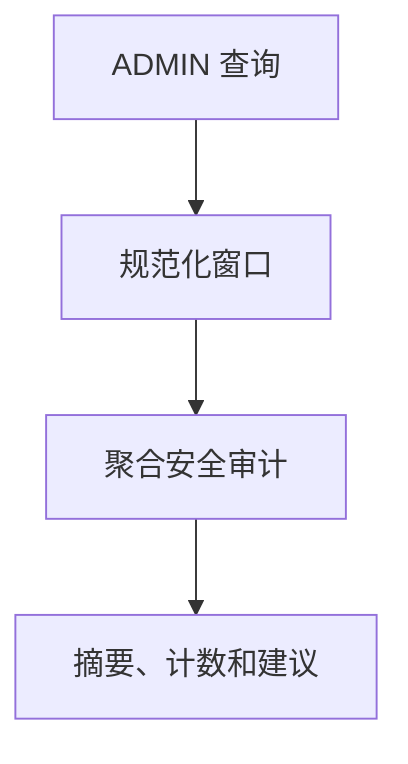
### Current development flow {#ops-001-dev}
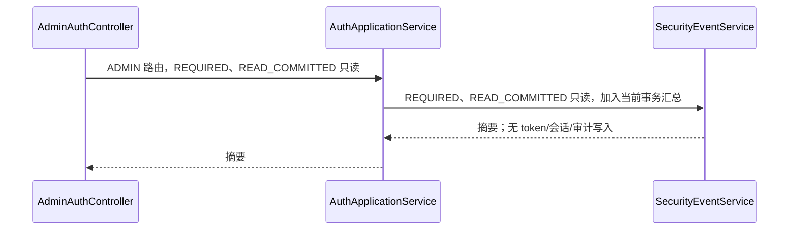
### Target architecture flow
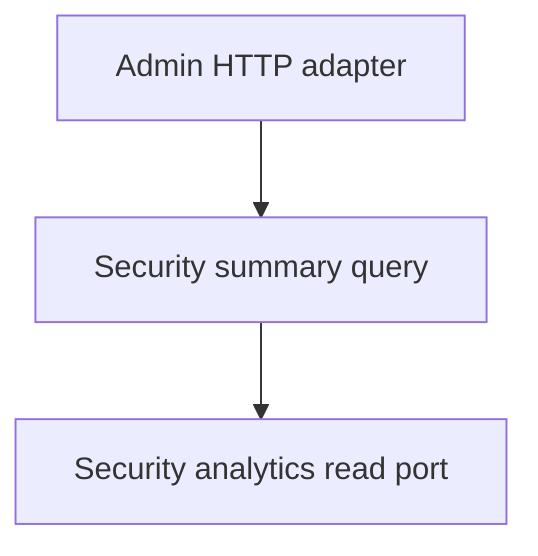
### Gaps
- targetPhase: 1；当前服务直连查询编排，尚无运营查询端口和独立用例。

## OPS-002 安全事件时间线

管理员按 lookbackMinutes 和可选 actionTypes 查询分钟级时间线；空/无效动作回退全部登记动作，非正窗口归一为 60。当前为 READ_COMMITTED 只读、30 秒事务，读取审计数据，不改令牌、会话或审计。实现测试：`DocumentationCatalogCoverageTest#catalogOwnsTheExactApplicationRoutesSchedulersEventsAndTasks`；计划测试（Phase 1）：`OperationsSecurityWebTest#documentsSecurityOperation`。

### Requirement flow {#ops-002}
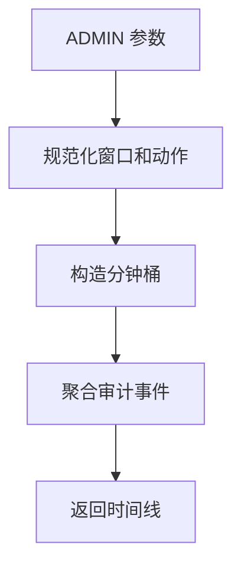
### Current development flow {#ops-002-dev}
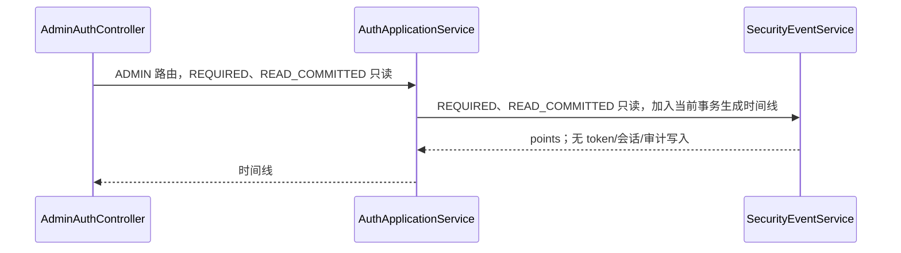
### Target architecture flow
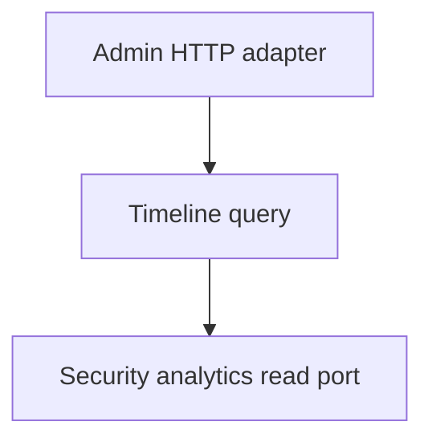
### Gaps
- targetPhase: 1；当前在应用服务中完成归一和聚合，未形成可替换读端口。

## OPS-003 高风险用户 TopN

管理员按窗口、TopN 和动作筛选风险用户；TopN 非正归一为 10，最大 100。当前为 READ_COMMITTED 只读、30 秒事务，从审计 targetId 聚合，返回 username/eventCount；不写会话、token 或审计。实现测试：`DocumentationCatalogCoverageTest#catalogOwnsTheExactApplicationRoutesSchedulersEventsAndTasks`；计划测试（Phase 1）：`OperationsSecurityWebTest#documentsSecurityOperation`。

### Requirement flow {#ops-003}
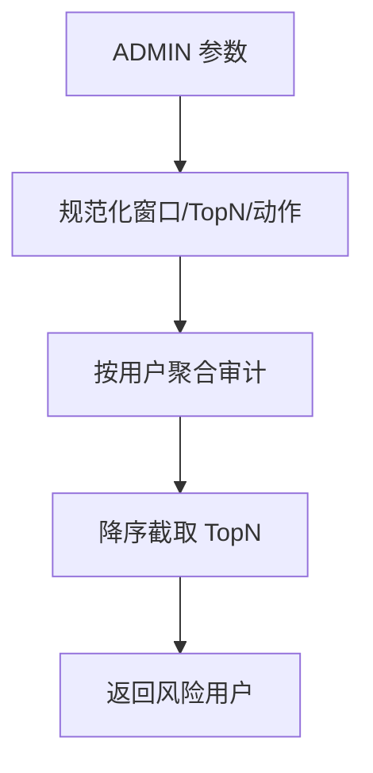
### Current development flow {#ops-003-dev}
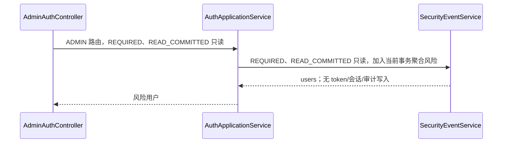
### Target architecture flow
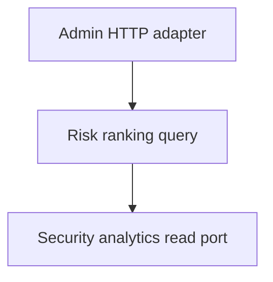
### Gaps
- targetPhase: 1；当前没有独立的风险计算模型、读端口或查询测试。

## OPS-004 同步旧版安全导出

管理员请求 type（summary/timeline/risk-users-top）、format 及过滤参数，直接生成内容并用下载响应返回；不支持 type 为 `PARAM_INVALID`。当前代码只在生成 payload 时校验 type；format 没有独立校验，只有大小写不敏感的 `csv` 输出 CSV，其余任何 format 均按 JSON 响应。摘要/时间线/风险聚合发生在只读调用中，渲染不声明事务；不创建导出任务、不改 token/会话，仅读取既有审计。实现测试：`DocumentationCatalogCoverageTest#catalogOwnsTheExactApplicationRoutesSchedulersEventsAndTasks`；计划测试（Phase 1）：`OperationsSecurityWebTest#documentsSecurityOperation`。

### Requirement flow {#ops-004}
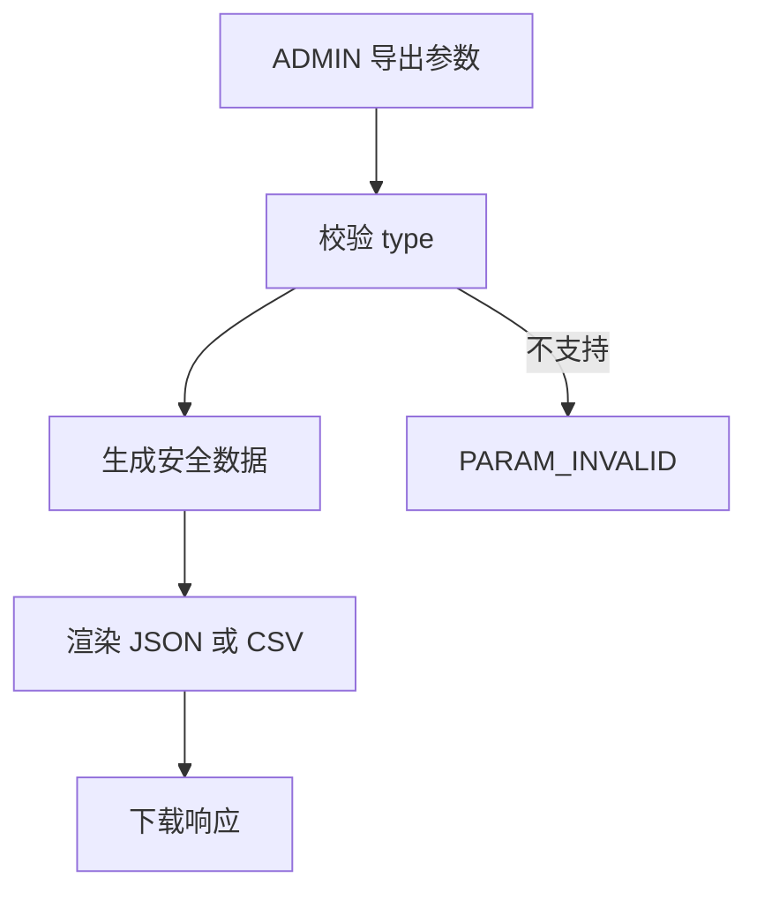
### Current development flow {#ops-004-dev}
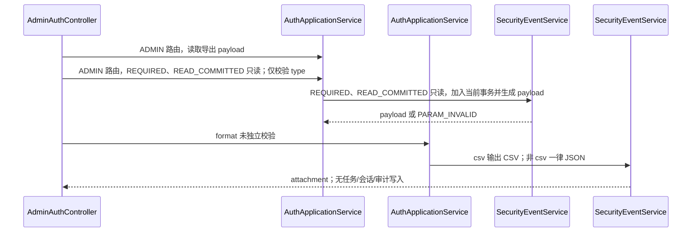
### Target architecture flow
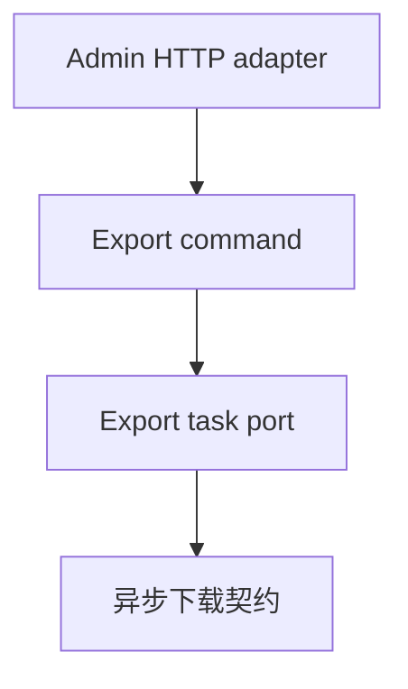
### Gaps
- targetPhase: 1；同步旧接口直接渲染，format 未形成受限契约（非 csv 均为 JSON），尚未迁移到可追踪的异步导出用例。

## OPS-005 创建安全导出任务

管理员提交 type、format、窗口、TopN、动作及可选幂等键；RUNNING/SUCCESS 相同键复用结果，超过运行上限返回 `SYS_INTERNAL_ERROR`。当前在 `@AuthTransactional` 中创建 RUNNING 任务、记录创建审计并同步执行，成功/失败会写任务状态和相应审计；不改认证 token 或会话。实现测试：`DocumentationCatalogCoverageTest#catalogOwnsTheExactApplicationRoutesSchedulersEventsAndTasks`；计划测试（Phase 1）：`OperationsSecurityWebTest#documentsSecurityOperation`。

### Requirement flow {#ops-005}
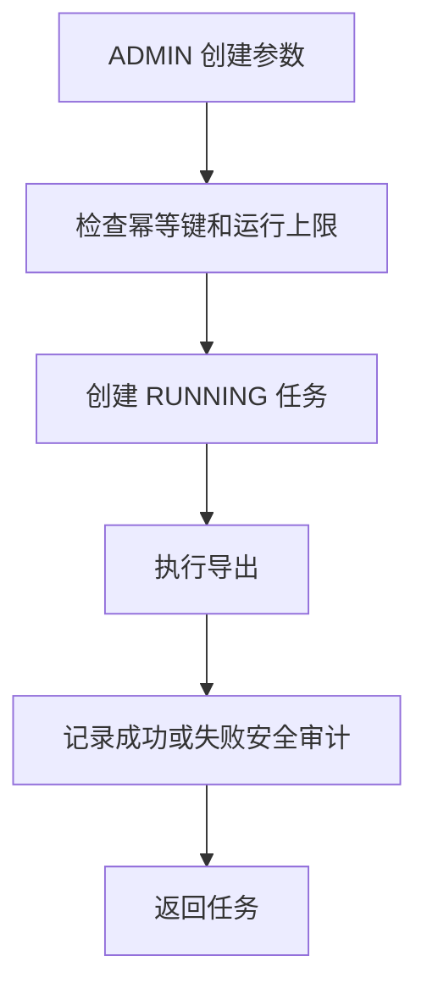
### Current development flow {#ops-005-dev}
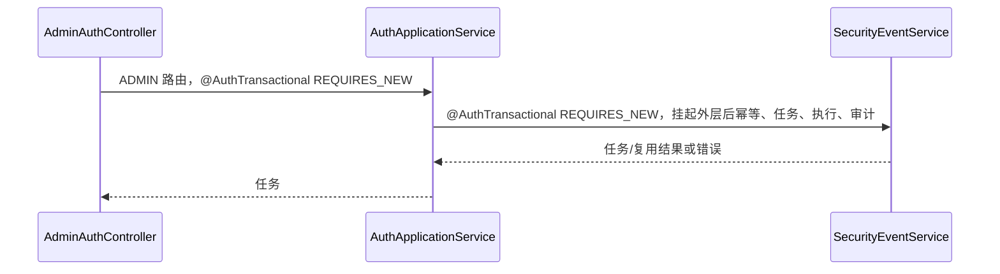
### Target architecture flow
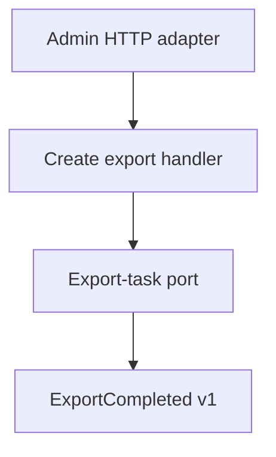
### Gaps
- targetPhase: 1；执行仍在请求事务内，尚无异步工作器、outbox 或公开完成事件。

## OPS-006 重试安全导出任务

管理员对 taskId 重试，任务不存在为 `ORDER_NOT_FOUND`，RUNNING 或超过 maxRetry 为 `ORDER_STATUS_CONFLICT`。当前 `@AuthTransactional` 中把任务置 RUNNING、增加 retryCount、记录重试审计并同步执行；结果再次读取返回，不改认证 token/会话。实现测试：`DocumentationCatalogCoverageTest#catalogOwnsTheExactApplicationRoutesSchedulersEventsAndTasks`；计划测试（Phase 1）：`OperationsSecurityWebTest#documentsSecurityOperation`。

### Requirement flow {#ops-006}
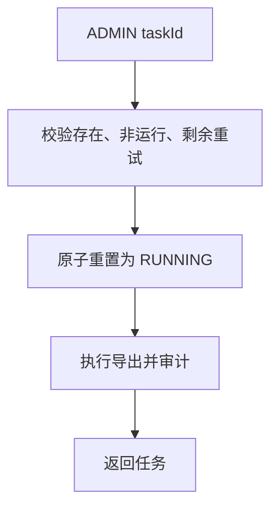
### Current development flow {#ops-006-dev}
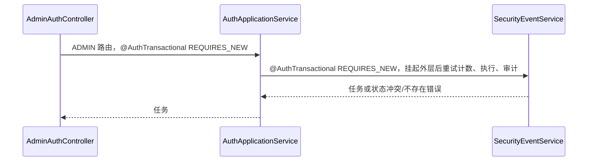
### Target architecture flow
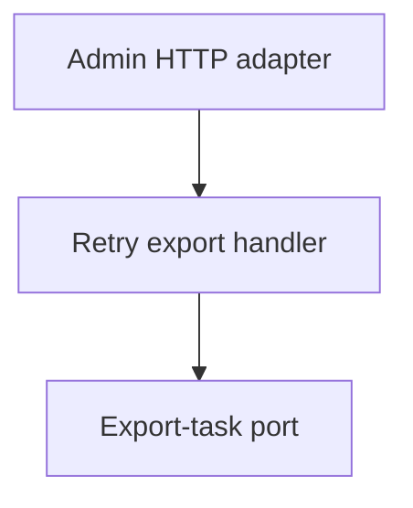
### Gaps
- targetPhase: 1；当前重试在 HTTP 请求内执行，尚无后台重试调度与并发控制边界。

## OPS-007 查询安全导出任务详情

管理员按 taskId 查询任务状态、重试信息、错误与文件名；不存在为 `ORDER_NOT_FOUND`。当前为 READ_COMMITTED 只读、30 秒事务，不改变 token、会话、任务或审计；ADMIN 路由是唯一授权检查。实现测试：`DocumentationCatalogCoverageTest#catalogOwnsTheExactApplicationRoutesSchedulersEventsAndTasks`；计划测试（Phase 1）：`OperationsSecurityWebTest#documentsSecurityOperation`。

### Requirement flow {#ops-007}
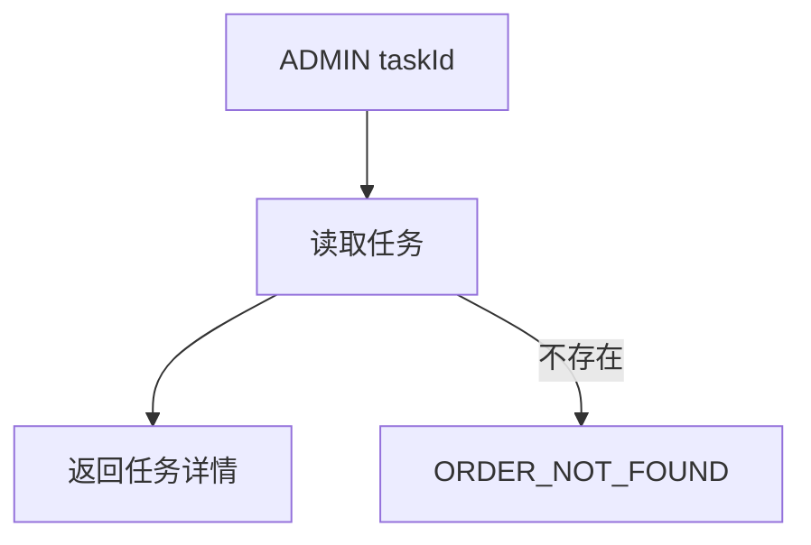
### Current development flow {#ops-007-dev}
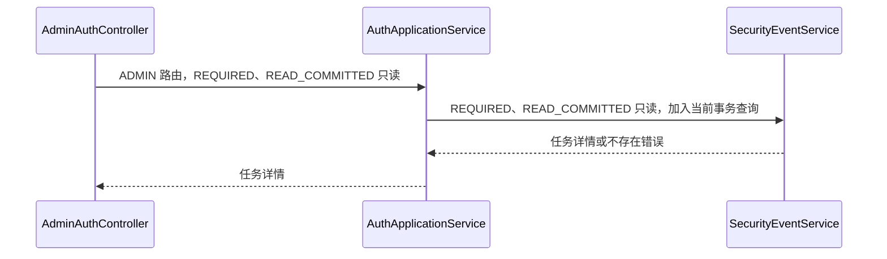
### Target architecture flow
```mermaid
flowchart TD
  C[Admin HTTP adapter] --> H[Export detail query] --> P[Export-task read port]
```
### Gaps
- targetPhase: 1；当前查询没有隔离读模型与运营授权策略。

## OPS-008 下载安全导出任务

管理员下载已 SUCCESS 的任务内容，响应按任务 format 选择 JSON/CSV 附件；任务不存在为 `ORDER_NOT_FOUND`，未完成为 `ORDER_STATUS_CONFLICT`。当前为 READ_COMMITTED 只读、30 秒事务，不改 token、会话、任务或审计。实现测试：`DocumentationCatalogCoverageTest#catalogOwnsTheExactApplicationRoutesSchedulersEventsAndTasks`；计划测试（Phase 1）：`OperationsSecurityWebTest#documentsSecurityOperation`。

### Requirement flow {#ops-008}
```mermaid
flowchart TD
  A[ADMIN taskId] --> Q[读取任务]
  Q --> V{SUCCESS}
  V -->|是| D[返回 JSON/CSV 附件]
  V -->|否| E[ORDER_STATUS_CONFLICT]
```
### Current development flow {#ops-008-dev}
```mermaid
sequenceDiagram
  participant C as AdminAuthController#downloadSecurityEventsExportTask
  participant A as AuthApplicationService#getSecurityExportTaskDownload
  participant S as SecurityEventService#getSecurityExportTaskDownload
  C->>A: ADMIN 路由，REQUIRED、READ_COMMITTED 只读
  A->>S: REQUIRED、READ_COMMITTED 只读，加入当前事务并验证 SUCCESS
  S-->>A: 内容或错误
  A-->>C: 内容附件
```
### Target architecture flow
```mermaid
flowchart TD
  C[Admin HTTP adapter] --> H[Download query] --> P[Export-content read port]
```
### Gaps
- targetPhase: 1；下载内容仍保存在现有任务记录，尚无受控文件存储端口。

## OPS-009 列出安全导出任务

管理员按 page、size、可选 status 分页查询任务；page 最小 0，size 非正归一 20、最大 200，status 转大写。当前为 READ_COMMITTED 只读、30 秒事务，按创建时间倒序返回；不写 token、会话或审计。实现测试：`DocumentationCatalogCoverageTest#catalogOwnsTheExactApplicationRoutesSchedulersEventsAndTasks`；计划测试（Phase 1）：`OperationsSecurityWebTest#documentsSecurityOperation`。

### Requirement flow {#ops-009}
```mermaid
flowchart TD
  A[ADMIN 分页参数] --> N[规范化 page/size/status]
  N --> Q[倒序查询任务页]
  Q --> R[返回 items 和分页元数据]
```
### Current development flow {#ops-009-dev}
```mermaid
sequenceDiagram
  participant C as AdminAuthController#listSecurityEventsExportTasks
  participant A as AuthApplicationService#listSecurityExportTasks
  participant S as SecurityEventService#listSecurityExportTasks
  C->>A: ADMIN 路由，REQUIRED、READ_COMMITTED 只读
  A->>S: REQUIRED、READ_COMMITTED 只读，加入当前事务分页
  S-->>A: items；无 token/会话/审计写入
  A-->>C: 分页结果
```
### Target architecture flow
```mermaid
flowchart TD
  C[Admin HTTP adapter] --> H[Export list query] --> P[Export-task read port]
```
### Gaps
- targetPhase: 1；当前过滤/分页规则尚未成为独立运营查询契约。

## OPS-010 清理安全导出任务

管理员可用 retainDays 手工清理已完成任务；请求缺失或非正 retainDays 使用配置默认保留天数。当前 `@AuthTransactional` 内删除截止时间前的完成任务，返回 retainDays/cutoff/deletedCount；不写安全审计，也不改 token/会话。实现测试：`DocumentationCatalogCoverageTest#catalogOwnsTheExactApplicationRoutesSchedulersEventsAndTasks`；计划测试（Phase 1）：`OperationsSecurityWebTest#documentsSecurityOperation`。

### Requirement flow {#ops-010}
```mermaid
flowchart TD
  A[ADMIN retainDays] --> N[解析保留期]
  N --> D[删除过期完成任务]
  D --> R[返回删除统计]
```
### Current development flow {#ops-010-dev}
```mermaid
sequenceDiagram
  participant C as AdminAuthController#cleanupSecurityEventsExportTasks
  participant A as AuthApplicationService#cleanupSecurityExportTasks
  participant S as SecurityEventService#cleanupSecurityExportTasks
  C->>A: ADMIN 路由，@AuthTransactional REQUIRES_NEW
  A->>S: @AuthTransactional REQUIRES_NEW，挂起外层后清理完成任务
  S-->>A: deletedCount；无 token/会话/审计写入
  A-->>C: 删除统计
```
### Target architecture flow
```mermaid
flowchart TD
  C[Admin HTTP adapter] --> H[Cleanup command] --> P[Export-task retention port]
```
### Gaps
- targetPhase: 1；当前删除没有运营审计、保留策略端口或清理结果事件。

## OPS-S001 安全导出任务定时清理

scheduler 按 `security.auth.export-task.cleanup-fixed-delay-ms`（默认 3600000ms）触发，无外部身份或 HTTP 授权；使用配置 retain-days 删除过期完成任务，并将超时 RUNNING 任务置 FAILED、写超时安全审计。整个调度方法为 `@AuthTransactional`。当前方法没有 catch、重试循环或错误码映射：若内部操作抛出异常，事务按异常回滚并由调度基础设施处理该次失败；该方法自身只会等待后续 fixed-delay 调度。实现测试：`DocumentationCatalogCoverageTest#catalogOwnsTheExactApplicationRoutesSchedulersEventsAndTasks`；计划测试（Phase 1）：`OperationsSchedulerTest#documentsOperationsScheduler`。

### Requirement flow {#ops-s001}
```mermaid
flowchart TD
  S[fixed-delay scheduler] --> C[清理过期完成任务]
  C --> T[标记超时 RUNNING 任务失败]
  T --> A[记录超时安全审计]
  A --> R[等待下一轮]
```
### Current development flow {#ops-s001-dev}
```mermaid
flowchart TD
  S[SecurityEventService#scheduledCleanupSecurityExportTasks] --> C[@AuthTransactional 清理完成任务]
  C --> T[标记超时任务并记录审计]
  C -->|异常| R[事务回滚；本方法无 catch/重试/错误码映射]
```
### Target architecture flow
```mermaid
flowchart TD
  S[Scheduler adapter] --> H[Retention handler] --> P[Task retention port]
  H --> E[Operational alert event]
```
### Gaps
- targetPhase: 1；当前调度逻辑直接完成清理和超时扫描，缺少独立策略、失败告警和可观测的执行记录。

## OPS-020 审计日志列表

管理员按 actionType、targetId 和 limit 读取最近审计日志；limit 被限制为 1..200。实现测试：无；计划测试（Phase 5）：`OperationsUseCaseWebTest#documentsOperationsUseCase`。

### Requirement flow {#ops-020}
```mermaid
flowchart TD
  A[ADMIN 筛选] --> N[规范化 limit] --> Q[按创建时间倒序查询] --> R[返回审计项]
```
### Current development flow {#ops-020-dev}
```mermaid
sequenceDiagram
  participant C as AdminRecycleController#listAuditLogs
  participant A as RecycleApplicationService#listAuditLogs
  participant S as AuditLogService#listAuditLogs
  C->>A: ADMIN route
  A->>S: REQUIRED READ_COMMITTED read-only
  S-->>C: 当前直接返回遗留审计投影
```
### Target architecture flow
```mermaid
flowchart LR
  C[Operations adapter] --> Q[Audit query handler] --> P[Audit read port]
```
### Gaps
- targetPhase: 5；当前跨 Recycle 应用服务直连遗留表，没有 Operations 读端口、访问审计或稳定查询模型。

## OPS-021 审计日志分页

管理员按 actionType、targetId、page、size 浏览审计页；page 最小为 0，size 限制为 1..200。实现测试：无；计划测试（Phase 5）：`OperationsUseCaseWebTest#documentsOperationsUseCase`。

### Requirement flow {#ops-021}
```mermaid
flowchart TD
  A[ADMIN 分页参数] --> N[规范化页码] --> Q[分页审计查询] --> R[items 与页元数据]
```
### Current development flow {#ops-021-dev}
```mermaid
sequenceDiagram
  participant C as AdminRecycleController#pageAuditLogs
  participant A as RecycleApplicationService#pageAuditLogs
  participant S as AuditLogService#pageAuditLogs
  C->>A: ADMIN route
  A->>S: REQUIRED READ_COMMITTED read-only
  S-->>C: Page 直接映射
```
### Target architecture flow
```mermaid
flowchart LR
  C[Operations adapter] --> Q[Cursor/page audit query] --> P[Audit read port]
```
### Gaps
- targetPhase: 5；当前固定为偏移分页，未定义跨模块查询契约、游标稳定性或查询审计。

## OPS-022 导出审计日志

管理员按同一筛选导出 CSV；limit 限制为 1..5000。实现测试：无；计划测试（Phase 5）：`OperationsUseCaseWebTest#documentsOperationsUseCase`。

### Requirement flow {#ops-022}
```mermaid
flowchart TD
  A[ADMIN 导出请求] --> N[限制导出量] --> Q[读取审计] --> F[CSV 附件]
```
### Current development flow {#ops-022-dev}
```mermaid
sequenceDiagram
  participant C as AdminRecycleController#exportAuditLogs
  participant A as RecycleApplicationService#exportAuditLogsCsv
  participant S as AuditLogService#exportAuditLogsCsv
  C->>A: ADMIN route
  A->>S: REQUIRED READ_COMMITTED read-only
  S-->>C: 同步 CSV 字符串
```
### Target architecture flow
```mermaid
flowchart LR
  C[Operations adapter] --> H[Export command] --> P[Audited export-task port] --> O[Outbox]
```
### Gaps
- targetPhase: 5；当前在请求线程构建 CSV，缺少异步任务、下载授权、保留策略和完成事件。

## OPS-030 审核风险摘要

管理员以 lookbackMinutes 读取评论举报/处理风险摘要；非正窗口归一为服务默认值。实现测试：无；计划测试（Phase 5）：`OperationsUseCaseWebTest#documentsOperationsUseCase`。

### Requirement flow {#ops-030}
```mermaid
flowchart TD
  A[ADMIN 窗口] --> N[规范化窗口] --> Q[聚合审核风险] --> R[摘要]
```
### Current development flow {#ops-030-dev}
```mermaid
sequenceDiagram
  participant C as AdminRecycleController#reviewRiskSummary
  participant A as RecycleApplicationService#adminReviewRiskSummary
  participant S as ResaleReviewService#adminReviewRiskSummary
  C->>A: ADMIN route
  A->>S: read-only aggregation
  S-->>C: 直接聚合评论数据
```
### Target architecture flow
```mermaid
flowchart LR
  C[Operations adapter] --> Q[Risk summary query] --> P[Moderation analytics port]
```
### Gaps
- targetPhase: 5；当前风险计算属于 Recycle 服务，未隔离分析读模型、指标版本或阈值策略。

## OPS-031 审核风险时间线

管理员以窗口读取分钟级审核风险趋势。实现测试：无；计划测试（Phase 5）：`OperationsUseCaseWebTest#documentsOperationsUseCase`。

### Requirement flow {#ops-031}
```mermaid
flowchart TD
  A[ADMIN 窗口] --> N[规范化] --> B[构造时间桶] --> Q[风险聚合] --> R[时间线]
```
### Current development flow {#ops-031-dev}
```mermaid
sequenceDiagram
  participant C as AdminRecycleController#reviewRiskTimeline
  participant A as RecycleApplicationService#adminReviewRiskTimeline
  participant S as ResaleReviewService#adminReviewRiskTimeline
  C->>A: ADMIN route
  A->>S: read-only aggregation
  S-->>C: 直接生成时间桶
```
### Target architecture flow
```mermaid
flowchart LR
  C[Operations adapter] --> Q[Risk timeline query] --> P[Analytics read port]
```
### Gaps
- targetPhase: 5；当前桶化与数据访问耦合，缺少可重放指标、时区契约和分析存储。

## OPS-032 高风险 listing TopN

管理员按窗口和 TopN 查询高风险 listing；TopN 限制在服务的安全范围。实现测试：无；计划测试（Phase 5）：`OperationsUseCaseWebTest#documentsOperationsUseCase`。

### Requirement flow {#ops-032}
```mermaid
flowchart TD
  A[ADMIN 窗口/TopN] --> N[规范化] --> Q[按 listing 聚合] --> S[排序截断] --> R[TopN]
```
### Current development flow {#ops-032-dev}
```mermaid
sequenceDiagram
  participant C as AdminRecycleController#reviewRiskTopListings
  participant A as RecycleApplicationService#adminReviewRiskTopListings
  participant S as ResaleReviewService#adminReviewRiskTopListings
  C->>A: ADMIN route
  A->>S: read-only ranking
  S-->>C: 遗留评论聚合
```
### Target architecture flow
```mermaid
flowchart LR
  C[Operations adapter] --> Q[Risk ranking query] --> P[Moderation analytics port]
```
### Gaps
- targetPhase: 5；当前没有独立风险评分版本、资源归属解释或可审计阈值。

## OPS-040 读取审核策略

管理员读取可缓存的审核策略，并以 ETag 支持条件响应。实现测试：无；计划测试（Phase 5）：`OperationsUseCaseWebTest#documentsOperationsUseCase`。

### Requirement flow {#ops-040}
```mermaid
flowchart TD
  A[ADMIN If-None-Match] --> Q[读取策略] --> E{ETag 匹配} -->|是| N[304] -->|否| R[策略]
```
### Current development flow {#ops-040-dev}
```mermaid
sequenceDiagram
  participant C as AdminRecycleController#getReviewStrategy
  participant A as RecycleApplicationService#adminGetReviewStrategyConfig
  participant S as ConfigCenterService#adminGetReviewStrategyConfig
  C->>A: ADMIN route
  A->>S: read-only configuration
  S-->>C: 遗留策略和 ETag
```
### Target architecture flow
```mermaid
flowchart LR
  C[Operations adapter] --> Q[Configuration query] --> P[Configuration read port]
```
### Gaps
- targetPhase: 5；当前配置由 bootstrap 服务内存/遗留实现提供，缺少版本化所有权和发布事件。

## OPS-041 更新审核策略

管理员提交策略变更、operator 和审计上下文；变更写入当前审核服务。实现测试：无；计划测试（Phase 5）：`OperationsUseCaseWebTest#documentsOperationsUseCase`。

### Requirement flow {#ops-041}
```mermaid
flowchart TD
  A[ADMIN 更新] --> V[校验字段] --> W[保存策略与审计] --> R[返回新版本]
```
### Current development flow {#ops-041-dev}
```mermaid
sequenceDiagram
  participant C as AdminRecycleController#updateReviewStrategy
  participant A as RecycleApplicationService#adminUpdateReviewStrategyConfig
  participant S as ConfigCenterService#adminUpdateReviewStrategyConfig
  C->>A: ADMIN route
  A->>S: 当前命令委托
  S-->>C: 更新遗留评论策略
```
### Target architecture flow
```mermaid
flowchart LR
  C[Operations adapter] --> H[Configuration command] --> P[Versioned config port] --> O[Outbox]
```
### Gaps
- targetPhase: 5；当前没有乐观版本、审批边界、原子 outbox 或 ConfigurationPublished 发布。

## OPS-042 全局错误码字典

管理员读取全球错误码、HTTP 状态和建议动作的缓存字典。实现测试：无；计划测试（Phase 5）：`OperationsUseCaseWebTest#documentsOperationsUseCase`。

### Requirement flow {#ops-042}
```mermaid
flowchart TD
  A[ADMIN] --> Q[读取错误码字典] --> E{ETag 匹配} -->|否| R[字典]
```
### Current development flow {#ops-042-dev}
```mermaid
sequenceDiagram
  participant C as AdminRecycleController#globalErrorCodes
  participant A as RecycleApplicationService#adminGlobalErrorCodeDictionary
  participant S as ConfigCenterService#adminGlobalErrorCodeDictionary
  C->>A: ADMIN route
  A->>S: in-memory dictionary
  S-->>C: ETag response
```
### Target architecture flow
```mermaid
flowchart LR
  C[Operations adapter] --> Q[Error-contract query] --> P[Configuration read port]
```
### Gaps
- targetPhase: 5；当前字典没有独立版本、变更审计或跨服务发布契约。

## OPS-043 降级动作字典

管理员读取稳定降级动作类型及参数 schema。实现测试：无；计划测试（Phase 5）：`OperationsUseCaseWebTest#documentsOperationsUseCase`。

### Requirement flow {#ops-043}
```mermaid
flowchart TD
  A[ADMIN] --> Q[读取降级动作] --> R[版本化字典]
```
### Current development flow {#ops-043-dev}
```mermaid
sequenceDiagram
  participant C as AdminRecycleController#degradeActionDictionary
  participant A as RecycleApplicationService#adminDegradeActionTypeDictionary
  participant S as ConfigCenterService#adminDegradeActionTypeDictionary
  C->>A: ADMIN route
  A->>S: in-memory dictionary
  S-->>C: ETag response
```
### Target architecture flow
```mermaid
flowchart LR
  C[Operations adapter] --> Q[Degrade catalog query] --> P[Configuration read port]
```
### Gaps
- targetPhase: 5；当前常量式字典缺少受控发布、消费者兼容性和事件通知。

## OPS-044 读取告警降噪规则

管理员读取告警路由和静默窗口规则，支持 ETag。实现测试：无；计划测试（Phase 5）：`OperationsUseCaseWebTest#documentsOperationsUseCase`。

### Requirement flow {#ops-044}
```mermaid
flowchart TD
  A[ADMIN] --> Q[读取降噪规则] --> E{ETag 匹配} -->|否| R[规则]
```
### Current development flow {#ops-044-dev}
```mermaid
sequenceDiagram
  participant C as AdminRecycleController#alertNoiseRules
  participant A as RecycleApplicationService#adminAlertNoiseRulesConfig
  participant S as ConfigCenterService#adminAlertNoiseRulesConfig
  C->>A: ADMIN route
  A->>S: read-only config
  S-->>C: 内存规则
```
### Target architecture flow
```mermaid
flowchart LR
  C[Operations adapter] --> Q[Alert-policy query] --> P[Configuration read port]
```
### Gaps
- targetPhase: 5；当前规则无持久版本、范围验证、访问审计和发布记录。

## OPS-045 更新告警降噪规则

管理员提交规则更新及审计上下文。实现测试：无；计划测试（Phase 5）：`OperationsUseCaseWebTest#documentsOperationsUseCase`。

### Requirement flow {#ops-045}
```mermaid
flowchart TD
  A[ADMIN 更新] --> V[校验规则] --> W[保存与审计] --> R[新版本]
```
### Current development flow {#ops-045-dev}
```mermaid
sequenceDiagram
  participant C as AdminRecycleController#updateAlertNoiseRules
  participant A as RecycleApplicationService#adminUpdateAlertNoiseRulesConfig
  participant S as ConfigCenterService#adminUpdateAlertNoiseRulesConfig
  C->>A: ADMIN route
  A->>S: 当前命令委托
  S-->>C: 更新规则
```
### Target architecture flow
```mermaid
flowchart LR
  C[Operations adapter] --> H[Alert-policy command] --> P[Versioned config port] --> O[Outbox]
```
### Gaps
- targetPhase: 5；当前缺少并发版本、审批、原子审计/outbox 和配置发布。

## OPS-046 配置中心 bundle

管理员按可选 clientVersion 获取配置 bundle 与兼容性计划。实现测试：`ConfigCenterServiceTest#returnsConfigCenterBundle`；计划测试（Phase 5）：`OperationsUseCaseWebTest#documentsOperationsUseCase`。

### Requirement flow {#ops-046}
```mermaid
flowchart TD
  A[ADMIN clientVersion] --> B[汇集配置模块] --> C[计算兼容性] --> R[bundle]
```
### Current development flow {#ops-046-dev}
```mermaid
sequenceDiagram
  participant C as AdminRecycleController#configCenterBundle
  participant A as RecycleApplicationService#adminConfigCenterBundle
  participant S as ConfigCenterService#adminConfigCenterBundle
  C->>A: ADMIN route
  A->>S: bundle assembly
  S-->>C: in-memory bundle
```
### Target architecture flow
```mermaid
flowchart LR
  C[Operations adapter] --> Q[Bundle query] --> P[Configuration registry port]
```
### Gaps
- targetPhase: 5；当前进程内拼装不具备发布版本、签名、缓存失效或跨模块所有权。

## OPS-047 配置中心单模块

管理员按 moduleName 和 clientVersion 读取一个配置模块；未知模块返回参数错误。实现测试：`ConfigCenterServiceTest#returnsConfigCenterModule`；计划测试（Phase 5）：`OperationsUseCaseWebTest#documentsOperationsUseCase`。

### Requirement flow {#ops-047}
```mermaid
flowchart TD
  A[ADMIN 模块名] --> V{支持模块} -->|是| Q[读取模块] --> R[模块] -->|否| E[PARAM_INVALID]
```
### Current development flow {#ops-047-dev}
```mermaid
sequenceDiagram
  participant C as AdminRecycleController#configCenterModule
  participant A as RecycleApplicationService#adminConfigCenterModule
  participant S as ConfigCenterService#adminConfigCenterModule
  C->>A: ADMIN route
  A->>S: switch moduleName
  S-->>C: 模块或参数错误
```
### Target architecture flow
```mermaid
flowchart LR
  C[Operations adapter] --> Q[Module query] --> P[Configuration registry port]
```
### Gaps
- targetPhase: 5；当前字符串 switch 是隐式注册表，缺少模块所有者、版本协商和权限范围。

## OPS-048 配置中心模块索引

管理员读取所有配置模块的版本、摘要和客户端兼容能力。实现测试：`ConfigCenterServiceTest#returnsConfigCenterModules`；计划测试（Phase 5）：`OperationsUseCaseWebTest#documentsOperationsUseCase`。

### Requirement flow {#ops-048}
```mermaid
flowchart TD
  A[ADMIN] --> Q[读取模块索引] --> R[版本与 digest]
```
### Current development flow {#ops-048-dev}
```mermaid
sequenceDiagram
  participant C as AdminRecycleController#configCenterModules
  participant A as RecycleApplicationService#adminConfigCenterModules
  participant S as ConfigCenterService#adminConfigCenterModules
  C->>A: ADMIN route
  A->>S: 汇集内存模块
  S-->>C: 索引
```
### Target architecture flow
```mermaid
flowchart LR
  C[Operations adapter] --> Q[Registry index query] --> P[Configuration registry port]
```
### Gaps
- targetPhase: 5；当前摘要仅进程可见，缺少跨实例一致性、已发布版本与消费者确认。

## OPS-049 配置中心模块 diff

管理员提交本地 digest 与 clientVersion，读取 changed/unchanged 模块；当前结果可短暂缓存。实现测试：`ConfigCenterServiceTest#returnsModuleDiffAndReusesCache`；计划测试（Phase 5）：`OperationsUseCaseWebTest#documentsOperationsUseCase`。

### Requirement flow {#ops-049}
```mermaid
flowchart TD
  A[ADMIN 本地 digest] --> Q[读取模块索引] --> D[比较 digest] --> R[changed/unchanged]
```
### Current development flow {#ops-049-dev}
```mermaid
sequenceDiagram
  participant C as AdminRecycleController#configCenterModuleDiff
  participant A as RecycleApplicationService#adminConfigCenterModuleDiff
  participant S as ConfigCenterService#adminConfigCenterModuleDiff
  C->>A: ADMIN route
  A->>S: 进程内 diff/cache
  S-->>C: diff 结果
```
### Target architecture flow
```mermaid
flowchart LR
  C[Operations adapter] --> Q[Configuration diff query] --> P[Versioned registry port]
```
### Gaps
- targetPhase: 5；当前本地缓存没有分布式失效、签名快照或与发布事务一致的版本。

## OPS-E001 AuditRequested v1

Operations 在需要异步、可追踪审计时发布 `AuditRequested v1`；事件包含事件 ID、动作、资源、操作者、时间和脱敏明细。实现测试：无；计划测试（Phase 5）：`OperationsEventContractTest#documentsOperationsEvent`。

### Requirement flow {#ops-e001}
```mermaid
flowchart TD
  C[需要审计的命令] --> W[业务与 outbox 同一事务] -.-> E[AuditRequested v1]
```
### Current development flow {#ops-e001-dev}
```mermaid
sequenceDiagram
  participant A as AuditLogService#logAction
  A->>A: 直接写 operation audit log
  A-->>A: 当前不发布 AuditRequested
```
### Target architecture flow
```mermaid
flowchart LR
  C[Command] --> W[Aggregate/audit/outbox transaction] -.-> E[AuditRequested v1]
```
### Gaps
- targetPhase: 5；当前审计为直接表写入，缺少事件 ID、outbox、投递重试和消费者幂等。

## OPS-E002 SecurityIncidentRecorded v1

Operations 已登记安全事件事实 `SecurityIncidentRecorded v1`，其中 caseId 是稳定公开字段。实现测试：`DocumentationCatalogCoverageTest#catalogOwnsTheExactApplicationRoutesSchedulersEventsAndTasks`；计划测试（Phase 5）：`OperationsEventContractTest#documentsOperationsEvent`。

### Requirement flow {#ops-e002}
```mermaid
flowchart TD
  I[安全事件登记] --> E[SecurityIncidentRecorded v1] --> C[幂等消费者]
```
### Current development flow {#ops-e002-dev}
```mermaid
flowchart TD
  E[SecurityIncidentRecorded#caseId] --> R[公开事件类型已登记]
```

## OPS-E003 ExportCompleted v1

导出任务终态后应发布 `ExportCompleted v1`，携带任务、类型、格式、结果、文件及错误摘要。实现测试：无；计划测试（Phase 5）：`OperationsEventContractTest#documentsOperationsEvent`。

### Requirement flow {#ops-e003}
```mermaid
flowchart TD
  T[导出任务终态] --> W[任务与 outbox 同一事务] -.-> E[ExportCompleted v1]
```
### Current development flow {#ops-e003-dev}
```mermaid
sequenceDiagram
  participant S as SecurityEventService#createSecurityExportTask
  S->>S: 同步执行并更新任务/审计
  S-->>S: 当前不发布 ExportCompleted
```
### Target architecture flow
```mermaid
flowchart LR
  W[Export worker transaction] --> O[Outbox] -.-> E[ExportCompleted v1]
```
### Gaps
- targetPhase: 5；当前在 HTTP 事务同步执行，缺少 worker、完成事件、事件 ID 和重放边界。

## OPS-E004 ConfigurationPublished v1

Operations 已登记 `ConfigurationPublished v1`，以 catalogVersion 表示可被消费者拉取的配置版本。实现测试：`DocumentationCatalogCoverageTest#catalogOwnsTheExactApplicationRoutesSchedulersEventsAndTasks`；计划测试（Phase 5）：`OperationsEventContractTest#documentsOperationsEvent`。

### Requirement flow {#ops-e004}
```mermaid
flowchart TD
  C[配置发布] --> E[ConfigurationPublished v1] --> S[消费者按版本同步]
```
### Current development flow {#ops-e004-dev}
```mermaid
flowchart TD
  E[ConfigurationPublished#catalogVersion] --> R[公开事件类型已登记]
```
