# 支付回调与重放需求流

本文件覆盖 Task 10 的 20 个 HTTP、3 个 scheduler 与 4 个事件。当前 HTTP 的 `/api/payment/callback` 是匿名网关入口；`/api/mall/orders/pay` 要求已认证用户；`/api/admin/payment/**` 要求 ADMIN。所有当前开发流只列 catalog 的 `currentSymbols`，没有把尚不存在的 `PaymentEventProcessor` 伪装成现有路径。除下列已有的回调日志写入单测外，其余支付测试均为 **计划测试（Phase 2）**。

## 共同回调安全语义

签名版本是当前唯一版本 **HMAC-SHA256 v1**，没有 version header 或协商：canonical signed fields 的 UTF-8 文本严格为 `orderNo|idempotencyKey|timestamp|nonce`。服务先清除过期 nonce，再拒绝空 nonce 与已经存在的 nonce；随后要求 `abs(nowEpochSeconds - timestamp) <= payment.callback.max-skew-seconds`（默认 300 秒），比对 HMAC 后才保存 nonce，`expireAt = now + maxSkewSeconds`。因此 nonce 仅在签名通过后被保留；并发同 nonce 由唯一键最终裁决，当前实现没有显式的冲突转换。

订单幂等以 `idempotencyKey` 查 `suno_payment_idempotency`：已有记录但 `orderNo` 不同为 `ORDER_IDEMPOTENT_KEY_CONFLICT`（事件/请求摘要冲突）；相同订单返回快照和 `idempotentReplay=true`。新键只允许 `UNPAID → PAID`、`fulfillStatus → TO_DELIVER`，其它支付状态为 `ORDER_STATUS_CONFLICT`。回调无论成功、IGNORED 或失败，finally 都写 callback log；但该日志写入是独立 `REQUIRES_NEW` 支付事务，不与订单事务形成外部原子边界。

```mermaid
flowchart TD
  I[回调 v1] --> C[canonical: orderNo|idempotencyKey|timestamp|nonce]
  C --> T{时间窗口 <= 300 秒默认值}
  T -->|否| X[FAIL；finally 记录 FAILED]
  T -->|是| N{nonce 未保留}
  N -->|否| X
  N -->|是| H{HMAC-SHA256 匹配}
  H -->|否| X
  H -->|是| R[保留 nonce 至窗口结束]
  R --> D{idempotencyKey 对应同一 orderNo}
  D -->|否| K[请求摘要冲突]
  D -->|是| O{UNPAID}
  O -->|是| P[PAID/TO_DELIVER]
  O -->|否| S[订单状态冲突或同键快照]
```

重放任务当前状态为 `PENDING → PROCESSING → SUCCESS`。处理异常时 `retryCount + 1`；小于 `payment.callback.replay-max-retry`（默认 3）则回到 PENDING，并按 `min(baseSeconds << (retryCount-1), maxSeconds)`（默认 5 秒、300 秒）设置 nextRetryAt，否则转 `DEAD`。当前死信不会发布事件；人工/自动重投才将 DEAD 转 PENDING。

## PAY-001 网关支付回调

网关以 `X-Timestamp`、`X-Signature` 和 body 的 orderNo/idempotencyKey/payStatus/nonce 调用回调。按共同安全语义验签并预约 nonce；非 SUCCESS 返回 `IGNORED`，SUCCESS 以幂等键应用订单。`SUCCESS`、`IGNORED`、验签/业务失败均生成可配置 JSON 或 plain ack，并在 finally 独立写 callback log（源为 GATEWAY）。已有实现测试：`PaymentReplayServiceTest#testLogPaymentCallback`（仅精确覆盖回调日志落库）；计划测试（Phase 2）：`PaymentUseCaseWebTest#documentsPaymentUseCase`。

### Requirement flow {#pay-001}
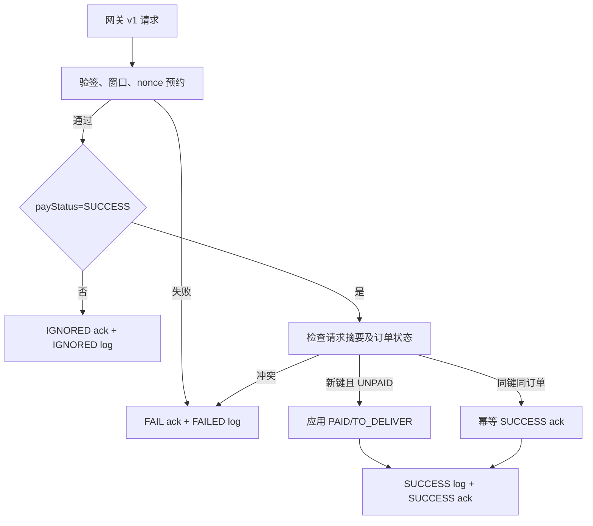
### Current development flow {#pay-001-dev}
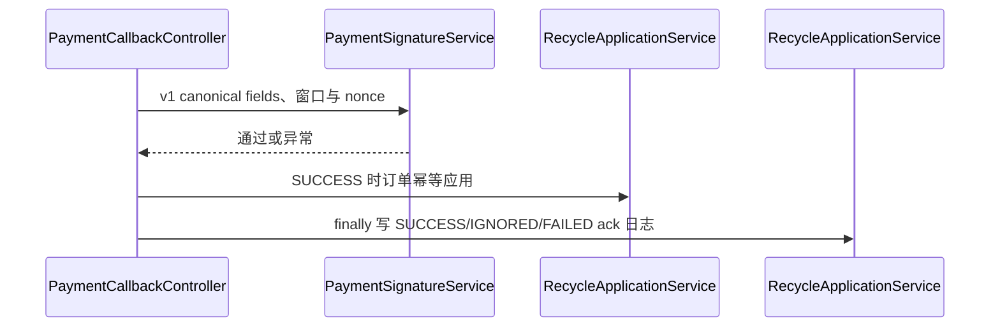
### Target architecture flow
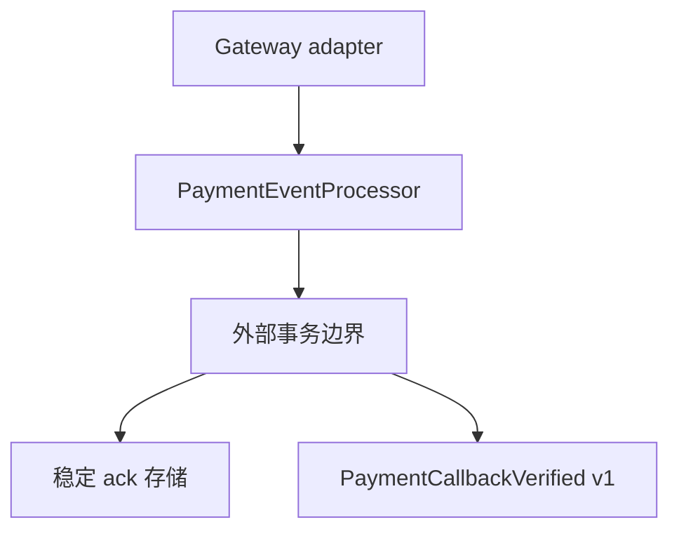
### Gaps
- targetPhase: 2；验签、订单更新和 ack 日志目前跨服务事务，尚无 `PaymentEventProcessor`、稳定 ack 存储或原子外部事务边界。

## PAY-002 商城签名支付

已认证用户提交 orderNo、idempotencyKey、timestamp、nonce、signature。当前端点同样采用共同 v1 签名契约；验签成功后按相同请求摘要和订单状态规则应用支付，返回 ApiResponse。计划测试（Phase 2）：`PaymentUseCaseWebTest#documentsPaymentUseCase`。

### Requirement flow {#pay-002}
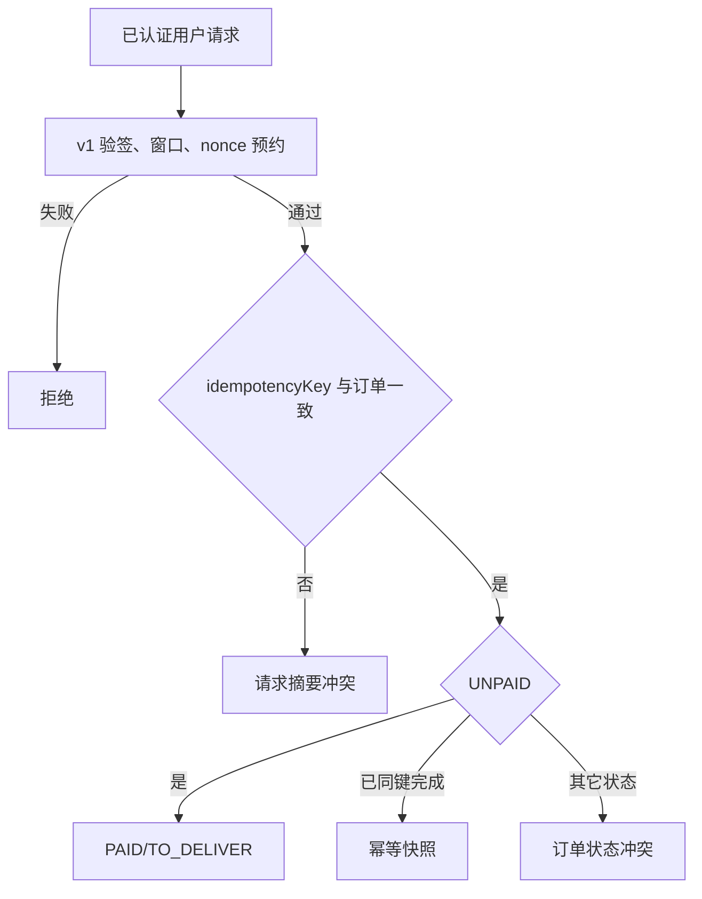
### Current development flow {#pay-002-dev}
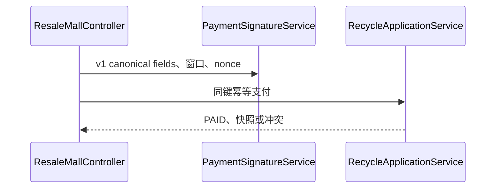
### Target architecture flow
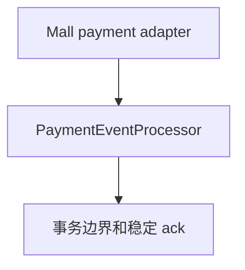
### Gaps
- targetPhase: 2；当前商城支付直接调用验签与订单服务，尚无支付命令处理器、事件发布或稳定确认记录。

## PAY-101 回调日志分页

ADMIN 可按 page/size/callbackStatus 倒序读取回调日志；page 最小 0、size 截断为 1..200。该查询不会重新验签、预约 nonce、改变请求摘要、订单状态或重放状态。计划测试（Phase 2）：`PaymentUseCaseWebTest#documentsPaymentUseCase`。

### Requirement flow {#pay-101}
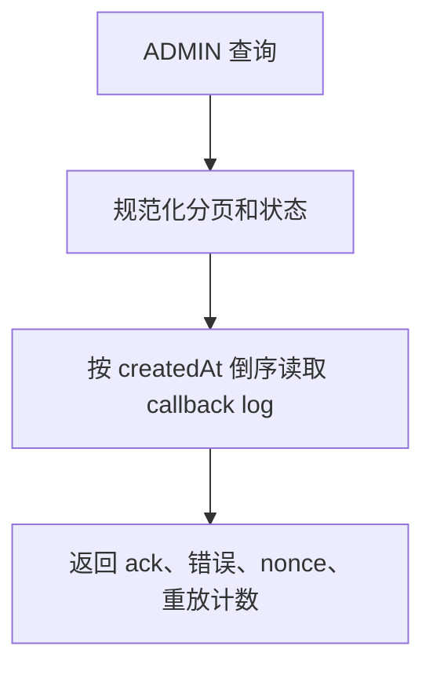
### Current development flow {#pay-101-dev}
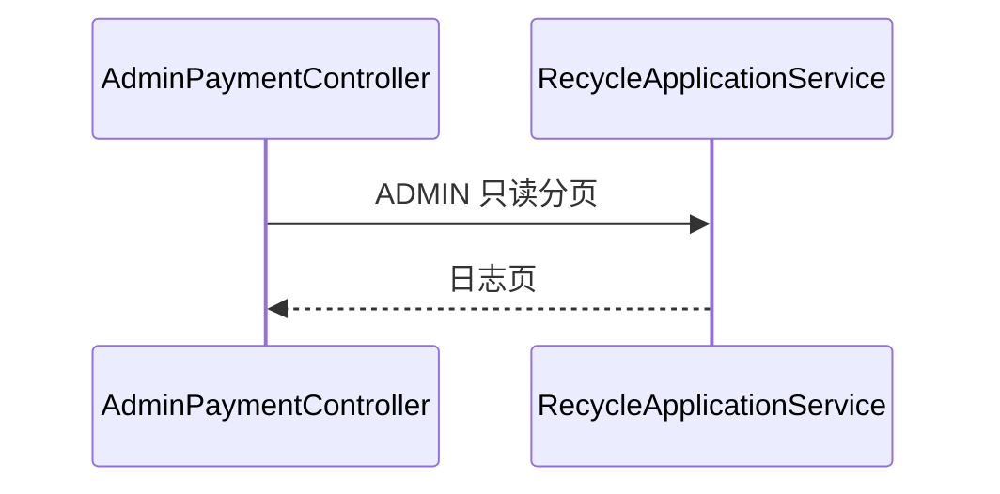
### Target architecture flow
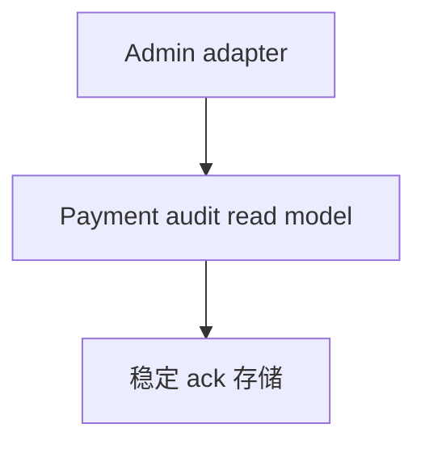
### Gaps
- targetPhase: 2；当前直接读取日志表，没有可独立演进的支付审计读模型。

## PAY-102 同步重放回调

ADMIN 按 callbackLogId 重放。存在日志时，当前实现直接按 orderNo 查订单；UNPAID 应用 PAID/TO_DELIVER，已支付视为幂等成功，随后更新 callback log 为 REPLAY_SUCCESS。异常更新 REPLAY_FAILED 后抛出；它不重新验签、不预约 nonce，也不重新比较签名。计划测试（Phase 2）：`PaymentUseCaseWebTest#documentsPaymentUseCase`。

### Requirement flow {#pay-102}
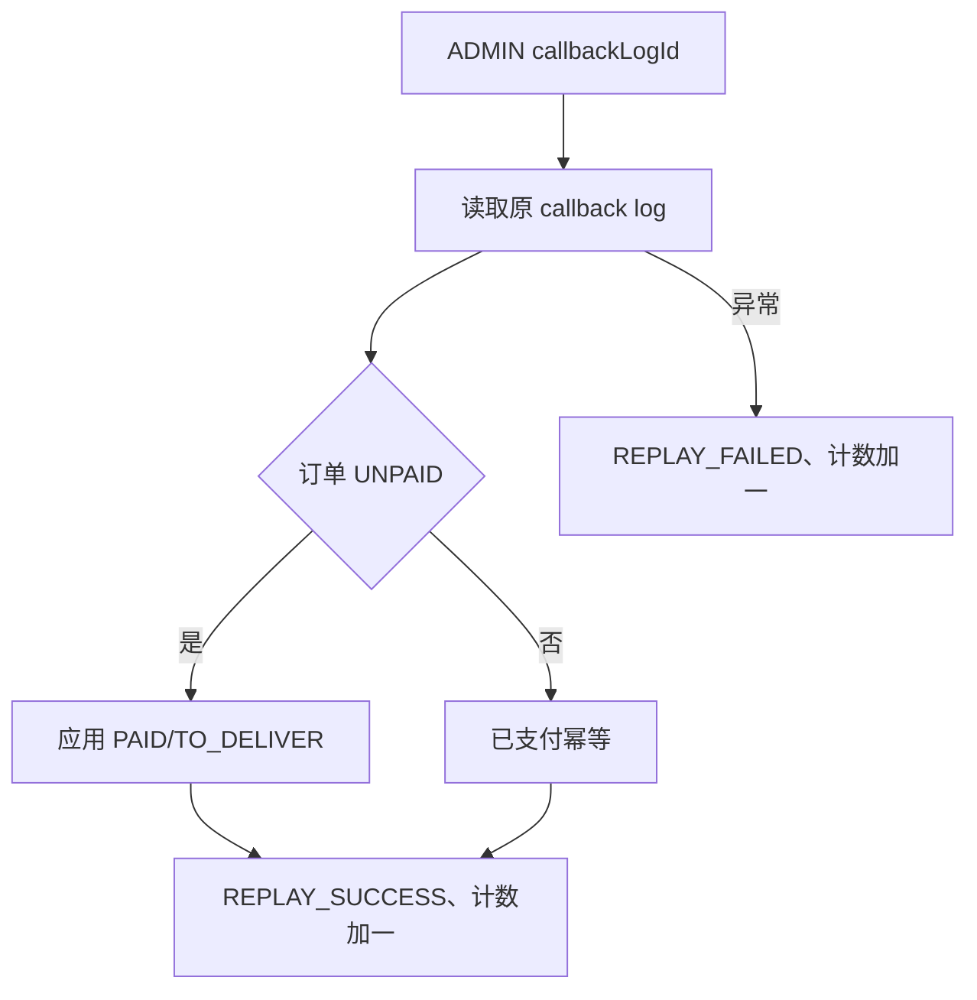
### Current development flow {#pay-102-dev}
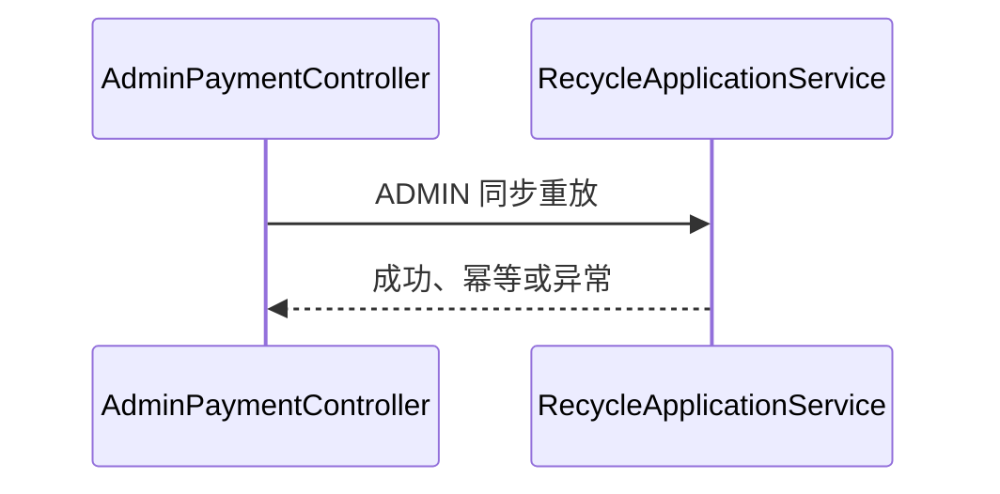
### Target architecture flow
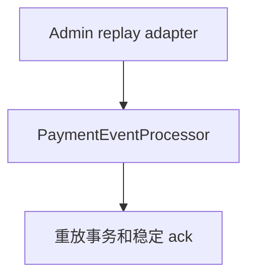
### Gaps
- targetPhase: 2；当前重放绕过验签并直接改订单/日志，缺少统一事件处理器及可审计的边界。

## PAY-103 入队重放任务

ADMIN 为 callbackLogId 创建 PENDING 重放任务；不存在日志失败。已有 PENDING/PROCESSING 的同日志任务直接复用，避免队列重复；新任务 retryCount 为 0、nextRetryAt 为当前时间。计划测试（Phase 2）：`PaymentUseCaseWebTest#documentsPaymentUseCase`。

### Requirement flow {#pay-103}
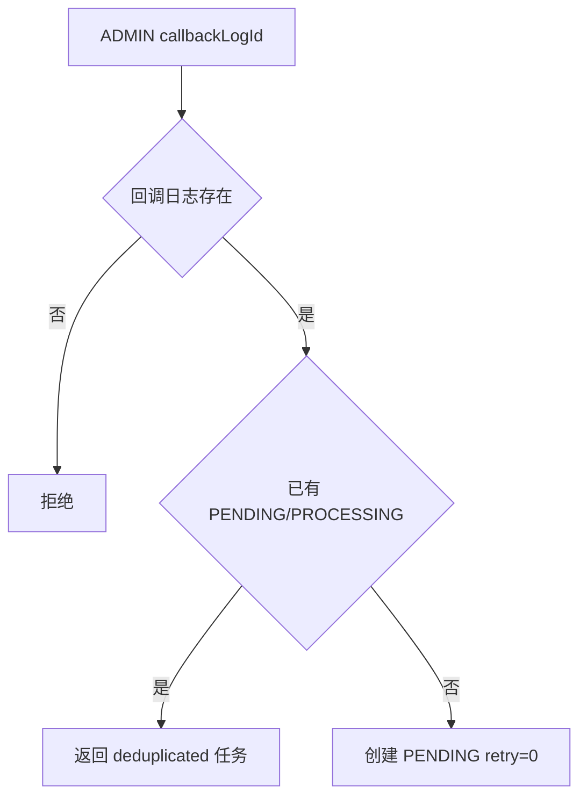
### Current development flow {#pay-103-dev}
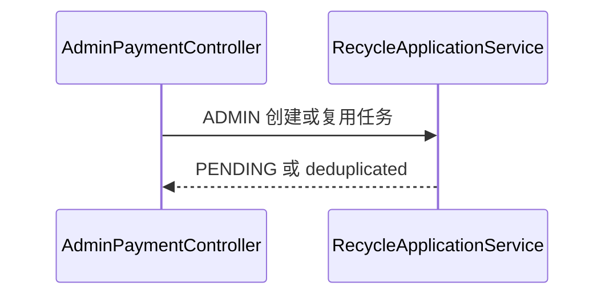
### Target architecture flow
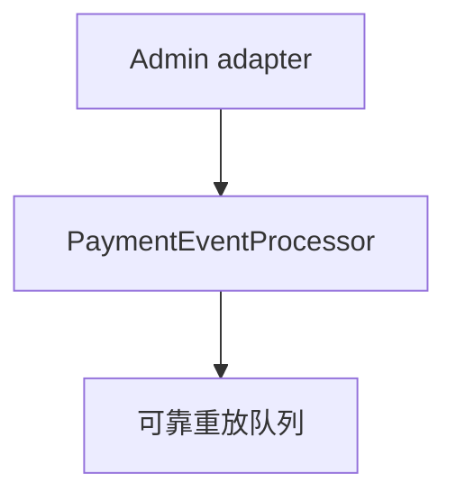
### Gaps
- targetPhase: 2；当前任务与 callback log 在本地表中直接协调，尚无 outbox 或统一事件消费边界。

## PAY-104 手工消费重放队列

ADMIN 提交 maxCount（截断 1..200），消费到期 PENDING 任务。每项先 PROCESSING，再同步重放；成功为 SUCCESS；失败未到上限退回 PENDING 并指数退避，达到上限为 DEAD。计划测试（Phase 2）：`PaymentUseCaseWebTest#documentsPaymentUseCase`。

### Requirement flow {#pay-104}
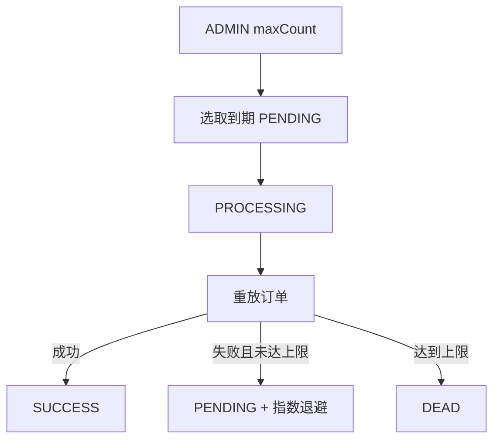
### Current development flow {#pay-104-dev}
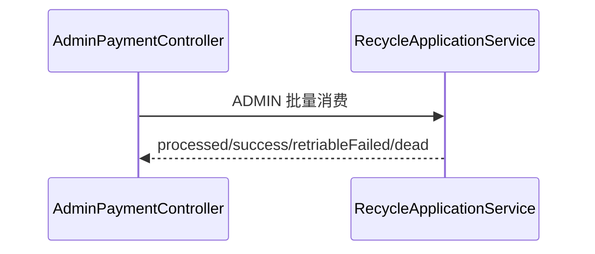
### Target architecture flow
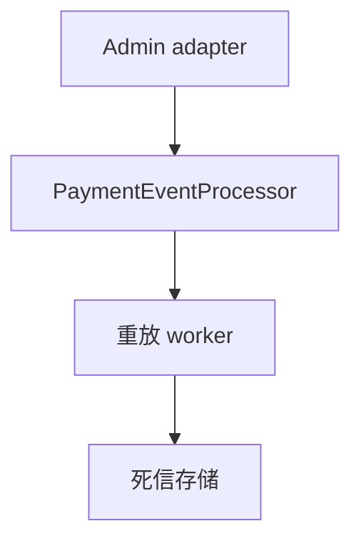
### Gaps
- targetPhase: 2；HTTP 请求直接消费并转 DEAD，没有独立 worker、可靠死信事件或稳定 ack。

## PAY-105 重放任务分页

ADMIN 按 page/size/status 正序读取任务；分页规范化为 page≥0、size 1..200，只读展示 PENDING/PROCESSING/SUCCESS/DEAD、retryCount、lastError 与 nextRetryAt，不改变重放状态。计划测试（Phase 2）：`PaymentUseCaseWebTest#documentsPaymentUseCase`。

### Requirement flow {#pay-105}
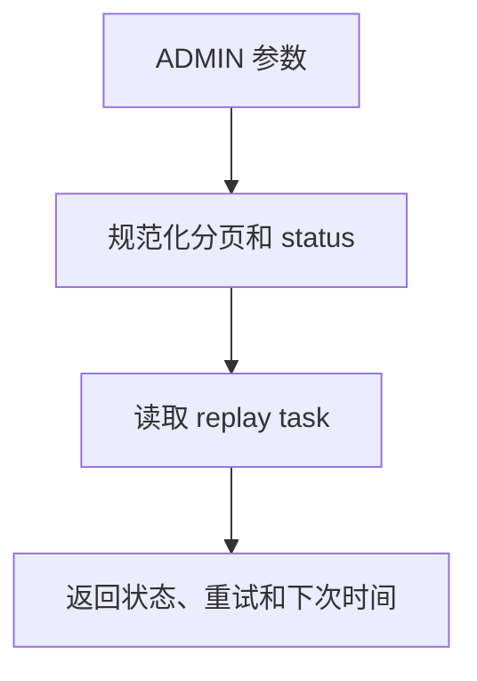
### Current development flow {#pay-105-dev}
```mermaid
sequenceDiagram
  participant C as AdminPaymentController#pageReplayTasks
  participant A as RecycleApplicationService#pageReplayTasks
  C->>A: ADMIN 只读分页
  A-->>C: 重放任务页
```
### Target architecture flow
```mermaid
flowchart TD
  C[Admin adapter] --> R[重放读模型] --> D[死信观察视图]
```
### Gaps
- targetPhase: 2；当前状态直接来自任务表，没有队列读模型或事件投影。

## PAY-106 重放队列汇总

ADMIN 读取 PENDING、PROCESSING、SUCCESS、DEAD 计数和到期可消费 PENDING 数；这是 READ_COMMITTED 只读快照，不消费任务、不改变 retry/dead-letter。计划测试（Phase 2）：`PaymentUseCaseWebTest#documentsPaymentUseCase`。

### Requirement flow {#pay-106}
```mermaid
flowchart TD
  A[ADMIN] --> C[按状态计数]
  C --> R[返回 readyToConsume 和各状态]
```
### Current development flow {#pay-106-dev}
```mermaid
sequenceDiagram
  participant C as AdminPaymentController#replayTaskSummary
  participant A as RecycleApplicationService#replayTaskSummary
  C->>A: ADMIN 只读汇总
  A-->>C: 状态计数
```
### Target architecture flow
```mermaid
flowchart TD
  C[Admin adapter] --> Q[重放指标投影]
```
### Gaps
- targetPhase: 2；目前同步聚合表数据，没有面向告警的独立投影。

## PAY-107 查询审计动作字典

ADMIN 可携带 X-Trace-Id 与 lang（仅 en-US，否则 zh-CN），读取 health/diagnosis/cleanup 查询审计动作字典。缺失 traceId 生成 `req-` UUID；该外部查询本身记录 QUERY 审计，不改变任务、nonce 或订单。计划测试（Phase 2）：`PaymentUseCaseWebTest#documentsPaymentUseCase`。

### Requirement flow {#pay-107}
```mermaid
flowchart TD
  A[ADMIN trace/lang] --> N[归一 requestId 与语言]
  N --> D[构造查询审计动作字典]
  D --> L[记录外部查询审计]
  L --> R[返回字典]
```
### Current development flow {#pay-107-dev}
```mermaid
sequenceDiagram
  participant C as AdminPaymentController#replayQueryAuditActions
  participant A as RecycleApplicationService#replayQueryAuditActions
  C->>A: ADMIN 查询字典
  A-->>C: 字典和 requestId
```
### Target architecture flow
```mermaid
flowchart TD
  C[Admin adapter] --> Q[支付运营查询服务] --> A[审计事件]
```
### Gaps
- targetPhase: 2；当前查询审计与字典构造耦合在重放服务，缺少稳定运营事件边界。

## PAY-108 重放队列健康检查

ADMIN 以可选 X-Trace-Id 读取队列健康。它计算 pending/dead/最老 pending 年龄及近期 cleanup 慢告警，超过配置阈值为 WARN；外部请求写健康 QUERY 审计，内部诊断调用不会写该审计。计划测试（Phase 2）：`PaymentUseCaseWebTest#documentsPaymentUseCase`。

### Requirement flow {#pay-108}
```mermaid
flowchart TD
  A[ADMIN trace] --> M[汇总队列和 cleanup 指标]
  M --> T{超过 pending/dead/年龄阈值}
  T -->|是| W[WARN + alerts]
  T -->|否| O[OK]
  W --> L[写外部查询审计]
  O --> L
```
### Current development flow {#pay-108-dev}
```mermaid
sequenceDiagram
  participant C as AdminPaymentController#replayTaskHealth
  participant A as RecycleApplicationService#replayTaskHealth
  C->>A: ADMIN 健康查询
  A-->>C: OK/WARN 指标与告警
```
### Target architecture flow
```mermaid
flowchart TD
  C[Admin adapter] --> H[支付健康投影] --> A[告警事件]
```
### Gaps
- targetPhase: 2；当前健康计算是请求内查询，尚无异步指标投影或事件化告警。

## PAY-109 重放诊断

ADMIN 组合 health 和 cleanup 性能检查，给出按优先级排序的消费、重投 DEAD、失败回调检查或清理建议，并写诊断 QUERY 审计。诊断只提出动作；它本身不改变任务状态。计划测试（Phase 2）：`PaymentUseCaseWebTest#documentsPaymentUseCase`。

### Requirement flow {#pay-109}
```mermaid
flowchart TD
  A[ADMIN trace] --> H[计算 health]
  H --> C[计算 cleanup 性能]
  C --> D[生成按优先级建议]
  D --> L[记录诊断查询审计]
  L --> R[OK/WARN 诊断]
```
### Current development flow {#pay-109-dev}
```mermaid
sequenceDiagram
  participant C as AdminPaymentController#replayTaskDiagnosis
  participant A as RecycleApplicationService#replayTaskDiagnosis
  C->>A: ADMIN 诊断
  A-->>C: 建议和状态
```
### Target architecture flow
```mermaid
flowchart TD
  C[Admin adapter] --> D[支付诊断投影] --> E[运营建议事件]
```
### Gaps
- targetPhase: 2；当前诊断在事务内同步组合，推荐与实际执行没有事件关联。

## PAY-110 幂等清理性能验收

ADMIN 读取最近 cleanup 审计：观察窗口内有运行、最后 duration 未超过阈值且无近期 WARN 才为 PASS，否则 WARN；外部请求写性能检查 QUERY 审计，不实际删除记录。计划测试（Phase 2）：`PaymentUseCaseWebTest#documentsPaymentUseCase`。

### Requirement flow {#pay-110}
```mermaid
flowchart TD
  A[ADMIN trace] --> Q[读取最近 cleanup 审计]
  Q --> V{运行/时长/WARN 均合格}
  V -->|是| P[PASS]
  V -->|否| W[WARN + 建议]
  P --> L[记录外部查询审计]
  W --> L
```
### Current development flow {#pay-110-dev}
```mermaid
sequenceDiagram
  participant C as AdminPaymentController#replayCleanupPerformanceCheck
  participant A as RecycleApplicationService#replayCleanupPerformanceCheck
  C->>A: ADMIN 性能验收
  A-->>C: PASS/WARN
```
### Target architecture flow
```mermaid
flowchart TD
  C[Admin adapter] --> P[清理性能投影] --> A[告警事件]
```
### Gaps
- targetPhase: 2；性能验收依赖解析审计文本，没有结构化清理运行记录。

## PAY-111 自动处理重放任务

ADMIN 提交 allowRequeueDead、消费/重投上限和可选 operator/traceId。traceId 有效窗口内命中缓存返回同一响应并标识 `idempotentReplay=true`；否则先诊断，再消费 ready PENDING，可选批量将 DEAD 转 PENDING，记录操作审计并存响应。消费仍遵循 PENDING/PROCESSING/SUCCESS、退避与 DEAD 分支。计划测试（Phase 2）：`PaymentUseCaseWebTest#documentsPaymentUseCase`。

### Requirement flow {#pay-111}
```mermaid
flowchart TD
  A[ADMIN traceId] --> I{有效幂等记录}
  I -->|是| R[返回缓存响应]
  I -->|否| D[诊断队列]
  D --> C[消费 ready PENDING]
  C --> X{允许重投 DEAD}
  X -->|是| Q[DEAD 转 PENDING]
  X -->|否| H[跳过]
  Q --> S[审计并保存 trace 响应]
  H --> S
```
### Current development flow {#pay-111-dev}
```mermaid
sequenceDiagram
  participant C as AdminPaymentController#replayTaskAutoHandle
  participant A as RecycleApplicationService#replayTaskAutoHandle
  C->>A: ADMIN、operator、traceId
  A-->>C: 缓存响应或已执行动作
```
### Target architecture flow
```mermaid
flowchart TD
  C[Admin adapter] --> P[PaymentEventProcessor] --> W[重放 worker]
  P --> S[稳定响应/ack 存储]
```
### Gaps
- targetPhase: 2；当前幂等记录、诊断和队列消费同处一事务，缺少跨节点并发协调、稳定 ack 及事件边界。

## PAY-112 自动处理幂等记录分页

ADMIN 按 page/size、traceId 包含条件和创建时间范围读取 auto-handle 幂等记录；page≥0、size 1..200，按 createdAt 倒序，只读且不续期记录。计划测试（Phase 2）：`PaymentUseCaseWebTest#documentsPaymentUseCase`。

### Requirement flow {#pay-112}
```mermaid
flowchart TD
  A[ADMIN 筛选] --> N[规范化分页]
  N --> Q[按 trace/time 读取记录]
  Q --> R[返回创建和过期时间]
```
### Current development flow {#pay-112-dev}
```mermaid
sequenceDiagram
  participant C as AdminPaymentController#pageReplayAutoHandleIdempotencyRecords
  participant A as RecycleApplicationService#pageReplayAutoHandleIdempotencyRecords
  C->>A: ADMIN 只读筛选
  A-->>C: 幂等记录页
```
### Target architecture flow
```mermaid
flowchart TD
  C[Admin adapter] --> R[幂等响应读模型]
```
### Gaps
- targetPhase: 2；当前读取实体表，尚无响应审计读模型。

## PAY-113 自动处理幂等记录详情

ADMIN 必须给出非空 traceId；存在记录则返回响应 JSON、expireAt 和以当前时钟计算的 expired，缺失记录失败。读取不改变缓存、任务或订单。计划测试（Phase 2）：`PaymentUseCaseWebTest#documentsPaymentUseCase`。

### Requirement flow {#pay-113}
```mermaid
flowchart TD
  A[ADMIN traceId] --> V{非空且记录存在}
  V -->|否| E[拒绝]
  V -->|是| R[返回响应与 expired]
```
### Current development flow {#pay-113-dev}
```mermaid
sequenceDiagram
  participant C as AdminPaymentController#getReplayAutoHandleIdempotencyDetail
  participant A as RecycleApplicationService#getReplayAutoHandleIdempotencyDetail
  C->>A: ADMIN 只读详情
  A-->>C: 响应快照或错误
```
### Target architecture flow
```mermaid
flowchart TD
  C[Admin adapter] --> R[稳定 auto-handle ack 存储]
```
### Gaps
- targetPhase: 2；当前保存的是内部响应 JSON，尚未定义稳定响应契约或保留策略。

## PAY-114 按 traceId 删除幂等记录

ADMIN 提交非空 traceId，删除匹配的 auto-handle 幂等记录并返回 deleted 数；缺失键失败。删除不回滚已执行的消费或死信重投。计划测试（Phase 2）：`PaymentUseCaseWebTest#documentsPaymentUseCase`。

### Requirement flow {#pay-114}
```mermaid
flowchart TD
  A[ADMIN traceId] --> V{非空}
  V -->|否| E[拒绝]
  V -->|是| D[删除缓存记录]
  D --> R[返回 deleted]
```
### Current development flow {#pay-114-dev}
```mermaid
sequenceDiagram
  participant C as AdminPaymentController#deleteReplayAutoHandleIdempotencyByTraceId
  participant A as RecycleApplicationService#deleteReplayAutoHandleIdempotencyByTraceId
  C->>A: ADMIN 删除 trace 缓存
  A-->>C: deleted
```
### Target architecture flow
```mermaid
flowchart TD
  C[Admin adapter] --> P[ack 保留策略] --> S[稳定 ack 存储]
```
### Gaps
- targetPhase: 2；当前管理员可直接删内部幂等记录，无保留审计或稳定确认策略。

## PAY-115 按创建时间批量删除幂等记录

ADMIN 提交 beforeTime；空时间失败，非空则删除早于该时间的 auto-handle 幂等记录并返回计数。不会改变 replay task、nonce 或订单状态。计划测试（Phase 2）：`PaymentUseCaseWebTest#documentsPaymentUseCase`。

### Requirement flow {#pay-115}
```mermaid
flowchart TD
  A[ADMIN beforeTime] --> V{非空}
  V -->|否| E[拒绝]
  V -->|是| D[删除早期记录]
  D --> R[deleted]
```
### Current development flow {#pay-115-dev}
```mermaid
sequenceDiagram
  participant C as AdminPaymentController#batchDeleteReplayAutoHandleIdempotencyBefore
  participant A as RecycleApplicationService#batchDeleteReplayAutoHandleIdempotencyBefore
  C->>A: ADMIN 批量删除
  A-->>C: deleted
```
### Target architecture flow
```mermaid
flowchart TD
  C[Admin adapter] --> P[ack 保留策略] --> S[稳定 ack 存储]
```
### Gaps
- targetPhase: 2；没有以业务保留期或审计授权约束的批量删除边界。

## PAY-116 手工清理幂等记录

ADMIN 提交 retainDays，空时默认 7、实际最小为 1。方法用 JVM 内 ReentrantLock 避免同进程重入；占用时返回 skipped。持锁时删除已过期及历史记录，写 cleanup 审计，耗时超阈值再写 WARN 审计。计划测试（Phase 2）：`PaymentUseCaseWebTest#documentsPaymentUseCase`。

### Requirement flow {#pay-116}
```mermaid
flowchart TD
  A[ADMIN retainDays] --> N[默认 7、最小 1]
  N --> L{获得本机锁}
  L -->|否| S[skipped]
  L -->|是| D[删 expireAt 与历史记录]
  D --> W[写 cleanup/WARN 审计]
  W --> R[统计与 duration]
```
### Current development flow {#pay-116-dev}
```mermaid
sequenceDiagram
  participant C as AdminPaymentController#cleanupReplayAutoHandleIdempotencyRecords
  participant A as RecycleApplicationService#cleanupReplayAutoHandleIdempotencyRecords
  C->>A: ADMIN 清理
  A-->>C: skipped 或删除统计
```
### Target architecture flow
```mermaid
flowchart TD
  C[Admin adapter] --> P[分布式保留任务] --> S[稳定 ack 存储]
```
### Gaps
- targetPhase: 2；锁只保护单 JVM，当前删除/审计没有分布式执行记录与保留策略端口。

## PAY-117 单个死信重投

ADMIN 提交 taskId；任务必须为 DEAD 或 FAILED，否则拒绝。若同 callbackLog 已有另一 PENDING/PROCESSING 则复用；否则清空 lastError，将该任务置 PENDING 并立即可消费，保留 retryCount。计划测试（Phase 2）：`PaymentUseCaseWebTest#documentsPaymentUseCase`。

### Requirement flow {#pay-117}
```mermaid
flowchart TD
  A[ADMIN taskId] --> V{DEAD 或 FAILED}
  V -->|否| E[拒绝]
  V -->|是| D{同日志活跃任务}
  D -->|是| R[deduplicated]
  D -->|否| P[PENDING、清 error、立即可消费]
```
### Current development flow {#pay-117-dev}
```mermaid
sequenceDiagram
  participant C as AdminPaymentController#requeueTask
  participant A as RecycleApplicationService#requeueReplayTask
  C->>A: ADMIN 单任务重投
  A-->>C: PENDING 或 deduplicated
```
### Target architecture flow
```mermaid
flowchart TD
  C[Admin adapter] --> P[PaymentEventProcessor] --> Q[可靠队列]
```
### Gaps
- targetPhase: 2；当前重投直接改任务表，未发布死信恢复事件或建立并发领取协议。

## PAY-118 批量死信重投

ADMIN 提交 maxCount（截断 1..200）；按创建时间取 DEAD，逐个清 lastError、置 PENDING、nextRetryAt 为当前时间。批量重投不会立即消费；后续消费者仍遵循重试和 DEAD 分支。计划测试（Phase 2）：`PaymentUseCaseWebTest#documentsPaymentUseCase`。

### Requirement flow {#pay-118}
```mermaid
flowchart TD
  A[ADMIN maxCount] --> N[限制 1..200]
  N --> Q[取最早 DEAD]
  Q --> P[逐个置 PENDING、清 error]
  P --> R[返回 requeued]
```
### Current development flow {#pay-118-dev}
```mermaid
sequenceDiagram
  participant C as AdminPaymentController#batchRequeueDeadTasks
  participant A as RecycleApplicationService#batchRequeueDeadTasks
  C->>A: ADMIN 批量死信重投
  A-->>C: requested/requeued
```
### Target architecture flow
```mermaid
flowchart TD
  C[Admin adapter] --> P[PaymentEventProcessor] --> Q[可靠重投队列]
```
### Gaps
- targetPhase: 2；当前批量更新没有逐项审计、事件发布或竞争消费者协调。

## PAY-S001 nonce 清理调度器

fixed-delay 使用 `payment.callback.nonce-cleanup-fixed-delay-ms`（默认 300000ms），删除 `expireAt < now` 的 nonce。它只清理历史预约，不更改订单、callback log 或 replay task；方法异常由调度基础设施处理，当前没有捕获、重试或死信。计划测试（Phase 2）：`PaymentSchedulerTest#documentsPaymentScheduler`。

### Requirement flow {#pay-s001}
```mermaid
flowchart TD
  S[fixed-delay] --> D[删除过期 nonce]
  D --> N[等待下一轮]
  D -->|异常| F[本轮失败；无重试/死信]
```
### Current development flow {#pay-s001-dev}
```mermaid
sequenceDiagram
  participant S as PaymentNonceCleanupScheduler#cleanupExpiredNonces
  participant V as PaymentSignatureService#cleanupExpiredNonces
  S->>V: fixed-delay 清理 nonce
```
### Target architecture flow
```mermaid
flowchart TD
  S[Scheduler adapter] --> P[PaymentEventProcessor] --> R[nonce 保留任务记录]
```
### Gaps
- targetPhase: 2；当前清理没有执行记录、失败重试或与稳定 ack/回调生命周期统一的保留策略。

## PAY-S002 重放任务消费调度器

fixed-delay 使用 `payment.callback.replay-consume-fixed-delay-ms`（默认 30000ms），batch size 默认 20。它调用与 PAY-104 相同的消费逻辑：PENDING→PROCESSING→SUCCESS，异常按退避回 PENDING 或达上限转 DEAD；调度方法自身无 catch，异常不额外死信。计划测试（Phase 2）：`PaymentSchedulerTest#documentsPaymentScheduler`。

### Requirement flow {#pay-s002}
```mermaid
flowchart TD
  S[fixed-delay batch] --> Q[到期 PENDING]
  Q --> P[PROCESSING]
  P -->|成功| O[SUCCESS]
  P -->|可重试失败| R[PENDING + 退避]
  P -->|达到上限| D[DEAD]
```
### Current development flow {#pay-s002-dev}
```mermaid
sequenceDiagram
  participant S as PaymentReplayTaskScheduler#consumeReplayTasks
  participant A as RecycleApplicationService#consumeReplayTasks
  S->>A: fixed-delay、配置 batch size
```
### Target architecture flow
```mermaid
flowchart TD
  S[Scheduler adapter] --> P[PaymentEventProcessor] --> W[隔离重放 worker] --> D[死信事件]
```
### Gaps
- targetPhase: 2；目前 scheduler 与 HTTP 共用同步消费，缺少租约、可靠死信投递和独立执行记录。

## PAY-S003 自动处理幂等记录清理调度器

fixed-delay 使用 `payment.callback.replay-auto-handle-idempotency-cleanup-fixed-delay-ms`（默认 3600000ms），retainDays 默认 7；调用同 PAY-116 清理，获得本机锁后删除过期和历史响应、记录耗时/WARN。计划测试（Phase 2）：`PaymentSchedulerTest#documentsPaymentScheduler`。

### Requirement flow {#pay-s003}
```mermaid
flowchart TD
  S[fixed-delay retainDays] --> L{本机锁}
  L -->|否| K[skipped]
  L -->|是| D[删除过期和历史响应]
  D --> A[记录清理/WARN 审计]
```
### Current development flow {#pay-s003-dev}
```mermaid
sequenceDiagram
  participant S as PaymentReplayAutoHandleIdempotencyCleanupScheduler#cleanupAutoHandleIdempotencyRecords
  participant A as RecycleApplicationService#cleanupReplayAutoHandleIdempotencyRecords
  S->>A: fixed-delay、retainDays
```
### Target architecture flow
```mermaid
flowchart TD
  S[Scheduler adapter] --> P[PaymentEventProcessor] --> R[分布式保留任务]
```
### Gaps
- targetPhase: 2；当前仅 JVM 锁，尚无分布式清理协调、稳定 ack 保留策略或失败告警事件。

## PAY-E001 PaymentCallbackVerified v1

目标事件表示 v1 签名、时间窗口和 nonce 均已通过；应携带版本、订单号、幂等键请求摘要、nonce、验证时刻与 callback log/ack 引用。当前没有该事件类或发布路径；现有回调路径只完成验签和同步响应。计划测试（Phase 2）：`PaymentEventContractTest#documentsPaymentEvent`。

### Requirement flow {#pay-e001}
```mermaid
flowchart TD
  V[v1 验签通过] --> N[nonce 已预约]
  N --> A[稳定 ack 记录]
  A --> E[PaymentCallbackVerified v1]
```
### Current development flow {#pay-e001-dev}
```mermaid
sequenceDiagram
  participant C as PaymentCallbackController#paymentCallback
  participant S as PaymentSignatureService#verifyOrThrow
  C->>S: v1 验签、窗口、nonce
  Note over C,S: 当前没有 PaymentCallbackVerified 发布
```
### Target architecture flow
```mermaid
flowchart TD
  P[PaymentEventProcessor] --> T[外部事务边界] --> E[PaymentCallbackVerified v1]
```
### Gaps
- targetPhase: 2；没有支付事件类型、outbox、发布器或稳定 ack 到事件的原子关联。

## PAY-E002 PaymentApplied v1

目标事件表示通过请求摘要冲突和订单状态检查后，订单已由 UNPAID 应用为 PAID/TO_DELIVER；同键重放应能关联原结果而不重复产生业务事实。当前没有该事件发布。计划测试（Phase 2）：`PaymentEventContractTest#documentsPaymentEvent`。

### Requirement flow {#pay-e002}
```mermaid
flowchart TD
  K[请求摘要同订单] --> O{UNPAID}
  O -->|是| A[PAID/TO_DELIVER]
  A --> E[PaymentApplied v1]
  O -->|同键完成| I[关联原事实]
  O -->|冲突| R[PaymentRejected]
```
### Current development flow {#pay-e002-dev}
```mermaid
sequenceDiagram
  participant A as RecycleApplicationService#markResaleOrderPaidWithIdempotency
  Note over A: 当前返回订单结果；没有 PaymentApplied 发布
```
### Target architecture flow
```mermaid
flowchart TD
  P[PaymentEventProcessor] --> T[订单与 outbox 事务] --> E[PaymentApplied v1]
```
### Gaps
- targetPhase: 2；当前订单更新和幂等记录没有版本化支付事实或 outbox 原子性。

## PAY-E003 PaymentRejected v1

目标事件表示验签、nonce 重放、时间窗口、请求摘要冲突或订单状态冲突造成的拒绝；不得泄露 callback secret/signature 原文，且应关联稳定 ack。当前没有该事件发布。计划测试（Phase 2）：`PaymentEventContractTest#documentsPaymentEvent`。

### Requirement flow {#pay-e003}
```mermaid
flowchart TD
  V[验签/nonce/窗口] -->|失败| E[PaymentRejected v1]
  V -->|通过| K[请求摘要和订单状态]
  K -->|冲突| E
  E --> A[稳定失败 ack]
```
### Current development flow {#pay-e003-dev}
```mermaid
sequenceDiagram
  participant C as PaymentCallbackController#paymentCallback
  participant S as PaymentSignatureService#verifyOrThrow
  C->>S: 失败时返回 FAIL ack
  Note over C,S: 当前没有 PaymentRejected 发布
```
### Target architecture flow
```mermaid
flowchart TD
  P[PaymentEventProcessor] --> A[稳定失败 ack] --> E[PaymentRejected v1]
```
### Gaps
- targetPhase: 2；失败只写 callback log/响应，尚无脱敏拒绝事件与可靠投递。

## PAY-E004 PaymentReplayDeadLettered v1

目标事件表示重放失败达到 retry 上限并由 PENDING/PROCESSING 转 DEAD；应包含 task/callback-log 引用、retryCount、错误分类、下一步人工重投信息和版本。当前没有该事件发布。计划测试（Phase 2）：`PaymentEventContractTest#documentsPaymentEvent`。

### Requirement flow {#pay-e004}
```mermaid
flowchart TD
  P[重放 PROCESSING] --> F[失败]
  F --> R{retryCount 达上限}
  R -->|否| B[PENDING + 退避]
  R -->|是| D[DEAD]
  D --> E[PaymentReplayDeadLettered v1]
```
### Current development flow {#pay-e004-dev}
```mermaid
sequenceDiagram
  participant A as RecycleApplicationService#consumeReplayTasks
  Note over A: 达到上限仅置 DEAD；没有事件发布
```
### Target architecture flow
```mermaid
flowchart TD
  P[PaymentEventProcessor] --> D[死信存储] --> E[PaymentReplayDeadLettered v1]
```
### Gaps
- targetPhase: 2；DEAD 只是任务表状态，尚无版本化死信事件、可靠投递和稳定人工处置 ack。
