# 回收、估值、物流与积分需求流

本文件覆盖 Phase 4 的 4 个 Recycle HTTP 契约和 5 个公开事件契约。当前实现中的第三方图片审核、SN 解析和物流调用发生在 `@RecycleTransactional` 的事务内；这是当前事实，不是目标设计。所有积分金额、回收次数、估值规则版本和公开事件均应由服务端确定并可审计。当前没有已实现的 Recycle 用例或事件契约测试；下文每节单列 **计划测试（Phase 4）**。

## REC-001 创建回收订单

客户提交 SN、图片和磨损分数以创建回收申请。目标系统先在事务外完成有界的图片审核与 SN 解析，再由服务端取得可信回收次数、选择可追溯的估值规则，并在一个短事务中写产品、订单、物流委托、幂等积分流水和账户积分。客户端提交的 `recycleCount` 不能成为积分依据；响应只能返回服务端计算的估值和积分。图片审核拒绝、SN 无法解析、估值不存在、物流不可用和幂等冲突均返回类型化业务失败，不以提供方异常文本作为契约。实现测试：无；计划测试（Phase 4）：`RecycleUseCaseWebTest#createsRecycleOrderWithServerDerivedValuationAndPoints`。

### Requirement flow {#rec-001}
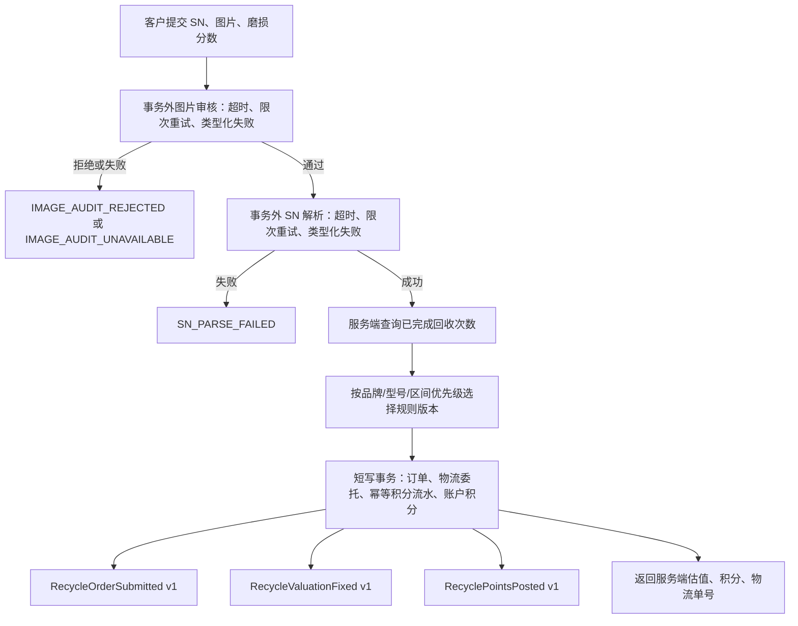

### Current development flow {#rec-001-dev}
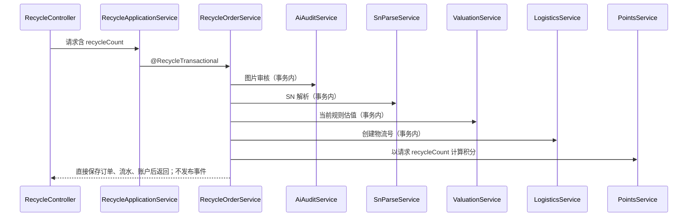

### Target architecture flow
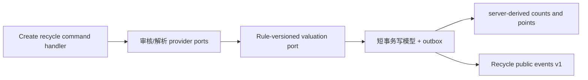

### Gaps
- targetPhase: 4；当前所有外部调用都在 `RecycleOrderService#createRecycleOrder` 的 30 秒写事务内，未设置提供方超时、重试预算或稳定的类型化错误。
- targetPhase: 4；当前积分直接使用请求 `recycleCount`，SN 为演示解析，估值结果未保留规则版本和确定性并列规则选择依据。
- targetPhase: 4；当前积分流水无业务幂等键，未用同一原子写模型保证流水、账户余额和事件 outbox；没有发布任何 Recycle 事件。

## REC-002 查询回收物流状态

客户以已存在的物流单号查询最新状态。目标读写本地跟踪快照，并在事务外调用物流提供方；提供方调用必须具有连接/读取超时、有限重试和 `LOGISTICS_UNAVAILABLE`、`LOGISTICS_RESPONSE_INVALID` 等稳定错误。不能因网络等待而长期占用数据库事务。实现测试：无；计划测试（Phase 4）：`RecycleUseCaseWebTest#getsLogisticsStatusWithProviderFailureContract`。

### Requirement flow {#rec-002}
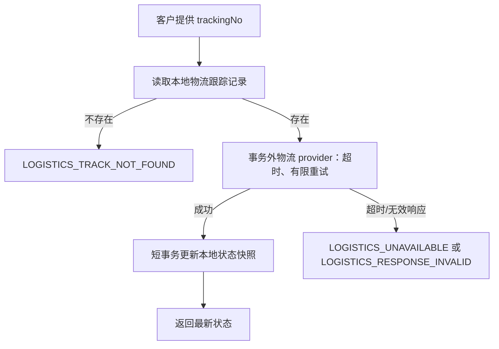

### Current development flow {#rec-002-dev}
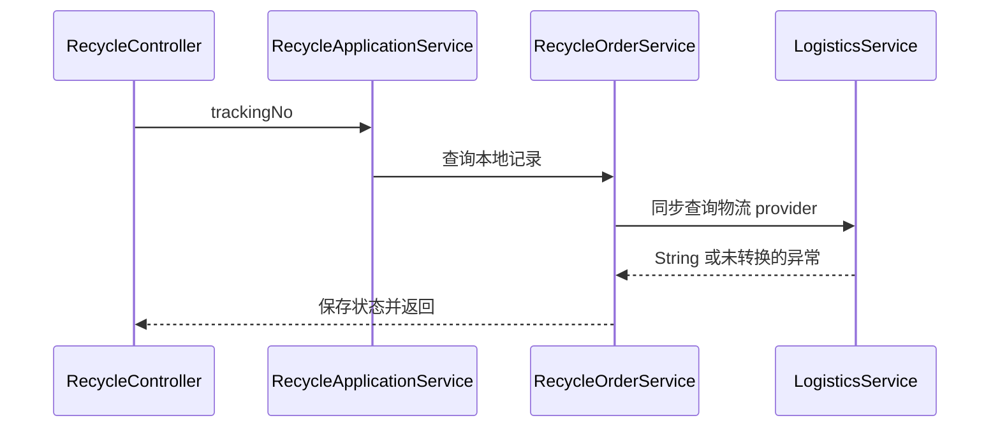

### Target architecture flow
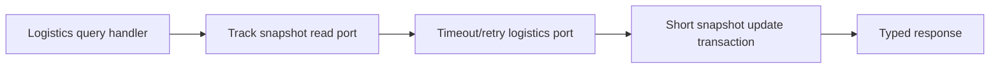

### Gaps
- targetPhase: 4；当前查询方法没有事务/外部调用边界、超时、重试或提供方错误转换；实际 provider 可抛配置或网络异常。
- targetPhase: 4；当前把字符串状态直接覆盖本地记录，未验证状态枚举、来源时间或快照版本。

## REC-101 管理员查询回收订单

管理员查询回收订单的当前状态、等级、估值和创建时间。读取不得重新计算估值、积分或调用物流；结果应只包含管理员权限允许的字段，并具备可扩展的分页、筛选和审计查询契约。实现测试：无；计划测试（Phase 4）：`RecycleUseCaseWebTest#listsRecycleOrdersForAdministrator`。

### Requirement flow {#rec-101}
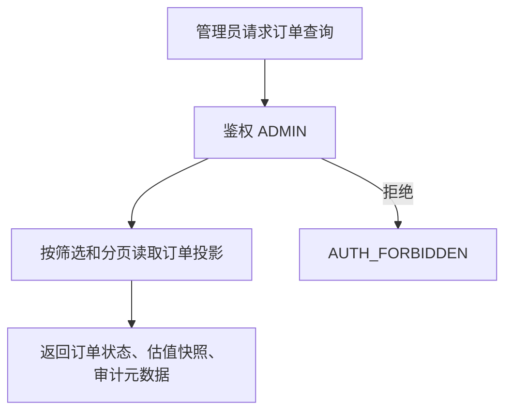

### Current development flow {#rec-101-dev}
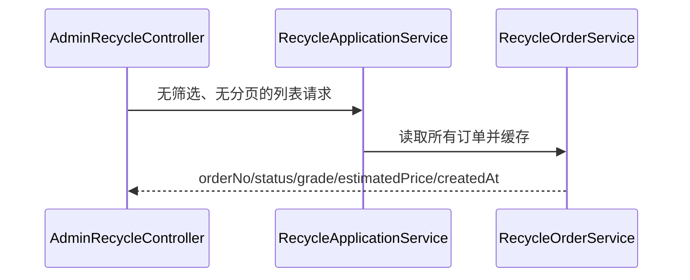

### Target architecture flow


### Gaps
- targetPhase: 4；当前只返回全量列表，没有显式管理员查询权限、分页、筛选、排序和查询审计契约。
- targetPhase: 4；当前缓存键为固定 `listAll`，状态转换驱逐的是订单号键，可能返回过期列表。

## REC-102 管理员审核与质量状态迁移

管理员只能按状态机完成 `CREATED → QUALITY_CHECKED → PRICE_REVIEWED → LISTED` 的审核动作；质量等级变更、状态、审计和应发布的审核完成事实须在一个短事务中一致提交。上架请求随后由 Recycle 事件交给 Marketplace；同一回收订单最终最多对应一个二销 listing，数据库唯一约束与幂等消费共同保证该约束。实现测试：无；计划测试（Phase 4）：`RecycleUseCaseWebTest#transitionsRecycleOrderQualityAndListingState`。

### Requirement flow {#rec-102}
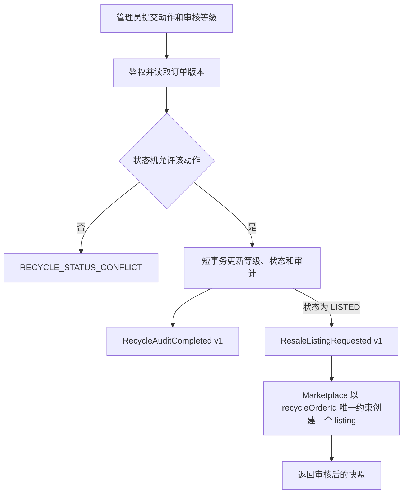

### Current development flow {#rec-102-dev}
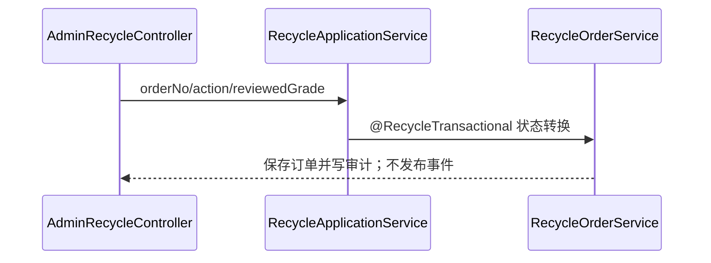

### Target architecture flow


### Gaps
- targetPhase: 4；当前接口没有可见的管理员授权、乐观版本检查或审核人/理由字段；状态、审计与事件也没有 outbox 原子边界。
- targetPhase: 4；当前 `LISTED` 仅是订单状态，未发布 listing 请求事件；尽管规范表已有 `recycle_order_id` 唯一约束，当前发布服务没有把重复键转换为幂等结果。

## REC-E001 RecycleOrderSubmitted v1

当回收订单及其必要的本地写入成功提交后，Recycle 发布 `RecycleOrderSubmitted v1`。事件携带稳定 eventId、orderNo、用户/产品引用、服务端确定的创建时间和估值快照；由 outbox 至少一次投递，消费者以 eventId 幂等。实现测试：无；计划测试（Phase 4）：`RecycleEventContractTest#publishesRecycleOrderSubmittedV1`。

### Requirement flow {#rec-e001}
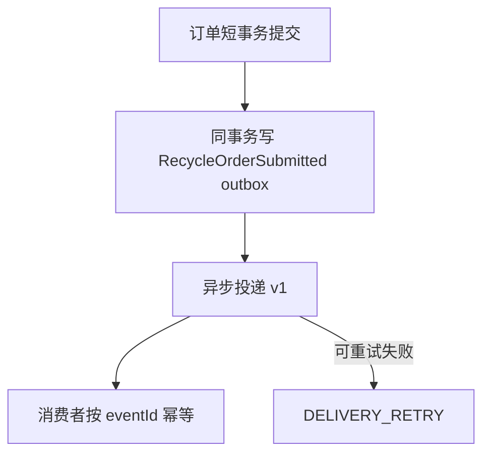

### Current development flow {#rec-e001-dev}
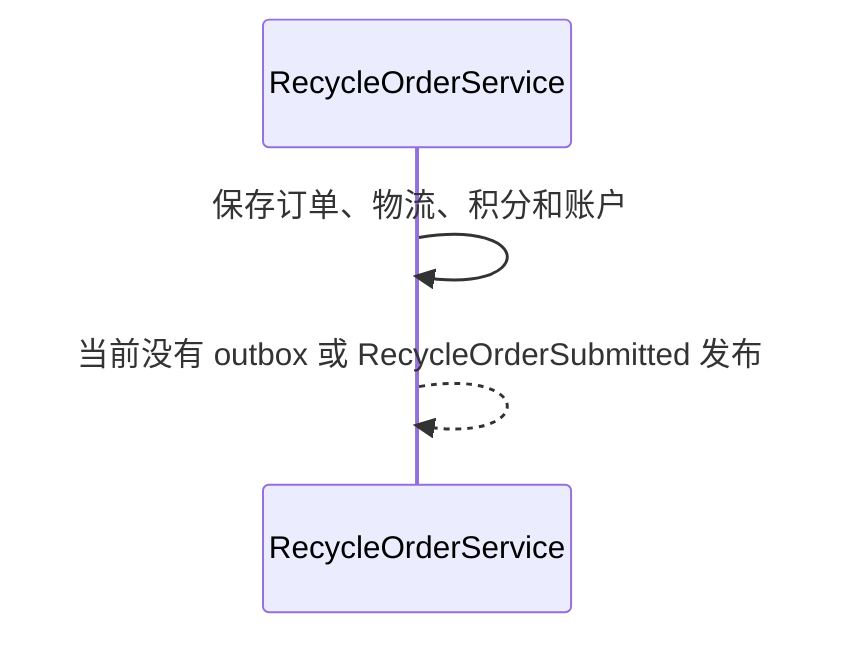

### Target architecture flow
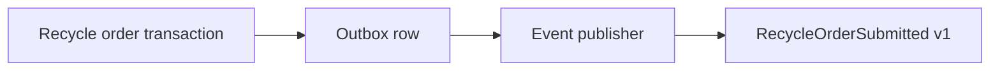

### Gaps
- targetPhase: 4；当前创建订单不会发布事件，也没有 eventId、outbox、投递重试或消费者幂等边界。

## REC-E002 RecycleAuditCompleted v1

审核状态迁移提交后，Recycle 发布 `RecycleAuditCompleted v1`，其中包含 orderNo、原/新状态、审核等级、审核人、发生时间和订单版本。该事件表示审核事实，不承担创建 listing 的 HTTP 职责。实现测试：无；计划测试（Phase 4）：`RecycleEventContractTest#publishesRecycleAuditCompletedV1`。

### Requirement flow {#rec-e002}
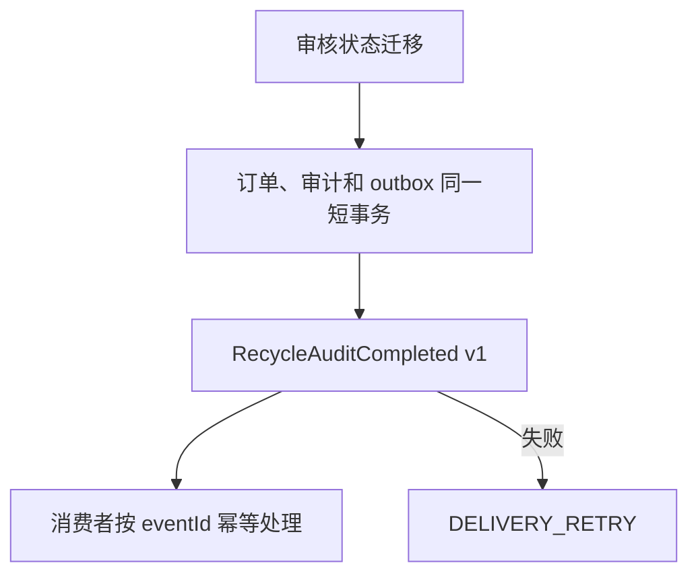

### Current development flow {#rec-e002-dev}
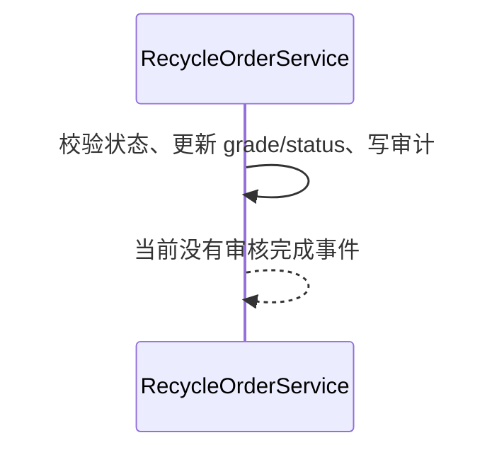

### Target architecture flow
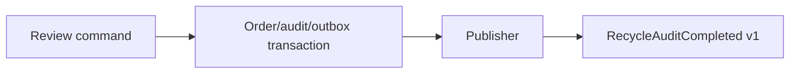

### Gaps
- targetPhase: 4；当前迁移没有订单版本、审核人或原因的事件快照，也没有与审计原子提交的 outbox。

## REC-E003 RecycleValuationFixed v1

估值确定后，Recycle 发布 `RecycleValuationFixed v1`，明确记录 orderNo、等级、金额、规则 ID/版本、匹配优先级和计算时间。优先级先采用品牌与型号的更具体匹配，再以明确的规则优先级和版本作稳定决策；不能让并列数据库返回顺序决定价格。实现测试：无；计划测试（Phase 4）：`RecycleEventContractTest#publishesRecycleValuationFixedV1`。

### Requirement flow {#rec-e003}
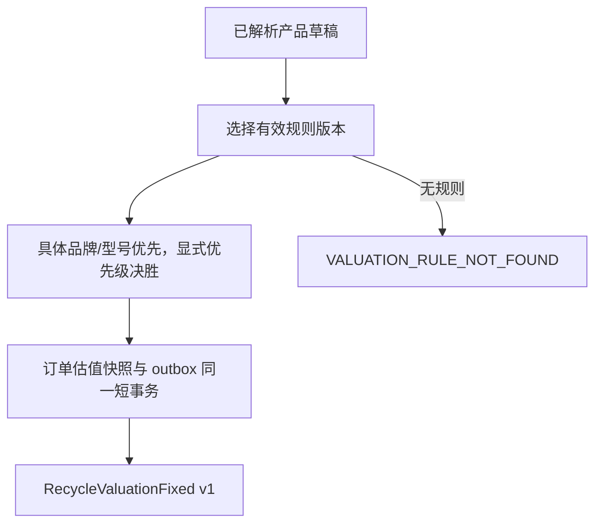

### Current development flow {#rec-e003-dev}
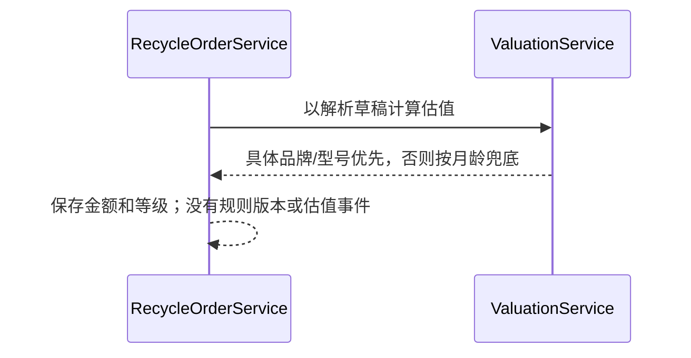

### Target architecture flow
```mermaid
flowchart LR
  H[Valuation handler] --> R[Versioned valuation rule port]
  R --> S[Deterministic valuation snapshot]
  S --> O[Order/outbox transaction]
  O --> E[RecycleValuationFixed v1]
```

### Gaps
- targetPhase: 4；当前规则只以品牌/型号通配程度排序，缺少显式优先级、有效版本、并列决胜和规则版本快照。
- targetPhase: 4；当前 SN 解析为 DEMO 数据且估值没有公开事实、错误码或 outbox。

## REC-E004 RecyclePointsPosted v1

当积分流水和账户累计积分在同一事务成功提交后，Recycle 发布 `RecyclePointsPosted v1`。积分以服务端计算的用户等级和已完成回收次数为输入；流水以 `RECYCLE_ORDER:<orderNo>` 或专用业务键唯一约束，重复投递/重试不得重复加分。事件包含 eventId、orderNo、userId、pointsDelta、余额快照、幂等键和时间。实现测试：无；计划测试（Phase 4）：`RecycleEventContractTest#publishesRecyclePointsPostedV1Idempotently`。

### Requirement flow {#rec-e004}
```mermaid
flowchart TD
  H[服务端读取用户等级和完成回收次数] --> P[计算积分]
  P --> K{orderNo 积分幂等键不存在}
  K -->|否| I[返回已有流水；不重复加分]
  K -->|是| T[同一事务插入流水、原子更新余额、写 outbox]
  T --> E[RecyclePointsPosted v1]
```

### Current development flow {#rec-e004-dev}
```mermaid
sequenceDiagram
  participant O as RecycleOrderService#createRecycleOrder
  participant P as PointsService#calculateRecyclePoints
  O->>P: 用户等级 + 请求 recycleCount
  P-->>O: 积分数
  O->>O: 保存积分流水并增加账户 points
  O-->>O: 当前没有流水幂等键或积分事件
```

### Target architecture flow
```mermaid
flowchart LR
  C[Server-derived count reader] --> P[Points policy]
  P --> W[Ledger/balance/outbox atomic transaction]
  W --> E[RecyclePointsPosted v1]
```

### Gaps
- targetPhase: 4；当前积分使用客户端 `recycleCount`，流水表没有 orderNo 唯一业务键，重试可能重复加分。
- targetPhase: 4；当前账户更新与流水没有明确的乐观并发/条件更新策略和 outbox，无法证明余额、流水和事件的原子一致性。

## REC-E005 ResaleListingRequested v1

这是 Recycle 向 Marketplace 发送的 `ResaleListingRequested v1` 事件侧契约：当审核流程把订单合法迁移到 `LISTED` 后，事件只请求 Marketplace 创建或取得该回收订单的 listing。它不是 HTTP 接口，也不复制 Marketplace 所有的发布路由。事件至少携带 eventId、recycleOrderId/orderNo、产品/等级/估值快照和订单版本；Marketplace 以 `recycle_order_id` 唯一约束和 eventId 幂等处理，确保每个回收订单只有一个 listing。实现测试：无；计划测试（Phase 4）：`RecycleEventContractTest#publishesResaleListingRequestedV1ForMarketplace`。

### Requirement flow {#rec-e005}
```mermaid
flowchart TD
  S[订单合法进入 LISTED] --> O[同事务写 ResaleListingRequested outbox]
  O --> E[发布 ResaleListingRequested v1]
  E --> M[Marketplace 幂等消费]
  M --> U{recycle_order_id 唯一}
  U -->|已有| I[返回已有 listing，不重复创建]
  U -->|没有| C[创建一个 listing]
```

### Current development flow {#rec-e005-dev}
```mermaid
sequenceDiagram
  participant O as RecycleOrderService#transitionOrder
  O->>O: LIST_ON_SHELF 仅将订单状态改为 LISTED
  O-->>O: 当前没有 Recycle 事件、outbox 或 Marketplace 消费调用
```

### Target architecture flow
```mermaid
flowchart LR
  R[Recycle review transaction] --> O[Resale listing request outbox]
  O --> E[ResaleListingRequested v1]
  E --> M[Marketplace idempotent listing consumer]
  M --> U[One listing per recycle order]
```

### Gaps
- targetPhase: 4；当前上架状态迁移不会发出 listing 请求事实，缺少 eventId、outbox、重试和 Marketplace 消费幂等性。
- targetPhase: 4；规范表虽定义 `recycle_order_id` 唯一约束，当前发布路径未将唯一冲突处理为“取得已有 listing”的幂等结果。
