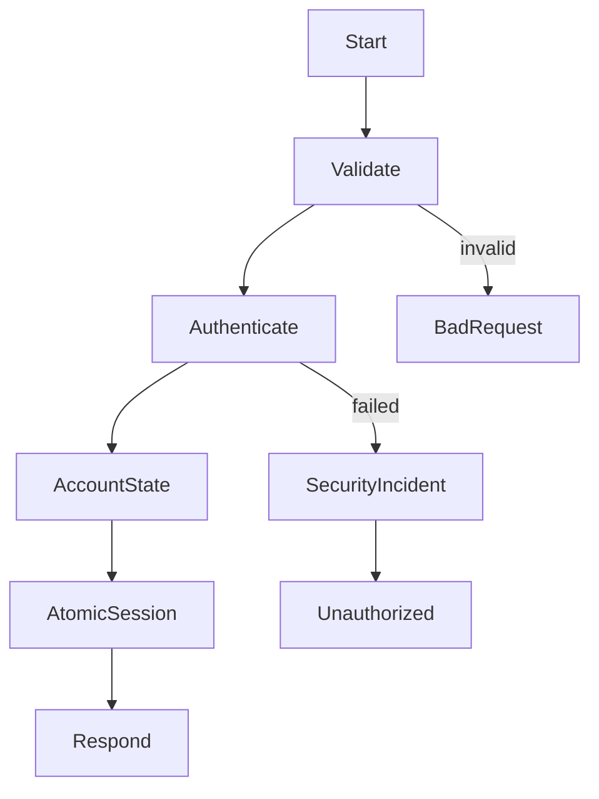
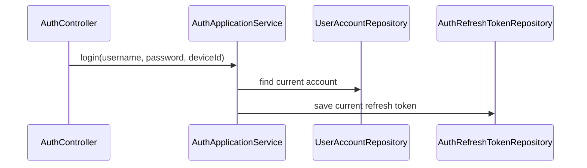
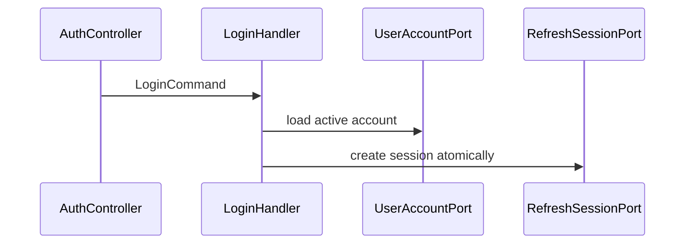

# Suno Phase 0 Engineering, Database, and Documentation Baseline Implementation Plan

> **For agentic workers:** REQUIRED SUB-SKILL: Use superpowers:subagent-driven-development (recommended) or superpowers:executing-plans to implement this plan task-by-task. Steps use checkbox (`- [ ]`) syntax for tracking.

**Goal:** Convert the broken single-module repository into a reproducible Maven modular-monolith baseline that compiles, starts from Flyway migrations, passes automated quality gates, and contains machine-verified requirement and development flow documentation for every current HTTP use case and scheduled job.

**Architecture:** The root becomes an aggregator parent. Phase 0 creates the eight approved modules while temporarily retaining the legacy implementation in `suno-bootstrap`; later phases migrate use cases behind each feature module's `api` package without another build-system rewrite. Flyway becomes the sole schema authority. A catalog-driven documentation test compares every application route and scheduler to `docs/requirements/use-cases.yaml`, then verifies that each catalog item owns a requirement section, a Mermaid requirement flow, a development call chain, and an exact test target.

**Tech Stack:** Java 25, Spring Boot 3.5.16, Maven 3.9.15 Wrapper, Spring Data JPA, Flyway, H2 in MySQL compatibility mode, MySQL 8.4 Testcontainers, JUnit 5, ArchUnit 1.4.2, JaCoCo 0.8.15, Maven Checkstyle Plugin 3.6.0, GitHub Actions.

## Global Constraints

- Preserve the current public URL paths and `ApiResponse` envelope during Phase 0; unsafe behavior is documented but fixed in later domain phases.
- Do not introduce service discovery, a message broker, distributed transactions, or separate deployments.
- Do not move legacy packages into feature modules in this phase. `suno-bootstrap` is an explicit migration shell, not the final ownership model.
- Use Flyway only. Remove `schema.sql`, `data.sql`, and runtime schema initialization after equivalent versioned migrations and dev seed data exist.
- MySQL is authoritative. H2 is a fast local profile and must run in MySQL mode with its own compatibility location only when syntax differs.
- Every code or configuration change starts with a failing automated test or executable verification check.
- Every task ends with a focused verification command and an intentional commit. Never push or open a pull request without explicit user authorization.
- Documentation is written in Chinese for product and development readers. Stable IDs, Java symbols, paths, error codes, and commands remain in English.
- `./mvnw verify` is the single local and CI entry point. Optional Docker-dependent tests may be skipped only through an explicit `-DskipITs` local flag; CI must run them.

---

## Task 1: Capture the executable red baseline

**Files:**

- Create: `docs/development/baseline.md`
- Create: `scripts/verify-repository.sh`
- Test: repository shell checks

- [ ] Run `mvn test` and record the exact compiler failures, Maven/Java versions, test count, and timestamp in `docs/development/baseline.md`.
- [ ] Add `scripts/verify-repository.sh` with `set -eu`; fail when tracked files match `(^|/)(target|build)/|\.class$`, when production configuration contains known demo secrets, or when README names a missing local script.
- [ ] Make the script executable and run it before cleanup to prove it fails on `src/main/java/com/suno/mall/dto/response/RecycleOrderVO.class` and the missing README scripts.
- [ ] Keep the failing output in the baseline document; do not weaken the checks to make the current tree pass.

The secret scan must target concrete unsafe defaults rather than arbitrary words:

```sh
if git grep -nE 'change-me|your-secret|demo-payment-secret|root123' -- \
  '*application*.yml' '*application*.yaml' '*.properties'; then
  echo 'Unsafe configuration default detected' >&2
  exit 1
fi
```

**Verify:** `./scripts/verify-repository.sh` exits non-zero and names each current violation.

**Commit:** `test: capture executable repository baseline`

## Task 2: Create the Maven modular-monolith reactor

**Files:**

- Modify: `pom.xml`
- Create: `suno-core/pom.xml`
- Create: `suno-identity/pom.xml`
- Create: `suno-recycle/pom.xml`
- Create: `suno-marketplace/pom.xml`
- Create: `suno-payment/pom.xml`
- Create: `suno-operations/pom.xml`
- Create: `suno-test-support/pom.xml`
- Create: `suno-bootstrap/pom.xml`
- Create: `suno-core/src/main/java/com/suno/mall/core/package-info.java`
- Create: `suno-identity/src/main/java/com/suno/mall/identity/package-info.java`
- Create: `suno-recycle/src/main/java/com/suno/mall/recycle/package-info.java`
- Create: `suno-marketplace/src/main/java/com/suno/mall/marketplace/package-info.java`
- Create: `suno-payment/src/main/java/com/suno/mall/payment/package-info.java`
- Create: `suno-operations/src/main/java/com/suno/mall/operations/package-info.java`
- Create: `suno-test-support/src/main/java/com/suno/mall/testsupport/package-info.java`
- Test: `suno-bootstrap/src/test/java/com/suno/mall/architecture/ReactorStructureTest.java`

- [ ] Add `ReactorStructureTest` first. It loads the root `pom.xml`, asserts packaging `pom`, and asserts the ordered module list is exactly `suno-core`, `suno-identity`, `suno-recycle`, `suno-marketplace`, `suno-payment`, `suno-operations`, `suno-test-support`, `suno-bootstrap`.
- [ ] Change the root artifact to `suno-parent`, packaging to `pom`, and centralize Java, encoding, plugin, test, and dependency versions.
- [ ] Create all child POMs. Feature modules depend only on the approved upstream modules; `suno-bootstrap` depends on all runtime modules; `suno-test-support` is consumed only in test scope.
- [ ] Add a package marker to every module so empty feature JARs are intentional and visible to architecture tests.

The parent must declare these exact module edges:

```text
suno-core        -> none
suno-identity    -> suno-core
suno-recycle     -> suno-core
suno-marketplace -> suno-core, suno-recycle
suno-payment     -> suno-core, suno-marketplace
suno-operations  -> suno-core, suno-identity, suno-recycle, suno-marketplace, suno-payment
suno-bootstrap   -> all runtime feature modules
```

Use dependency management rather than child-level version repetition:

```xml
<properties>
  <java.version>25</java.version>
  <maven.compiler.release>25</maven.compiler.release>
  <archunit.version>1.4.2</archunit.version>
  <jacoco.version>0.8.15</jacoco.version>
</properties>
```

**Verify:** `mvn -N help:effective-pom` succeeds; `mvn validate` lists all eight modules in reactor order.

**Commit:** `build: establish modular monolith reactor`

## Task 3: Move the legacy application into the bootstrap migration shell

**Files:**

- Move: `src/main/java/**` to `suno-bootstrap/src/main/java/**`
- Move: `src/main/resources/**` to `suno-bootstrap/src/main/resources/**`
- Move: meaningful `src/test/java/**` to `suno-bootstrap/src/test/java/**`
- Delete: `src/main/java/com/suno/mall/config/TransactionConfig.java`
- Delete: `src/main/java/com/suno/mall/config/TransactionalWrapper.java`
- Delete: `src/main/java/com/suno/mall/dao/RecycleRepositoryTransactional.java`
- Delete: `src/main/java/com/suno/mall/dto/response/RecycleOrderVO.class`
- Delete: `src/test/java/com/suno/mall/IntegrationTest.java`
- Delete: `src/test/java/com/suno/mall/TestRunner.java`

- [ ] Move source and resources with history-preserving `git mv` operations.
- [ ] Remove the three unused broken transaction wrappers only after `rg` proves no production caller references them. Retain `TransactionalWrapperConfiguration` because it supplies the currently injected `VersionHelper` and `AuditContext` beans.
- [ ] Delete the duplicated/stale pseudo-integration tests; preserve focused unit tests and repair their imports only as required by the move.
- [ ] Fix remaining compilation errors with the smallest behavior-preserving changes. Do not refactor business logic in this task.
- [ ] Run every surviving focused unit test after the compilation repairs. Do not add, disable, or commit a knowingly failing application-context smoke test before Flyway and its minimal startup profile exist.

**Verify:** `mvn -pl suno-bootstrap -am test` succeeds with no Java compilation errors and all surviving focused unit tests passing.

**Commit:** `refactor: isolate legacy application in bootstrap module`

## Task 4: Add the pinned Maven Wrapper and reproducible dependency baseline

**Files:**

- Create: `.mvn/wrapper/maven-wrapper.properties`
- Create: `mvnw`
- Create: `mvnw.cmd`
- Modify: `pom.xml`
- Create: `docs/architecture/decisions/0001-runtime-and-build-baseline.md`

- [ ] Generate Maven Wrapper 3.9.15 using Maven Wrapper Plugin 3.3.4 and commit the generated scripts and properties.
- [ ] Upgrade within the supported Spring Boot 3.5 line from 3.5.0 to 3.5.16; do not move to Spring Boot 4 during the modular migration.
- [ ] Pin Maven plugin versions in `pluginManagement`, including Surefire, Failsafe, JaCoCo, Checkstyle, Enforcer, and Spring Boot.
- [ ] Add Maven Enforcer rules for Maven 3.9.15+, Java 25, dependency convergence, and banned duplicate classes.
- [ ] Record the runtime decision and compatibility reasoning in ADR 0001.

Wrapper properties must resolve a checksum-verifiable binary distribution:

```properties
distributionUrl=https://repo.maven.apache.org/maven2/org/apache/maven/apache-maven/3.9.15/apache-maven-3.9.15-bin.zip
wrapperUrl=https://repo.maven.apache.org/maven2/org/apache/maven/wrapper/maven-wrapper/3.3.4/maven-wrapper-3.3.4.jar
```

**Verify:** `./mvnw --version` reports Maven 3.9.15 and Java 25; `./mvnw -q validate` succeeds.

**Commit:** `build: pin supported runtime and Maven wrapper`

## Task 5: Replace ad-hoc SQL initialization with versioned Flyway migrations

**Files:**

- Modify: `pom.xml`
- Modify: `suno-bootstrap/pom.xml`
- Delete: `suno-bootstrap/src/main/resources/schema.sql`
- Delete: `suno-bootstrap/src/main/resources/data.sql`
- Delete: `suno-bootstrap/src/main/resources/db/migration/V2__add_optimization_indexes.sql`
- Create: `suno-bootstrap/src/main/java/db/migration/V0001__Normalize_legacy_table_names.java`
- Create: `suno-identity/src/main/resources/db/migration/V1000__identity_baseline.sql`
- Create: `suno-recycle/src/main/resources/db/migration/V2000__recycle_baseline.sql`
- Create: `suno-marketplace/src/main/resources/db/migration/V3000__marketplace_baseline.sql`
- Create: `suno-payment/src/main/resources/db/migration/V4000__payment_baseline.sql`
- Create: `suno-operations/src/main/resources/db/migration/V5000__operations_baseline.sql`
- Create: `suno-bootstrap/src/main/java/db/migration/V5900__Reconcile_canonical_schema.java`
- Create: `suno-bootstrap/src/main/resources/db/dev/R__dev_seed.sql`
- Modify: `suno-bootstrap/src/main/resources/application.yml`
- Create: `suno-bootstrap/src/main/resources/application-dev.yml`
- Modify: `suno-bootstrap/src/main/resources/application-mysql.yml`
- Create: `suno-bootstrap/src/main/resources/application-staging.yml`
- Create: `suno-bootstrap/src/main/resources/application-prod.yml`
- Create: `suno-bootstrap/src/test/resources/application-test.yml`
- Create: `suno-bootstrap/src/test/resources/db/legacy/legacy-schema.sql`
- Test: `suno-bootstrap/src/test/java/com/suno/mall/persistence/FlywayH2MigrationTest.java`
- Test: `suno-bootstrap/src/test/java/com/suno/mall/persistence/LegacySchemaCompatibilityIT.java`
- Test: `suno-bootstrap/src/test/java/com/suno/mall/persistence/FlywayLocationProfileTest.java`
- Test: `suno-bootstrap/src/test/java/com/suno/mall/RecycleMallApplicationSmokeTest.java`

- [ ] Keep Spring Boot 3.5.16 dependency management as the sole version authority for Flyway and Testcontainers. Add unversioned `org.flywaydb:flyway-core` at compile scope for the Java migration, `org.flywaydb:flyway-mysql` at runtime scope, H2 at runtime scope, and Spring Boot Test/Testcontainers JUnit/MySQL dependencies explicitly at test scope; do not repeat managed versions in child POMs.
- [ ] Write `FlywayH2MigrationTest` first. Start an empty H2 database in MySQL mode, run `classpath:db/migration`, assert no failed migration, and assert every JPA `@Table` name exists.
- [ ] Implement `V0001__Normalize_legacy_table_names.java` as the platform migration. It inspects `DatabaseMetaData`, detects H2 versus MySQL, and processes only this fixed old-to-canonical allowlist: `user_account`, `auth_refresh_token`, `auth_token_blacklist`, `auth_export_task`, `product`, `valuation_rule`, `recycle_order`, `logistics_track`, `points_ledger`, `resale_listing`, `resale_favorite`, `resale_order`, `resale_review`, `resale_review_vote`, `resale_review_report`, `operation_audit_log`, `payment_idempotency`, `payment_replay_auto_handle_idempotency`, `payment_nonce`, `payment_callback_log`, and `payment_replay_task`, each renamed to the same name prefixed with `suno_`.
- [ ] For each allowlisted pair, if only the legacy table exists, rename it in place with dialect-correct quoted H2/MySQL SQL. If both names exist and the legacy table contains rows, abort with an actionable message naming both tables and requiring operator resolution; never merge, copy, truncate, drop, or overwrite silently. If neither exists, only the canonical table exists, or both exist with an empty legacy table, leave data unchanged and let feature migrations create/complete canonical schema as applicable.
- [ ] Convert the current schema to canonical `suno_*` names and split it by the approved version ranges. SQL migrations `V1000`, `V2000`, `V3000`, `V4000`, and `V5000` use `CREATE TABLE IF NOT EXISTS` to create missing canonical tables; they do not attempt non-portable conditional `ALTER` statements. Include every currently mapped entity, not only tables present in the old `schema.sql`.
- [ ] Implement bootstrap-owned `V5900__Reconcile_canonical_schema.java` after the five feature baselines. It owns a fixed schema manifest for every canonical table, column definition, index, unique constraint, and foreign key, inspects `DatabaseMetaData`, detects H2/MySQL, and emits dialect-correct DDL only for missing objects. Before making an existing legacy column non-null, run that column's explicit manifest backfill expression, assert the remaining null count is zero, and only then add the constraint; if no approved backfill exists, abort with the table/column and operator action. Existing same-name objects are validated, never recreated blindly.
- [ ] Preserve and rename useful indexes. Add the already-approved one-to-one listing constraint and existing favorite/review/vote/report uniqueness constraints without yet redesigning application behavior.
- [ ] Add `LegacySchemaCompatibilityIT` and the test-only `db/legacy/legacy-schema.sql` fixture. The H2 and Testcontainers MySQL cases start from a populated unprefixed schema, run the full migrations, and assert row counts, representative primary/foreign keys and business fields, canonical table names, and absence of old names. A separate collision case creates populated old and canonical names and asserts the actionable migration failure. The MySQL case may skip only when Docker is unavailable; it is mandatory in Docker-backed `verify`.
- [ ] Put `{noop}` demo users and sample records only in the idempotent `db/dev/R__dev_seed.sql`; use existence guards/upserts that are safe on repeated dev starts.
- [ ] Configure common `application.yml`, `application-mysql.yml`, `application-staging.yml`, and production `application-prod.yml` with only `classpath:db/migration`. Only `application-dev.yml` appends `classpath:db/dev`. `FlywayLocationProfileTest` must load each profile and prove non-dev profiles cannot resolve the dev seed location while dev can.
- [ ] Configure JPA `ddl-auto=validate`, SQL initialization `never`, Flyway enabled, UTC JDBC behavior, and H2 `MODE=MySQL;DATABASE_TO_LOWER=TRUE`.
- [ ] Add `RecycleMallApplicationSmokeTest` now that Flyway and `application-test.yml` provide a minimal H2 startup profile; it uses `@SpringBootTest` plus `@ActiveProfiles("test")`, obtains `RecycleMallApplication` from the context, and asserts that the application bean exists.

The application configuration must have a single schema owner:

```yaml
spring:
  sql:
    init:
      mode: never
  jpa:
    hibernate:
      ddl-auto: validate
  flyway:
    enabled: true
    locations: classpath:db/migration
```

`application-dev.yml` is the sole overlay that sets `spring.flyway.locations: classpath:db/migration,classpath:db/dev`.

**Verify:** `./mvnw -pl suno-bootstrap -am -Dsurefire.failIfNoSpecifiedTests=false -Dtest=FlywayH2MigrationTest,FlywayLocationProfileTest,RecycleMallApplicationSmokeTest,LegacySchemaCompatibilityIT test` passes from empty and populated H2 databases; with Docker available the same command also passes its MySQL compatibility cases.

**Commit:** `db: establish canonical Flyway schema baseline`

## Task 6: Add authoritative MySQL migration integration tests

**Files:**

- Modify: `suno-test-support/pom.xml`
- Create: `suno-test-support/src/main/java/com/suno/mall/testsupport/MySqlContainerSupport.java`
- Create: `suno-bootstrap/src/test/java/com/suno/mall/persistence/FlywayMySqlIT.java`
- Create: `suno-bootstrap/src/test/java/com/suno/mall/persistence/SchemaInvariantIT.java`
- Modify: `suno-bootstrap/pom.xml`

- [ ] Add Testcontainers MySQL and JUnit dependencies to `suno-test-support`; expose a reusable MySQL 8.4 container definition with UTF-8 and UTC settings.
- [ ] Configure Failsafe to execute `*IT` classes during `integration-test` and `verify`.
- [ ] Add `FlywayMySqlIT` to migrate a clean database, validate Hibernate mappings, and prove a second migration run is idempotent.
- [ ] Run the MySQL branches of `LegacySchemaCompatibilityIT` from Task 5 under Failsafe so populated legacy migration, key-field preservation, and collision rejection are authoritative Docker-backed checks rather than optional local evidence.
- [ ] Parameterize `SchemaInvariantIT` over a clean database and the populated legacy fixture. For each path, migrate through `V5900`, query `information_schema` for every manifest column, unique key, foreign key, version column, and index, and assert both paths converge to the same canonical schema signature. Run the same convergence assertion on H2 metadata and authoritative MySQL.
- [ ] Make container reuse opt-in locally and disabled in CI so tests never depend on prior state.

Reusable support contract:

```java
public interface MySqlContainerSupport {
    MySQLContainer<?> MYSQL = new MySQLContainer<>("mysql:8.4")
            .withDatabaseName("suno")
            .withUsername("suno")
            .withPassword("suno-test")
            .withCommand("--default-time-zone=+00:00", "--character-set-server=utf8mb4");
}
```

**Verify:** `./mvnw -pl suno-bootstrap -am verify -DskipUnitTests` passes with Docker available and leaves Flyway validation clean.

**Commit:** `test: verify schema against MySQL`

## Task 7: Enforce module boundaries and repository hygiene

**Files:**

- Create: `config/checkstyle/checkstyle.xml`
- Modify: `pom.xml`
- Create: `suno-bootstrap/src/test/java/com/suno/mall/architecture/ModuleBoundaryTest.java`
- Create: `suno-bootstrap/src/test/java/com/suno/mall/architecture/LayerBoundaryTest.java`
- Modify: `scripts/verify-repository.sh`
- Create: `.gitignore`

- [ ] Add failing ArchUnit tests for the approved Maven/package dependency graph and for domain isolation from Spring, JPA, Jackson, and Servlet APIs.
- [ ] Add a transitional rule: legacy `com.suno.mall` code may remain in bootstrap, but no feature module may import a bootstrap class.
- [ ] Add Controller-to-Repository and cross-module-internal dependency rules that will apply as packages migrate.
- [ ] Enable compiler `-Xlint` checks, Checkstyle, JaCoCo report generation, and repository hygiene during `verify`.
- [ ] Set the initial coverage gate only for new `com.suno.mall.*.domain` and `application` packages; raise it to the approved 80% line/70% branch gate as code migrates. Do not fabricate coverage by counting generated DTOs.
- [ ] Run the repository script again and remove every violation found in Task 1.

Core ArchUnit assertion:

```java
noClasses()
    .that().resideInAnyPackage("com.suno.mall..domain..")
    .should().dependOnClassesThat()
    .resideInAnyPackage("org.springframework..", "jakarta.persistence..", "com.fasterxml.jackson..");
```

**Verify:** `./mvnw -DskipITs verify` and `./scripts/verify-repository.sh` both pass.

**Commit:** `build: enforce architecture and hygiene gates`

## Task 8: Define the machine-readable use-case contract

**Files:**

- Create: `docs/requirements/README.md`
- Create: `docs/requirements/use-cases.yaml`
- Create: `docs/requirements/use-case.schema.json`
- Create: `docs/requirements/public-events.yaml`
- Create: `suno-bootstrap/src/test/java/com/suno/mall/documentation/DocumentationCatalogCoverageTest.java`
- Create: `scripts/verify-docs.sh`
- Create: `scripts/verify-requirement-flows.sh`
- Create: `scripts/test/verify-requirement-flows-test.sh`
- Create: `scripts/test/fixtures/requirement-flows/**`

- [ ] Define the catalog schema first. Required fields are `id`, `kind`, `owner`, `actor`, `trigger`, `permission`, `invariants`, `errors`, `requirementDoc`, `requirementAnchor`, `developmentAnchor`, `implementationStatus`, `currentSymbols`, and `targetPhase`. `implementationStatus` is one of `implemented`, `partial`, or `absent`; `currentSymbols` is a non-empty list of Java symbols that actually exist at the end of Phase 0. HTTP entries additionally require `method` and `path`; scheduler entries require `scheduledMethod` and `scheduleProperty`.
- [ ] Replace ambiguous `tests` with optional `implementedTests` and `plannedTests`, requiring at least one non-empty list per use case. Each `implementedTests` value is exact `Class#method` and must resolve to an existing test method. Each `plannedTests` item contains exact `test: Class#method` plus integer `targetPhase`; validate its format and phase without claiming it is executable.
- [ ] Add a complete catalog before enabling its gate. `DocumentationCatalogCoverageTest` must pass in this task and validate unique IDs, all schema-required fields, the exact application HTTP route set from Spring's `RequestMappingHandlerMapping` (excluding framework and Actuator operator endpoints), the exact `@Scheduled` method set, unique route/scheduler ownership, real `currentSymbols`, strict `implementedTests`, and format/phase-only `plannedTests`. It also compares the complete `EVENT` item set exactly against `public-events.yaml` by `id`, `eventType`, `version`, and `owner`. It does not inspect requirement-document anchors or Mermaid flows yet.
- [ ] Reserve the code-to-registry contract in the schema and test: when a real event type appears, it must implement `DocumentedDomainEvent` or carry `@UseCaseId`; reflection/ArchUnit coverage discovers those types and requires an exact registered ID/type/version/owner match. Planned events may remain registry-only until their target phase, but an implemented event can never be unregistered.
- [ ] Add `scripts/verify-docs.sh` as the portable entry point. In Task 8 it invokes the passing catalog coverage test; Task 13 extends it with flow coverage and unfinished-content scans only after all requirement and handbook files exist.
- [ ] Add executable `scripts/verify-requirement-flows.sh <owner...>` for Tasks 9–12. For catalog items of the requested owner(s) that are present in the phase's requirement document, it verifies catalog membership, requirement/current-development anchors, non-empty Mermaid blocks, resolvable Phase 0 `currentSymbols`, and, whenever `implementationStatus` is not `implemented`, a target architecture flow plus explicit gaps; it rejects undocumented headings and future-only symbols in current-flow blocks. Owner completeness across the full catalog remains the Task 13 Java gate.
- [ ] Test the static checker itself with `scripts/test/verify-requirement-flows-test.sh` and committed valid/invalid fixtures covering a missing anchor, empty Mermaid, unresolved current symbol, missing target flow, and missing gaps. The fixture test must fail each invalid case for the expected diagnostic and pass the valid case before requirement documents are authored.
- [ ] Document actors, shared states, error semantics, pagination, compatibility policy, and the rule for adding a new route/task/event in `docs/requirements/README.md`.

The catalog must use this exact HTTP route ownership table; every row is unique and source ordered within its assigned decision group, and there are no inferred contiguous ranges:

| ID | Method | Path | Owner |
|---|---|---|---|
| `IDN-001` | POST | `/api/auth/login` | Identity |
| `IDN-002` | GET | `/api/auth/me` | Identity |
| `IDN-003` | GET | `/api/auth/sessions` | Identity |
| `IDN-004` | POST | `/api/auth/sessions/revoke-device` | Identity |
| `IDN-005` | POST | `/api/auth/sessions/revoke-all` | Identity |
| `IDN-006` | POST | `/api/auth/logout` | Identity |
| `IDN-007` | POST | `/api/auth/refresh` | Identity |
| `IDN-101` | GET | `/api/admin/auth/sessions` | Identity |
| `IDN-102` | POST | `/api/admin/auth/sessions/revoke-device` | Identity |
| `IDN-103` | POST | `/api/admin/auth/sessions/revoke-all` | Identity |
| `PAY-001` | POST | `/api/payment/callback` | Payment |
| `PAY-002` | POST | `/api/mall/orders/pay` | Payment |
| `PAY-101` | GET | `/api/admin/payment/callback-logs` | Payment |
| `PAY-102` | POST | `/api/admin/payment/callback-logs/replay` | Payment |
| `PAY-103` | POST | `/api/admin/payment/callback-logs/replay/enqueue` | Payment |
| `PAY-104` | POST | `/api/admin/payment/callback-logs/replay/consume` | Payment |
| `PAY-105` | GET | `/api/admin/payment/replay-tasks` | Payment |
| `PAY-106` | GET | `/api/admin/payment/replay-tasks/summary` | Payment |
| `PAY-107` | GET | `/api/admin/payment/replay-tasks/query-audit-actions` | Payment |
| `PAY-108` | GET | `/api/admin/payment/replay-tasks/health` | Payment |
| `PAY-109` | GET | `/api/admin/payment/replay-tasks/diagnosis` | Payment |
| `PAY-110` | GET | `/api/admin/payment/replay-tasks/cleanup-performance-check` | Payment |
| `PAY-111` | POST | `/api/admin/payment/replay-tasks/auto-handle` | Payment |
| `PAY-112` | GET | `/api/admin/payment/replay-tasks/auto-handle-idempotency` | Payment |
| `PAY-113` | GET | `/api/admin/payment/replay-tasks/auto-handle-idempotency/detail` | Payment |
| `PAY-114` | POST | `/api/admin/payment/replay-tasks/auto-handle-idempotency/delete` | Payment |
| `PAY-115` | POST | `/api/admin/payment/replay-tasks/auto-handle-idempotency/delete-before` | Payment |
| `PAY-116` | POST | `/api/admin/payment/replay-tasks/auto-handle-idempotency/cleanup` | Payment |
| `PAY-117` | POST | `/api/admin/payment/replay-tasks/requeue` | Payment |
| `PAY-118` | POST | `/api/admin/payment/replay-tasks/requeue/dead` | Payment |
| `REC-001` | POST | `/api/recycle/orders` | Recycle |
| `REC-002` | GET | `/api/recycle/logistics/status` | Recycle |
| `REC-101` | GET | `/api/admin/recycle/orders` | Recycle |
| `REC-102` | PATCH | `/api/admin/recycle/orders/review` | Recycle |
| `MKT-001` | GET | `/products/{id}.html` | Marketplace |
| `MKT-002` | POST | `/api/resale/listings` | Marketplace |
| `MKT-003` | GET | `/api/resale/listings` | Marketplace |
| `MKT-004` | GET | `/api/resale/listings/sold-out` | Marketplace |
| `MKT-005` | POST | `/api/resale/listings/{listingId}/reduce-stock` | Marketplace |
| `MKT-006` | POST | `/api/resale/listings/{listingId}/favorite` | Marketplace |
| `MKT-007` | DELETE | `/api/resale/listings/{listingId}/favorite` | Marketplace |
| `MKT-008` | GET | `/api/resale/listings/favorites` | Marketplace |
| `MKT-020` | GET | `/api/mall/listings` | Marketplace |
| `MKT-021` | GET | `/api/mall/orders` | Marketplace |
| `MKT-022` | GET | `/api/mall/orders/status-dictionary` | Marketplace |
| `MKT-023` | GET | `/api/mall/orders/summary` | Marketplace |
| `MKT-024` | POST | `/api/mall/orders` | Marketplace |
| `MKT-026` | POST | `/api/mall/orders/cancel` | Marketplace |
| `MKT-027` | POST | `/api/mall/orders/confirm-receipt` | Marketplace |
| `MKT-028` | GET | `/api/mall/orders/{orderNo}/track` | Marketplace |
| `MKT-029` | POST | `/api/mall/favorites/add` | Marketplace |
| `MKT-030` | POST | `/api/mall/favorites/remove` | Marketplace |
| `MKT-031` | GET | `/api/mall/favorites` | Marketplace |
| `MKT-032` | POST | `/api/mall/reviews/create` | Marketplace |
| `MKT-033` | POST | `/api/mall/reviews/append` | Marketplace |
| `MKT-034` | POST | `/api/mall/reviews/reply` | Marketplace |
| `MKT-035` | GET | `/api/mall/reviews` | Marketplace |
| `MKT-036` | POST | `/api/mall/reviews/vote-useful` | Marketplace |
| `MKT-037` | POST | `/api/mall/reviews/report` | Marketplace |
| `MKT-100` | POST | `/api/admin/recycle/listings/publish` | Marketplace |
| `MKT-101` | POST | `/api/admin/recycle/resale-orders/deliver` | Marketplace |
| `MKT-102` | POST | `/api/admin/recycle/resale-orders/refund` | Marketplace |
| `MKT-103` | POST | `/api/admin/recycle/resale-orders/auto-confirm-receipt` | Marketplace |
| `MKT-110` | GET | `/api/admin/recycle/review-reports` | Marketplace |
| `MKT-111` | GET | `/api/admin/recycle/review-reports/{reportId}` | Marketplace |
| `MKT-112` | POST | `/api/admin/recycle/review-reports/process` | Marketplace |
| `MKT-113` | POST | `/api/admin/recycle/review-reports/process-batch` | Marketplace |
| `OPS-001` | GET | `/api/admin/auth/security-events/summary` | Operations |
| `OPS-002` | GET | `/api/admin/auth/security-events/timeline` | Operations |
| `OPS-003` | GET | `/api/admin/auth/security-events/risk-users-top` | Operations |
| `OPS-004` | GET | `/api/admin/auth/security-events/export` | Operations |
| `OPS-005` | POST | `/api/admin/auth/security-events/export/tasks` | Operations |
| `OPS-006` | POST | `/api/admin/auth/security-events/export/tasks/{taskId}/retry` | Operations |
| `OPS-007` | GET | `/api/admin/auth/security-events/export/tasks/{taskId}` | Operations |
| `OPS-008` | GET | `/api/admin/auth/security-events/export/tasks/{taskId}/download` | Operations |
| `OPS-009` | GET | `/api/admin/auth/security-events/export/tasks` | Operations |
| `OPS-010` | POST | `/api/admin/auth/security-events/export/tasks/cleanup` | Operations |
| `OPS-020` | GET | `/api/admin/recycle/audit-logs` | Operations |
| `OPS-021` | GET | `/api/admin/recycle/audit-logs/page` | Operations |
| `OPS-022` | GET | `/api/admin/recycle/audit-logs/export` | Operations |
| `OPS-030` | GET | `/api/admin/recycle/review-risk/summary` | Operations |
| `OPS-031` | GET | `/api/admin/recycle/review-risk/timeline` | Operations |
| `OPS-032` | GET | `/api/admin/recycle/review-risk/top-listings` | Operations |
| `OPS-040` | GET | `/api/admin/recycle/review-strategy` | Operations |
| `OPS-041` | POST | `/api/admin/recycle/review-strategy/update` | Operations |
| `OPS-042` | GET | `/api/admin/recycle/error-codes/global` | Operations |
| `OPS-043` | GET | `/api/admin/recycle/degrade-actions/dictionary` | Operations |
| `OPS-044` | GET | `/api/admin/recycle/alert-noise-rules` | Operations |
| `OPS-045` | POST | `/api/admin/recycle/alert-noise-rules/update` | Operations |
| `OPS-046` | GET | `/api/admin/recycle/config-center/bundle` | Operations |
| `OPS-047` | GET | `/api/admin/recycle/config-center/module/{moduleName}` | Operations |
| `OPS-048` | GET | `/api/admin/recycle/config-center/modules` | Operations |
| `OPS-049` | POST | `/api/admin/recycle/config-center/module-diff` | Operations |

The scheduler ownership table is also exact:

| ID | Current scheduled method | Schedule property | Owner |
|---|---|---|---|
| `PAY-S001` | `PaymentNonceCleanupScheduler#cleanupExpiredNonces` | `payment.callback.nonce-cleanup-fixed-delay-ms` | Payment |
| `PAY-S002` | `PaymentReplayTaskScheduler#consumeReplayTasks` | `payment.callback.replay-consume-fixed-delay-ms` | Payment |
| `PAY-S003` | `PaymentReplayAutoHandleIdempotencyCleanupScheduler#cleanupAutoHandleIdempotencyRecords` | `payment.callback.replay-auto-handle-idempotency-cleanup-fixed-delay-ms` | Payment |
| `MKT-S001` | `ResaleOrderScheduler#autoCloseExpiredUnpaidOrders` | `mall.order.auto-close-fixed-delay-ms` | Marketplace |
| `MKT-S002` | `ResaleOrderScheduler#autoConfirmDeliveredOrders` | `mall.order.auto-confirm-receipt-fixed-delay-ms` | Marketplace |
| `OPS-S001` | `SecurityEventService#scheduledCleanupSecurityExportTasks` | `security.auth.export-task.cleanup-fixed-delay-ms` | Operations |

`docs/requirements/public-events.yaml` must contain exactly this initial registry; every entry uses schema version `1`:

| ID | eventType | version | Owner |
|---|---|---:|---|
| `IDN-E001` | `UserAuthenticated` | 1 | Identity |
| `IDN-E002` | `RefreshSessionRotated` | 1 | Identity |
| `IDN-E003` | `SessionRevoked` | 1 | Identity |
| `IDN-E004` | `SecurityIncidentRaised` | 1 | Identity |
| `PAY-E001` | `PaymentCallbackVerified` | 1 | Payment |
| `PAY-E002` | `PaymentApplied` | 1 | Payment |
| `PAY-E003` | `PaymentRejected` | 1 | Payment |
| `PAY-E004` | `PaymentReplayDeadLettered` | 1 | Payment |
| `REC-E001` | `RecycleOrderSubmitted` | 1 | Recycle |
| `REC-E002` | `RecycleAuditCompleted` | 1 | Recycle |
| `REC-E003` | `RecycleValuationFixed` | 1 | Recycle |
| `REC-E004` | `RecyclePointsPosted` | 1 | Recycle |
| `REC-E005` | `ResaleListingRequested` | 1 | Recycle |
| `MKT-E001` | `MarketplaceStockReserved` | 1 | Marketplace |
| `MKT-E002` | `MarketplaceOrderCreated` | 1 | Marketplace |
| `MKT-E003` | `MarketplacePaymentAccepted` | 1 | Marketplace |
| `MKT-E004` | `MarketplaceStockReleased` | 1 | Marketplace |
| `MKT-E005` | `MarketplaceFulfillmentCompleted` | 1 | Marketplace |
| `MKT-E006` | `MarketplaceReviewReported` | 1 | Marketplace |
| `OPS-E001` | `AuditRequested` | 1 | Operations |
| `OPS-E002` | `SecurityIncidentRecorded` | 1 | Operations |
| `OPS-E003` | `ExportCompleted` | 1 | Operations |
| `OPS-E004` | `ConfigurationPublished` | 1 | Operations |

Cross-module events use `-E` IDs and never duplicate an HTTP row. In particular, `POST /api/admin/recycle/listings/publish` is owned only by Marketplace as `MKT-100`; Recycle documents its side only as `REC-E005` (`listing requested`). `MKT-025` is intentionally unallocated because `/api/mall/orders/pay` is `PAY-002`.

Catalog entry shape:

```yaml
- id: IDN-001
  kind: HTTP
  owner: identity
  actor: anonymous
  method: POST
  path: /api/auth/login
  trigger: 用户提交用户名、密码和设备标识
  permission: public-explicit
  invariants: [账户必须启用, 凭据错误不得暴露账户是否存在]
  errors: [AUTH_BAD_CREDENTIALS, AUTH_ACCOUNT_DISABLED, RATE_LIMITED]
  requirementDoc: docs/requirements/identity.md
  requirementAnchor: idn-001-login
  developmentAnchor: idn-001-login-dev
  implementationStatus: partial
  currentSymbols: [AuthController#login, AuthApplicationService#login]
  targetPhase: 1
  plannedTests:
    - test: AuthControllerWebTest#loginIssuesSessionForActiveAccount
      targetPhase: 1
```

**Verify:** `./scripts/test/verify-requirement-flows-test.sh && ./scripts/verify-docs.sh` passes; `DocumentationCatalogCoverageTest` proves exact coverage of 93 HTTP routes, 6 scheduled methods, and 23 registered events.

**Commit:** `test: define executable use case documentation contract`

## Task 9: Document every Identity and security-operations flow

**Files:**

- Create: `docs/requirements/identity.md`
- Create or modify: `docs/requirements/operations.md`
- Modify: `docs/requirements/use-cases.yaml`

- [ ] Document exactly 10 Identity HTTP flows: `IDN-001..IDN-007` for login, current user, session list, device revoke, all-session revoke, logout, and refresh rotation, plus `IDN-101..IDN-103` for administrator cross-user session query, device revoke, and all-session revoke.
- [ ] Document exactly 10 security Operations HTTP flows `OPS-001..OPS-010`: summary, timeline, top-risk users, synchronous legacy export, task creation, retry, detail, download, list, and cleanup.
- [ ] Document the current security export cleanup method `SecurityEventService#scheduledCleanupSecurityExportTasks` as `OPS-S001` and the authentication/security events as `IDN-E001` through `IDN-E004`.
- [ ] For every item, include one specific requirement flow and one **current development flow** that uses only the item's Phase 0 `currentSymbols`. Show the current authorization behavior, account checks, token/session behavior, errors, audit/security recording, and actual transaction boundaries without inventing future handlers.
- [ ] When current behavior differs from the approved target, add a separately labeled target architecture flow plus an explicit gap list and `targetPhase`; future ports/handlers may appear only there.
- [ ] Put exact existing `Class#method` mappings in `implementedTests`; put exact future Identity test methods in `plannedTests` with `targetPhase: 1`. Label every planned mapping plainly in the prose.

Each section must follow this structure:

````markdown
## IDN-001 Login
<actors, preconditions, input/output, invariants, permissions, errors, test mapping>
### Requirement flow {#idn-001-login}

### Current development flow {#idn-001-login-dev}

### Target architecture flow

### Gaps
- Phase 0 still uses `AuthApplicationService` and repositories directly; `LoginHandler` and ports arrive in Phase 1.
````

**Verify:** `./scripts/verify-requirement-flows.sh identity operations && ./scripts/verify-docs.sh` exits zero and checks the Task 9 Identity/security-Operations sections without future-only symbols in current-flow blocks.

**Commit:** `docs: map identity and security operation flows`

## Task 10: Document every Payment and replay flow

**Files:**

- Create: `docs/requirements/payment.md`
- Modify: `docs/requirements/use-cases.yaml`

- [ ] Document exactly 20 Payment HTTP flows: `PAY-001` payment callback authentication/ledger/application/acknowledgment, `PAY-002` `/api/mall/orders/pay`, and `PAY-101..PAY-118` for the 18 administrator routes in the Task 8 source order.
- [ ] Document schedulers `PAY-S001` nonce cleanup, `PAY-S002` replay task consumption, and `PAY-S003` auto-handle idempotency cleanup.
- [ ] Document events `PAY-E001` callback verified, `PAY-E002` payment applied, `PAY-E003` payment rejected, and `PAY-E004` replay dead-lettered.
- [ ] Every requirement flow must show signature version, canonical signed fields, timestamp window, nonce reservation, event/request-digest conflict, order state conflict, and retry/dead-letter branches when relevant.
- [ ] Every item gets a current development flow using only Phase 0 `currentSymbols`. Because Phase 0 does not yet contain `PaymentEventProcessor`, show the actual callback/replay service paths honestly; add a separate target architecture flow and gap list showing their future convergence through `PaymentEventProcessor`, external transaction boundaries, and stable ack storage in Phase 2.
- [ ] Use `implementedTests` only for existing exact methods; record future payment tests under `plannedTests` with `targetPhase: 2` and label them planned in prose.

**Verify:** `./scripts/verify-requirement-flows.sh payment && ./scripts/verify-docs.sh` exits zero for all 27 Payment items (20 HTTP, 3 schedulers, 4 events), with no current-flow reference to `PaymentEventProcessor`.

**Commit:** `docs: map payment callback and replay flows`

## Task 11: Document every Recycle, valuation, logistics, and points flow

**Files:**

- Create: `docs/requirements/recycle.md`
- Modify: `docs/requirements/use-cases.yaml`

- [ ] Document public flows `REC-001` create recycle order and `REC-002` logistics status.
- [ ] Document administrator flows `REC-101` order search and `REC-102` review/quality transition. Do not allocate `REC-103`: the publish HTTP route is Marketplace-owned `MKT-100`.
- [ ] Document cross-module events `REC-E001` order submitted, `REC-E002` audit completed, `REC-E003` valuation fixed, `REC-E004` points posted, and `REC-E005` listing requested. `REC-E005` represents only Recycle's event side of `MKT-100`, not a duplicate HTTP entry.
- [ ] Show image audit, SN parsing, and logistics calls outside database transactions; include provider timeout, retry, and type-safe failure paths.
- [ ] Show server-derived recycle counts and points, valuation rule priority/version, ledger idempotency, atomic points updates, and the one-listing-per-recycle-order constraint.
- [ ] Every one of the 9 Recycle items (4 HTTP and 5 events) gets a requirement flow and a current development flow using Phase 0 `currentSymbols`; where the current chain violates the target, add a target architecture flow, explicit gap list, and `targetPhase: 4`. Distinguish strict `implementedTests` from plainly labeled `plannedTests`.

**Verify:** `./scripts/verify-requirement-flows.sh recycle && ./scripts/verify-docs.sh` exits zero for 4 Recycle-owned HTTP flows and 5 events exactly once, with no `REC-103` catalog or heading.

**Commit:** `docs: map recycle valuation and points flows`

## Task 12: Document every Marketplace, order, favorite, and review flow

**Files:**

- Create: `docs/requirements/marketplace.md`
- Modify: `docs/requirements/use-cases.yaml`

- [ ] Document page/listing flows `MKT-001..MKT-008`: product page plus the seven `/api/resale/listings` routes in source order.
- [ ] Document Mall flows `MKT-020`, `MKT-021..MKT-024`, and `MKT-026..MKT-037` exactly as assigned in Task 8. `MKT-025` stays unused because pay is Payment-owned `PAY-002`.
- [ ] Document `MKT-100` for administrator publish, `MKT-101..MKT-103` for deliver/refund/manual auto-confirm, and `MKT-110..MKT-113` for report list/detail/process/batch.
- [ ] Document schedulers `MKT-S001` unpaid-order close and `MKT-S002` delivered-order confirmation.
- [ ] Document events `MKT-E001` stock reserved, `MKT-E002` order created, `MKT-E003` payment accepted, `MKT-E004` stock released, `MKT-E005` fulfillment completed, and `MKT-E006` review reported.
- [ ] Every one of the 41 Marketplace items (33 HTTP, 2 schedulers, 6 events) gets a requirement flow and a current development flow using Phase 0 `currentSymbols`. Do not show `CurrentActor` in the current flow because it is not implemented at Phase 0; show it only in a separately labeled target architecture flow with an explicit Phase 3 gap list. Target flows must show resource-ownership rejection for cancel/query/review/favorite operations and administrator-only merchant replies.
- [ ] Show the order state machine and all no-regression rules, single stock release, late-payment rejection, refund idempotency, review eligibility, and database uniqueness branches.
- [ ] Use strict `implementedTests` for exact existing methods and plainly labeled `plannedTests` with `targetPhase: 3` for future coverage.

**Verify:** `./scripts/verify-requirement-flows.sh marketplace && ./scripts/verify-docs.sh` exits zero for 33 Marketplace-owned HTTP flows, 2 schedulers, and 6 events exactly once, with `MKT-025` absent and `CurrentActor` absent from current-flow blocks.

**Commit:** `docs: map marketplace order and review flows`

## Task 13: Complete operations, architecture, and developer workflow documentation

**Files:**

- Complete: `docs/requirements/operations.md`
- Create: `docs/development/workflow.md`
- Create: `docs/development/testing.md`
- Create: `docs/development/migrations.md`
- Create: `docs/architecture/modules.md`
- Create: `docs/architecture/decisions/0002-modular-monolith.md`
- Create: `docs/architecture/decisions/0003-flyway-schema-authority.md`
- Create: `docs/architecture/decisions/0004-database-outbox-and-jobs.md`
- Modify: `docs/requirements/use-cases.yaml`
- Create: `suno-bootstrap/src/test/java/com/suno/mall/documentation/DocumentationFlowCoverageTest.java`
- Modify: `scripts/verify-docs.sh`

- [ ] Document exactly 16 remaining Operations HTTP flows: `OPS-020..OPS-022` audit list/page/export, `OPS-030..OPS-032` review-risk summary/timeline/top, and `OPS-040..OPS-049` strategy read/update, global errors, degrade dictionary, alert-noise read/update, and four configuration-center routes.
- [ ] Document operations events `OPS-E001` audit requested, `OPS-E002` security incident recorded, `OPS-E003` export completed, and `OPS-E004` configuration published.
- [ ] Give each Operations item a requirement flow and Phase 0 current development flow using real `currentSymbols`; when the approved target differs, add a target architecture flow and explicit Phase 5 gap list. Use strict `implementedTests` and plainly labeled `plannedTests` with `targetPhase: 5`.
- [ ] Write `workflow.md` as the required development lifecycle: use-case ID allocation, failing test, domain design, migration, implementation, review, verify, release, rollback, and documentation update.
- [ ] Write `testing.md` with unit/application/web/persistence/concurrency/provider/E2E/architecture layers, naming rules, fixture ownership, and exact local/CI commands.
- [ ] Write `migrations.md` with version ownership, forward-only repair procedure, data backfill batching, lock/timeout review, checksum policy, rollback by compensating migration, and production verification queries.
- [ ] Write module diagrams and ADRs matching the approved design. Include allowed dependency arrows, public `api` boundary, composition root, outbox ownership, and the staged legacy migration rule.
- [ ] Add `DocumentationFlowCoverageTest` only now, after every requirement file exists. It validates requirement/current-development anchors, non-empty Mermaid blocks, resolution of every catalog `currentSymbols` entry, target architecture flow plus explicit gaps whenever `implementationStatus` is not `implemented`, strict `implementedTests`, and format/phase-only `plannedTests`. It also scans every concrete `DocumentedDomainEvent`/`@UseCaseId` event type and matches it to `public-events.yaml`. Extend `scripts/verify-docs.sh` to run both documentation tests and the unfinished-content scan.

The development lifecycle must be visually explicit:

```mermaid
flowchart LR
  UseCase["Allocate use-case ID"] --> Red["Write failing test"]
  Red --> Domain["Model invariants and ports"]
  Domain --> Migration["Add forward migration"]
  Migration --> Implement["Implement smallest vertical slice"]
  Implement --> Review["Security, concurrency, API review"]
  Review --> Verify["./mvnw verify"]
  Verify --> Docs["Update both flow diagrams"]
  Docs --> Release["Release with rollback evidence"]
```



**Verify:** `./scripts/verify-docs.sh` passes both `DocumentationCatalogCoverageTest` and `DocumentationFlowCoverageTest` for the full catalog, including the unfinished-content scan over `docs/requirements`, `docs/development`, and `docs/architecture`.

**Commit:** `docs: establish architecture and development handbook`

## Task 14: Add one-command CI and operator-facing project guidance

**Files:**

- Create: `.github/workflows/verify.yml`
- Modify: `README.md`
- Create: `docs/development/configuration.md`
- Create: `.env.example`
- Modify: `suno-bootstrap/pom.xml`
- Modify: `suno-bootstrap/src/main/resources/application.yml`
- Modify: `suno-bootstrap/src/main/java/com/suno/mall/config/SecurityConfig.java`
- Create: `suno-bootstrap/src/main/java/com/suno/mall/config/FlywayReadinessHealthIndicator.java`
- Create: `suno-bootstrap/src/test/java/com/suno/mall/actuator/HealthEndpointIT.java`

- [ ] Add a GitHub Actions workflow for pull requests and `main` pushes using Java 25, Maven cache, Docker-backed MySQL tests, and only `./mvnw --batch-mode verify` as the build command.
- [ ] Replace README's nonexistent script references with working wrapper/script commands and explain module ownership, profiles, local H2 startup, MySQL startup, docs index, and security-safe configuration.
- [ ] Move all secrets to environment variables. `.env.example` contains names and non-secret descriptions, never usable credentials.
- [ ] Correct Redis configuration to Spring Boot 3.5's `spring.data.redis` namespace and document that Redis is optional for non-critical caching in Phase 0.
- [ ] Add troubleshooting for missing Docker, migration checksum mismatch, invalid production secrets, and Java/Maven version mismatch.
- [ ] Add unversioned `spring-boot-starter-actuator` to `suno-bootstrap`, retaining Spring Boot 3.5.16 dependency management as version authority. Expose health probes and the operator endpoints named in configuration; enable liveness/readiness probes and use `show-details: when_authorized`.
- [ ] Configure the readiness group to include application readiness state, database health, and `FlywayReadinessHealthIndicator`. The Flyway indicator reports `UP` only after Flyway can validate the applied schema against the configured migrations; database connectivity and migration validation must therefore both contribute to readiness.
- [ ] Add an explicit Actuator authorization order in `SecurityConfig`: only `/actuator/health/liveness` and `/actuator/health/readiness` are `permitAll`; every other `/actuator/**` endpoint requires an authenticated administrator. Do not make the aggregate health, info, metrics, Flyway, env, or configuration endpoints public.
- [ ] Add `HealthEndpointIT` against the minimal H2 profile. Assert anonymous liveness/readiness access, anonymous rejection for aggregate/other Actuator endpoints, administrator access where exposed, readiness status `UP`, `db` and Flyway-readiness components present and `UP`, and a non-empty applied Flyway migration set.

CI core:

```yaml
- name: Verify
  run: ./mvnw --batch-mode --no-transfer-progress verify
```

**Verify:** `./mvnw -pl suno-bootstrap -am -Dsurefire.failIfNoSpecifiedTests=false -Dtest=HealthEndpointIT test` passes; parse `.github/workflows/verify.yml`, run every README command locally that does not require external credentials, and run `./scripts/verify-repository.sh`.

**Commit:** `ci: add reproducible verification workflow`

## Task 15: Run final Phase 0 verification and update the baseline report

**Files:**

- Modify: `docs/development/baseline.md`
- Modify: this plan, checking completed tasks

- [ ] Run `./scripts/verify-repository.sh`.
- [ ] Run `./scripts/verify-docs.sh`.
- [ ] Run `./mvnw -DskipITs verify` and record unit, architecture, documentation, and coverage results.
- [ ] Run `./mvnw verify` with Docker and record MySQL migration/invariant results. If Docker is unavailable, preserve the exact environmental failure and do not claim integration success.
- [ ] Start the application with the dev profile against a new H2 database, request `/actuator/health/liveness` and `/actuator/health/readiness`, confirm readiness reports database and Flyway migration health, and stop it cleanly.
- [ ] Review `git diff --check`, `git status --short`, dependency convergence, tracked binary scan, secret scan, and Flyway validation.
- [ ] Update the baseline document with before/after evidence, remaining Phase 1 security risks, and exact next-plan links. Do not state that domain defects are fixed by Phase 0.
- [ ] Request an independent code review focused on build reproducibility, schema correctness, documentation coverage, and accidental behavior changes; address every verified high-priority finding.

Expected Phase 0 outcome:

```text
Reactor: 8 modules, BUILD SUCCESS
Unit/architecture/documentation tests: all passing
Flyway H2: clean migration + validate
Flyway MySQL: clean migration + validate (Docker-backed)
Documented routes: 100% of application RequestMapping entries
Documented schedulers: 100% of @Scheduled methods
Registered events: 100% agreement between 23 public-events entries and EVENT catalog items
Tracked build artifacts and known default secrets: 0
```

**Verify:** `./mvnw verify && ./scripts/verify-repository.sh && ./scripts/verify-docs.sh` exits zero from a clean checkout with Docker available.

**Commit:** `chore: complete phase zero professional baseline`

## Phase 0 Exit Criteria

- [ ] The root checkout builds only through committed Maven Wrapper files.
- [ ] All eight approved modules are present and their dependency graph is enforced.
- [ ] The legacy implementation is isolated in bootstrap and compiles without the unused broken wrappers or tracked binary.
- [ ] A clean H2 and a clean MySQL database are created exclusively by Flyway and validated against all entity mappings.
- [ ] Local and CI verification use the same `./mvnw verify` entry point.
- [ ] Every HTTP route, scheduled method, and registered event has exactly one catalog entry, a requirement flow, and a current development flow; each item whose `implementationStatus` is not `implemented` additionally has a target architecture flow and explicit gaps.
- [ ] Requirement, architecture, testing, migration, configuration, release, and rollback guidance is complete and machine-checked.
- [ ] The baseline report distinguishes completed engineering foundations from the security and domain work intentionally scheduled for Phases 1–5.
