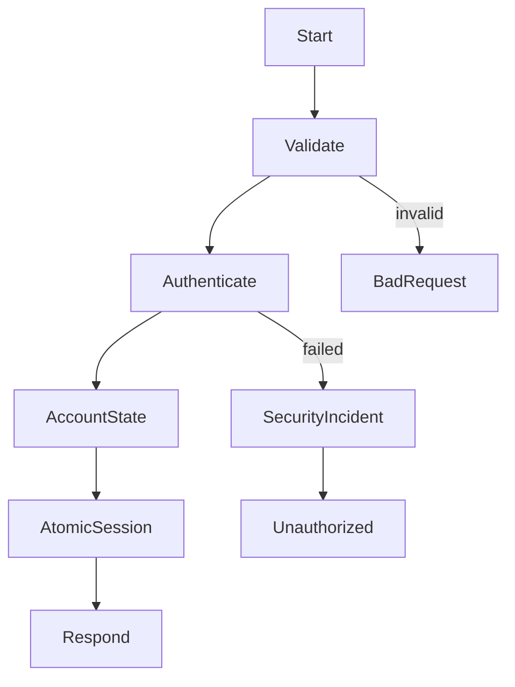
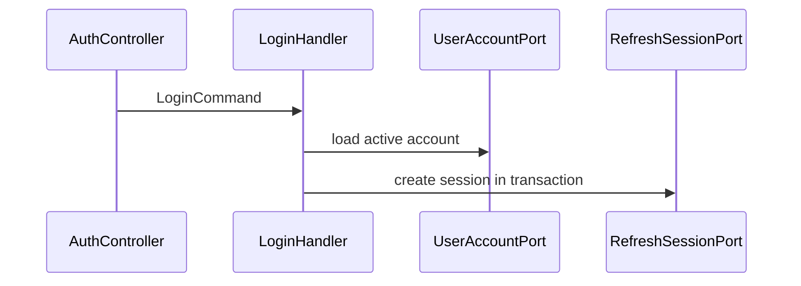

# Suno Phase 0 Engineering, Database, and Documentation Baseline Implementation Plan

> **For agentic workers:** REQUIRED SUB-SKILL: Use superpowers:subagent-driven-development (recommended) or superpowers:executing-plans to implement this plan task-by-task. Steps use checkbox (`- [ ]`) syntax for tracking.

**Goal:** Convert the broken single-module repository into a reproducible Maven modular-monolith baseline that compiles, starts from Flyway migrations, passes automated quality gates, and contains machine-verified requirement and development flow documentation for every current HTTP use case and scheduled job.

**Architecture:** The root becomes an aggregator parent. Phase 0 creates the eight approved modules while temporarily retaining the legacy implementation in `suno-bootstrap`; later phases migrate use cases behind each feature module's `api` package without another build-system rewrite. Flyway becomes the sole schema authority. A catalog-driven documentation test compares every application route and scheduler to `docs/requirements/use-cases.yaml`, then verifies that each catalog item owns a requirement section, a Mermaid requirement flow, a development call chain, and an exact test target.

**Tech Stack:** Java 25, Spring Boot 3.5.16, Maven 3.9.15 Wrapper, Spring Data JPA, Flyway, H2 in MySQL compatibility mode, MySQL 8.4 Testcontainers, JUnit 5, ArchUnit 1.4.2, JaCoCo 0.8.15, Maven Checkstyle Plugin 3.6.0, GitHub Actions.

## Global Constraints

- Preserve the current public URL paths and `ApiResponse` envelope during Phase 0; unsafe behavior is documented but fixed in later domain phases.
- Do not introduce service discovery, a message broker, distributed transactions, or separate deployments.
- Do not move legacy packages into feature modules in this phase. `suno-bootstrap` is an explicit migration shell, not the final ownership model.
- Use Flyway only. Remove `schema.sql`, `data.sql`, and runtime schema initialization after equivalent versioned migrations and dev seed data exist.
- MySQL is authoritative. H2 is a fast local profile and must run in MySQL mode with its own compatibility location only when syntax differs.
- Every code or configuration change starts with a failing automated test or executable verification check.
- Every task ends with a focused verification command and an intentional commit. Never push or open a pull request without explicit user authorization.
- Documentation is written in Chinese for product and development readers. Stable IDs, Java symbols, paths, error codes, and commands remain in English.
- `./mvnw verify` is the single local and CI entry point. Optional Docker-dependent tests may be skipped only through an explicit `-DskipITs` local flag; CI must run them.

---

## Task 1: Capture the executable red baseline

**Files:**

- Create: `docs/development/baseline.md`
- Create: `scripts/verify-repository.sh`
- Test: repository shell checks

- [ ] Run `mvn test` and record the exact compiler failures, Maven/Java versions, test count, and timestamp in `docs/development/baseline.md`.
- [ ] Add `scripts/verify-repository.sh` with `set -eu`; fail when tracked files match `(^|/)(target|build)/|\.class$`, when production configuration contains known demo secrets, or when README names a missing local script.
- [ ] Make the script executable and run it before cleanup to prove it fails on `src/main/java/com/suno/mall/dto/response/RecycleOrderVO.class` and the missing README scripts.
- [ ] Keep the failing output in the baseline document; do not weaken the checks to make the current tree pass.

The secret scan must target concrete unsafe defaults rather than arbitrary words:

```sh
if git grep -nE 'change-me|your-secret|demo-payment-secret|root123' -- \
  '*application*.yml' '*application*.yaml' '*.properties'; then
  echo 'Unsafe configuration default detected' >&2
  exit 1
fi
```

**Verify:** `./scripts/verify-repository.sh` exits non-zero and names each current violation.

**Commit:** `test: capture executable repository baseline`

## Task 2: Create the Maven modular-monolith reactor

**Files:**

- Modify: `pom.xml`
- Create: `suno-core/pom.xml`
- Create: `suno-identity/pom.xml`
- Create: `suno-recycle/pom.xml`
- Create: `suno-marketplace/pom.xml`
- Create: `suno-payment/pom.xml`
- Create: `suno-operations/pom.xml`
- Create: `suno-test-support/pom.xml`
- Create: `suno-bootstrap/pom.xml`
- Create: `suno-core/src/main/java/com/suno/mall/core/package-info.java`
- Create: `suno-identity/src/main/java/com/suno/mall/identity/package-info.java`
- Create: `suno-recycle/src/main/java/com/suno/mall/recycle/package-info.java`
- Create: `suno-marketplace/src/main/java/com/suno/mall/marketplace/package-info.java`
- Create: `suno-payment/src/main/java/com/suno/mall/payment/package-info.java`
- Create: `suno-operations/src/main/java/com/suno/mall/operations/package-info.java`
- Create: `suno-test-support/src/main/java/com/suno/mall/testsupport/package-info.java`
- Test: `suno-bootstrap/src/test/java/com/suno/mall/architecture/ReactorStructureTest.java`

- [ ] Add `ReactorStructureTest` first. It loads the root `pom.xml`, asserts packaging `pom`, and asserts the ordered module list is exactly `suno-core`, `suno-identity`, `suno-recycle`, `suno-marketplace`, `suno-payment`, `suno-operations`, `suno-test-support`, `suno-bootstrap`.
- [ ] Change the root artifact to `suno-parent`, packaging to `pom`, and centralize Java, encoding, plugin, test, and dependency versions.
- [ ] Create all child POMs. Feature modules depend only on the approved upstream modules; `suno-bootstrap` depends on all runtime modules; `suno-test-support` is consumed only in test scope.
- [ ] Add a package marker to every module so empty feature JARs are intentional and visible to architecture tests.

The parent must declare these exact module edges:

```text
suno-core        -> none
suno-identity    -> suno-core
suno-recycle     -> suno-core
suno-marketplace -> suno-core, suno-recycle
suno-payment     -> suno-core, suno-marketplace
suno-operations  -> suno-core, suno-identity, suno-recycle, suno-marketplace, suno-payment
suno-bootstrap   -> all runtime feature modules
```

Use dependency management rather than child-level version repetition:

```xml
<properties>
  <java.version>25</java.version>
  <maven.compiler.release>25</maven.compiler.release>
  <archunit.version>1.4.2</archunit.version>
  <jacoco.version>0.8.15</jacoco.version>
</properties>
```

**Verify:** `mvn -N help:effective-pom` succeeds; `mvn validate` lists all eight modules in reactor order.

**Commit:** `build: establish modular monolith reactor`

## Task 3: Move the legacy application into the bootstrap migration shell

**Files:**

- Move: `src/main/java/**` to `suno-bootstrap/src/main/java/**`
- Move: `src/main/resources/**` to `suno-bootstrap/src/main/resources/**`
- Move: meaningful `src/test/java/**` to `suno-bootstrap/src/test/java/**`
- Delete: `src/main/java/com/suno/mall/config/TransactionConfig.java`
- Delete: `src/main/java/com/suno/mall/config/TransactionalWrapper.java`
- Delete: `src/main/java/com/suno/mall/dao/RecycleRepositoryTransactional.java`
- Delete: `src/main/java/com/suno/mall/dto/response/RecycleOrderVO.class`
- Delete: `src/test/java/com/suno/mall/IntegrationTest.java`
- Delete: `src/test/java/com/suno/mall/TestRunner.java`
- Create: `suno-bootstrap/src/test/java/com/suno/mall/RecycleMallApplicationSmokeTest.java`

- [ ] Add a smoke test that uses `@SpringBootTest`, obtains `RecycleMallApplication` from the context, and asserts the application bean exists.
- [ ] Move source and resources with history-preserving `git mv` operations.
- [ ] Remove the three unused broken transaction wrappers only after `rg` proves no production caller references them. Retain `TransactionalWrapperConfiguration` because it supplies the currently injected `VersionHelper` and `AuditContext` beans.
- [ ] Delete the duplicated/stale pseudo-integration tests; preserve focused unit tests and repair their imports only as required by the move.
- [ ] Fix remaining compilation errors with the smallest behavior-preserving changes. Do not refactor business logic in this task.

Smoke test shape:

```java
@SpringBootTest
class RecycleMallApplicationSmokeTest {
    @Autowired
    private ApplicationContext context;

    @Test
    void startsApplicationContext() {
        assertThat(context.getBean(RecycleMallApplication.class)).isNotNull();
    }
}
```

**Verify:** `mvn -pl suno-bootstrap -am -DskipTests compile` succeeds with no Java compilation errors.

**Commit:** `refactor: isolate legacy application in bootstrap module`

## Task 4: Add the pinned Maven Wrapper and reproducible dependency baseline

**Files:**

- Create: `.mvn/wrapper/maven-wrapper.properties`
- Create: `mvnw`
- Create: `mvnw.cmd`
- Modify: `pom.xml`
- Create: `docs/architecture/decisions/0001-runtime-and-build-baseline.md`

- [ ] Generate Maven Wrapper 3.9.15 using Maven Wrapper Plugin 3.3.4 and commit the generated scripts and properties.
- [ ] Upgrade within the supported Spring Boot 3.5 line from 3.5.0 to 3.5.16; do not move to Spring Boot 4 during the modular migration.
- [ ] Pin Maven plugin versions in `pluginManagement`, including Surefire, Failsafe, JaCoCo, Checkstyle, Enforcer, and Spring Boot.
- [ ] Add Maven Enforcer rules for Maven 3.9.15+, Java 25, dependency convergence, and banned duplicate classes.
- [ ] Record the runtime decision and compatibility reasoning in ADR 0001.

Wrapper properties must resolve a checksum-verifiable binary distribution:

```properties
distributionUrl=https://repo.maven.apache.org/maven2/org/apache/maven/apache-maven/3.9.15/apache-maven-3.9.15-bin.zip
wrapperUrl=https://repo.maven.apache.org/maven2/org/apache/maven/wrapper/maven-wrapper/3.3.4/maven-wrapper-3.3.4.jar
```

**Verify:** `./mvnw --version` reports Maven 3.9.15 and Java 25; `./mvnw -q validate` succeeds.

**Commit:** `build: pin supported runtime and Maven wrapper`

## Task 5: Replace ad-hoc SQL initialization with versioned Flyway migrations

**Files:**

- Delete: `suno-bootstrap/src/main/resources/schema.sql`
- Delete: `suno-bootstrap/src/main/resources/data.sql`
- Delete: `suno-bootstrap/src/main/resources/db/migration/V2__add_optimization_indexes.sql`
- Create: `suno-identity/src/main/resources/db/migration/V1000__identity_baseline.sql`
- Create: `suno-recycle/src/main/resources/db/migration/V2000__recycle_baseline.sql`
- Create: `suno-marketplace/src/main/resources/db/migration/V3000__marketplace_baseline.sql`
- Create: `suno-payment/src/main/resources/db/migration/V4000__payment_baseline.sql`
- Create: `suno-operations/src/main/resources/db/migration/V5000__operations_baseline.sql`
- Create: `suno-bootstrap/src/main/resources/db/dev/R__dev_seed.sql`
- Modify: `suno-bootstrap/src/main/resources/application.yml`
- Modify: `suno-bootstrap/src/main/resources/application-mysql.yml`
- Test: `suno-bootstrap/src/test/java/com/suno/mall/persistence/FlywayH2MigrationTest.java`

- [ ] Write `FlywayH2MigrationTest` first. Start an empty H2 database in MySQL mode, run all five locations, assert no failed migration, and assert every JPA `@Table` name exists.
- [ ] Convert the current schema to canonical `suno_*` names and split it by the approved version ranges. Include every currently mapped entity, not only tables present in the old `schema.sql`.
- [ ] Preserve and rename useful indexes. Add the already-approved one-to-one listing constraint and existing favorite/review/vote/report uniqueness constraints without yet redesigning application behavior.
- [ ] Put `{noop}` demo users and sample records only in the `dev` repeatable seed location. Production and MySQL profiles must never load it.
- [ ] Configure JPA `ddl-auto=validate`, SQL initialization `never`, Flyway enabled, UTC JDBC behavior, and H2 `MODE=MySQL;DATABASE_TO_LOWER=TRUE`.

The application configuration must have a single schema owner:

```yaml
spring:
  sql:
    init:
      mode: never
  jpa:
    hibernate:
      ddl-auto: validate
  flyway:
    enabled: true
    locations: classpath:db/migration,classpath:db/dev
```

**Verify:** `./mvnw -pl suno-bootstrap -am -Dtest=FlywayH2MigrationTest test` passes from an empty database.

**Commit:** `db: establish canonical Flyway schema baseline`

## Task 6: Add authoritative MySQL migration integration tests

**Files:**

- Modify: `suno-test-support/pom.xml`
- Create: `suno-test-support/src/main/java/com/suno/mall/testsupport/MySqlContainerSupport.java`
- Create: `suno-bootstrap/src/test/java/com/suno/mall/persistence/FlywayMySqlIT.java`
- Create: `suno-bootstrap/src/test/java/com/suno/mall/persistence/SchemaInvariantIT.java`
- Modify: `suno-bootstrap/pom.xml`

- [ ] Add Testcontainers MySQL and JUnit dependencies to `suno-test-support`; expose a reusable MySQL 8.4 container definition with UTF-8 and UTC settings.
- [ ] Configure Failsafe to execute `*IT` classes during `integration-test` and `verify`.
- [ ] Add `FlywayMySqlIT` to migrate a clean database, validate Hibernate mappings, and prove a second migration run is idempotent.
- [ ] Add `SchemaInvariantIT` that queries `information_schema` for the expected unique keys, foreign keys, version columns, and indexes.
- [ ] Make container reuse opt-in locally and disabled in CI so tests never depend on prior state.

Reusable support contract:

```java
public interface MySqlContainerSupport {
    MySQLContainer<?> MYSQL = new MySQLContainer<>("mysql:8.4")
            .withDatabaseName("suno")
            .withUsername("suno")
            .withPassword("suno-test")
            .withCommand("--default-time-zone=+00:00", "--character-set-server=utf8mb4");
}
```

**Verify:** `./mvnw -pl suno-bootstrap -am verify -DskipUnitTests` passes with Docker available and leaves Flyway validation clean.

**Commit:** `test: verify schema against MySQL`

## Task 7: Enforce module boundaries and repository hygiene

**Files:**

- Create: `config/checkstyle/checkstyle.xml`
- Modify: `pom.xml`
- Create: `suno-bootstrap/src/test/java/com/suno/mall/architecture/ModuleBoundaryTest.java`
- Create: `suno-bootstrap/src/test/java/com/suno/mall/architecture/LayerBoundaryTest.java`
- Modify: `scripts/verify-repository.sh`
- Create: `.gitignore`

- [ ] Add failing ArchUnit tests for the approved Maven/package dependency graph and for domain isolation from Spring, JPA, Jackson, and Servlet APIs.
- [ ] Add a transitional rule: legacy `com.suno.mall` code may remain in bootstrap, but no feature module may import a bootstrap class.
- [ ] Add Controller-to-Repository and cross-module-internal dependency rules that will apply as packages migrate.
- [ ] Enable compiler `-Xlint` checks, Checkstyle, JaCoCo report generation, and repository hygiene during `verify`.
- [ ] Set the initial coverage gate only for new `com.suno.mall.*.domain` and `application` packages; raise it to the approved 80% line/70% branch gate as code migrates. Do not fabricate coverage by counting generated DTOs.
- [ ] Run the repository script again and remove every violation found in Task 1.

Core ArchUnit assertion:

```java
noClasses()
    .that().resideInAnyPackage("com.suno.mall..domain..")
    .should().dependOnClassesThat()
    .resideInAnyPackage("org.springframework..", "jakarta.persistence..", "com.fasterxml.jackson..");
```

**Verify:** `./mvnw -DskipITs verify` and `./scripts/verify-repository.sh` both pass.

**Commit:** `build: enforce architecture and hygiene gates`

## Task 8: Define the machine-readable use-case contract

**Files:**

- Create: `docs/requirements/README.md`
- Create: `docs/requirements/use-cases.yaml`
- Create: `docs/requirements/use-case.schema.json`
- Create: `suno-bootstrap/src/test/java/com/suno/mall/documentation/DocumentationCoverageTest.java`
- Create: `scripts/verify-docs.sh`

- [ ] Define the catalog schema first. Required fields are `id`, `kind`, `owner`, `actor`, `trigger`, `permission`, `invariants`, `errors`, `requirementDoc`, `requirementAnchor`, `developmentAnchor`, and `tests`. HTTP entries additionally require `method` and `path`; scheduler entries require `scheduledMethod` and `scheduleProperty`.
- [ ] Add `DocumentationCoverageTest` that validates unique IDs, schema-required fields, exact endpoint coverage from Spring's `RequestMappingHandlerMapping`, exact `@Scheduled` method coverage, existing anchors, two Mermaid blocks per item, and non-empty exact test mappings.
- [ ] Add the complete catalog using these stable ID ranges: `IDN-001..`, `REC-001..`, `MKT-001..`, `PAY-001..`, and `OPS-001..`; use `-S` IDs for schedulers and `-E` IDs for cross-module events.
- [ ] Add `scripts/verify-docs.sh` as the portable entry point that invokes the documentation test and rejects known unfinished-content markers and empty Mermaid blocks in the maintained requirement, development, and architecture directories.
- [ ] Document actors, shared states, error semantics, pagination, compatibility policy, and the rule for adding a new route/task/event in `docs/requirements/README.md`.

Catalog entry shape:

```yaml
- id: IDN-001
  kind: HTTP
  owner: identity
  actor: anonymous
  method: POST
  path: /api/auth/login
  trigger: 用户提交用户名、密码和设备标识
  permission: public-explicit
  invariants: [账户必须启用, 凭据错误不得暴露账户是否存在]
  errors: [AUTH_BAD_CREDENTIALS, AUTH_ACCOUNT_DISABLED, RATE_LIMITED]
  requirementDoc: docs/requirements/identity.md
  requirementAnchor: idn-001-login
  developmentAnchor: idn-001-login-dev
  tests: [AuthControllerWebTest#loginIssuesSessionForActiveAccount]
```

**Verify:** Run the new test before documentation files exist and confirm it reports every missing route and scheduler by signature, not only a count.

**Commit:** `test: define executable use case documentation contract`

## Task 9: Document every Identity and security-operations flow

**Files:**

- Create: `docs/requirements/identity.md`
- Create or modify: `docs/requirements/operations.md`
- Modify: `docs/requirements/use-cases.yaml`

- [ ] Document user authentication flows `IDN-001` through `IDN-007`: login, current user, session list, device revoke, all-session revoke, logout, and refresh rotation.
- [ ] Document administrator session flows `IDN-101` through `IDN-103`: cross-user session query, device revoke, and all-session revoke.
- [ ] Document security operations flows `OPS-001` through `OPS-010`: summary, timeline, top-risk users, synchronous legacy export, task creation, retry, detail, download, list, and cleanup.
- [ ] Document the export cleanup/claim scheduler as `OPS-S001` and the authentication/security events as `IDN-E001` through `IDN-E004`.
- [ ] For every item, include one specific requirement flow and one specific development flow. Show authorization rejection, account status checks, token/session atomicity, stable errors, audit/security recording, and transaction boundaries where applicable.
- [ ] Map each item to an exact Phase 1 test method even when that test is not implemented yet; use the catalog lifecycle value `planned` for work scheduled in the next phase.

Each section must follow this structure:

````markdown
## IDN-001 Login
<actors, preconditions, input/output, invariants, permissions, errors, test mapping>
### Requirement flow {#idn-001-login}

### Development flow {#idn-001-login-dev}

````

**Verify:** `./scripts/verify-docs.sh -Ddocumentation.module=identity,operations` reports no missing Identity/security entry or diagram.

**Commit:** `docs: map identity and security operation flows`

## Task 10: Document every Payment and replay flow

**Files:**

- Create: `docs/requirements/payment.md`
- Modify: `docs/requirements/use-cases.yaml`

- [ ] Document `PAY-001` payment callback authentication, ledger idempotency, Marketplace state application, and stable acknowledgment.
- [ ] Document administrator operations `PAY-101` through `PAY-118`: callback log query, direct replay, enqueue, manual consume, task query/summary/audit/health/diagnosis/performance check, automatic handling, idempotency list/detail/delete/delete-before/cleanup, requeue, and dead-task requeue.
- [ ] Document schedulers `PAY-S001` nonce cleanup, `PAY-S002` replay task consumption, and `PAY-S003` auto-handle idempotency cleanup.
- [ ] Document events `PAY-E001` callback verified, `PAY-E002` payment applied, `PAY-E003` payment rejected, and `PAY-E004` replay dead-lettered.
- [ ] Every requirement flow must show signature version, canonical signed fields, timestamp window, nonce reservation, event/request-digest conflict, order state conflict, and retry/dead-letter branches when relevant.
- [ ] Every development flow must route real-time callbacks and replay through the same `PaymentEventProcessor`; diagrams must make external transaction boundaries and stable ack storage explicit.

**Verify:** `./scripts/verify-docs.sh -Ddocumentation.module=payment` passes and the catalog count equals all payment routes plus three schedulers and four events.

**Commit:** `docs: map payment callback and replay flows`

## Task 11: Document every Recycle, valuation, logistics, and points flow

**Files:**

- Create: `docs/requirements/recycle.md`
- Modify: `docs/requirements/use-cases.yaml`

- [ ] Document public flows `REC-001` create recycle order and `REC-002` logistics status.
- [ ] Document administrator flows `REC-101` order search, `REC-102` review/quality transition, and `REC-103` publish approved recycle order into Marketplace.
- [ ] Document cross-module events `REC-E001` order submitted, `REC-E002` audit completed, `REC-E003` valuation fixed, `REC-E004` points posted, and `REC-E005` listing requested.
- [ ] Show image audit, SN parsing, and logistics calls outside database transactions; include provider timeout, retry, and type-safe failure paths.
- [ ] Show server-derived recycle counts and points, valuation rule priority/version, ledger idempotency, atomic points updates, and the one-listing-per-recycle-order constraint.

**Verify:** `./scripts/verify-docs.sh -Ddocumentation.module=recycle` passes and every current recycle/admin-recycle route owned by this module is covered exactly once.

**Commit:** `docs: map recycle valuation and points flows`

## Task 12: Document every Marketplace, order, favorite, and review flow

**Files:**

- Create: `docs/requirements/marketplace.md`
- Modify: `docs/requirements/use-cases.yaml`

- [ ] Document page/listing flows `MKT-001` through `MKT-008`: product page, listing creation, active listing query, sold-out query, stock reduction, favorite, unfavorite, and favorite list.
- [ ] Document Mall flows `MKT-020` through `MKT-037`: listing query, order query/dictionary/summary/create/pay/cancel/confirm/track, favorite add/remove/list, review create/append/reply/list/vote/report.
- [ ] Document administrator order/review flows `MKT-101` through `MKT-112`: deliver, refund, manual auto-confirm, report list/detail/process/batch process.
- [ ] Document schedulers `MKT-S001` unpaid-order close and `MKT-S002` delivered-order confirmation.
- [ ] Document events `MKT-E001` stock reserved, `MKT-E002` order created, `MKT-E003` payment accepted, `MKT-E004` stock released, `MKT-E005` fulfillment completed, and `MKT-E006` review reported.
- [ ] Make actor identity come from `CurrentActor` in all target flows; explicitly show resource-ownership rejection for cancel/query/review/favorite operations and administrator-only merchant replies.
- [ ] Show the order state machine and all no-regression rules, single stock release, late-payment rejection, refund idempotency, review eligibility, and database uniqueness branches.

**Verify:** `./scripts/verify-docs.sh -Ddocumentation.module=marketplace` passes and every current `/api/mall`, `/api/resale/listings`, product page, and Marketplace-owned admin route is covered exactly once.

**Commit:** `docs: map marketplace order and review flows`

## Task 13: Complete operations, architecture, and developer workflow documentation

**Files:**

- Complete: `docs/requirements/operations.md`
- Create: `docs/development/workflow.md`
- Create: `docs/development/testing.md`
- Create: `docs/development/migrations.md`
- Create: `docs/architecture/modules.md`
- Create: `docs/architecture/decisions/0002-modular-monolith.md`
- Create: `docs/architecture/decisions/0003-flyway-schema-authority.md`
- Create: `docs/architecture/decisions/0004-database-outbox-and-jobs.md`
- Modify: `docs/requirements/use-cases.yaml`

- [ ] Document Operations flows `OPS-020` through `OPS-049`: audit log list/page/export, review-risk reports, review strategy read/update, error and degrade dictionaries, alert-noise read/update, configuration bundle/module/modules/diff.
- [ ] Document operations events `OPS-E001` audit requested, `OPS-E002` security incident recorded, `OPS-E003` export completed, and `OPS-E004` configuration published.
- [ ] Write `workflow.md` as the required development lifecycle: use-case ID allocation, failing test, domain design, migration, implementation, review, verify, release, rollback, and documentation update.
- [ ] Write `testing.md` with unit/application/web/persistence/concurrency/provider/E2E/architecture layers, naming rules, fixture ownership, and exact local/CI commands.
- [ ] Write `migrations.md` with version ownership, forward-only repair procedure, data backfill batching, lock/timeout review, checksum policy, rollback by compensating migration, and production verification queries.
- [ ] Write module diagrams and ADRs matching the approved design. Include allowed dependency arrows, public `api` boundary, composition root, outbox ownership, and the staged legacy migration rule.

The development lifecycle must be visually explicit:

```mermaid
flowchart LR
  UseCase["Allocate use-case ID"] --> Red["Write failing test"]
  Red --> Domain["Model invariants and ports"]
  Domain --> Migration["Add forward migration"]
  Migration --> Implement["Implement smallest vertical slice"]
  Implement --> Review["Security, concurrency, API review"]
  Review --> Verify["./mvnw verify"]
  Verify --> Docs["Update both flow diagrams"]
  Docs --> Release["Release with rollback evidence"]
```



**Verify:** `./scripts/verify-docs.sh` passes for the full catalog, including its unfinished-content scan over `docs/requirements`, `docs/development`, and `docs/architecture`.

**Commit:** `docs: establish architecture and development handbook`

## Task 14: Add one-command CI and operator-facing project guidance

**Files:**

- Create: `.github/workflows/verify.yml`
- Modify: `README.md`
- Create: `docs/development/configuration.md`
- Create: `.env.example`

- [ ] Add a GitHub Actions workflow for pull requests and `main` pushes using Java 25, Maven cache, Docker-backed MySQL tests, and only `./mvnw --batch-mode verify` as the build command.
- [ ] Replace README's nonexistent script references with working wrapper/script commands and explain module ownership, profiles, local H2 startup, MySQL startup, docs index, and security-safe configuration.
- [ ] Move all secrets to environment variables. `.env.example` contains names and non-secret descriptions, never usable credentials.
- [ ] Correct Redis configuration to Spring Boot 3.5's `spring.data.redis` namespace and document that Redis is optional for non-critical caching in Phase 0.
- [ ] Add troubleshooting for missing Docker, migration checksum mismatch, invalid production secrets, and Java/Maven version mismatch.

CI core:

```yaml
- name: Verify
  run: ./mvnw --batch-mode --no-transfer-progress verify
```

**Verify:** Parse `.github/workflows/verify.yml`, run every README command locally that does not require external credentials, and run `./scripts/verify-repository.sh`.

**Commit:** `ci: add reproducible verification workflow`

## Task 15: Run final Phase 0 verification and update the baseline report

**Files:**

- Modify: `docs/development/baseline.md`
- Modify: this plan, checking completed tasks

- [ ] Run `./scripts/verify-repository.sh`.
- [ ] Run `./scripts/verify-docs.sh`.
- [ ] Run `./mvnw -DskipITs verify` and record unit, architecture, documentation, and coverage results.
- [ ] Run `./mvnw verify` with Docker and record MySQL migration/invariant results. If Docker is unavailable, preserve the exact environmental failure and do not claim integration success.
- [ ] Start the application with the dev profile against a new H2 database, request the health endpoint, and stop it cleanly.
- [ ] Review `git diff --check`, `git status --short`, dependency convergence, tracked binary scan, secret scan, and Flyway validation.
- [ ] Update the baseline document with before/after evidence, remaining Phase 1 security risks, and exact next-plan links. Do not state that domain defects are fixed by Phase 0.
- [ ] Request an independent code review focused on build reproducibility, schema correctness, documentation coverage, and accidental behavior changes; address every verified high-priority finding.

Expected Phase 0 outcome:

```text
Reactor: 8 modules, BUILD SUCCESS
Unit/architecture/documentation tests: all passing
Flyway H2: clean migration + validate
Flyway MySQL: clean migration + validate (Docker-backed)
Documented routes: 100% of application RequestMapping entries
Documented schedulers: 100% of @Scheduled methods
Tracked build artifacts and known default secrets: 0
```

**Verify:** `./mvnw verify && ./scripts/verify-repository.sh && ./scripts/verify-docs.sh` exits zero from a clean checkout with Docker available.

**Commit:** `chore: complete phase zero professional baseline`

## Phase 0 Exit Criteria

- [ ] The root checkout builds only through committed Maven Wrapper files.
- [ ] All eight approved modules are present and their dependency graph is enforced.
- [ ] The legacy implementation is isolated in bootstrap and compiles without the unused broken wrappers or tracked binary.
- [ ] A clean H2 and a clean MySQL database are created exclusively by Flyway and validated against all entity mappings.
- [ ] Local and CI verification use the same `./mvnw verify` entry point.
- [ ] Every current application HTTP route and scheduled method has one catalog entry and two rendered Mermaid flows.
- [ ] Requirement, architecture, testing, migration, configuration, release, and rollback guidance is complete and machine-checked.
- [ ] The baseline report distinguishes completed engineering foundations from the security and domain work intentionally scheduled for Phases 1–5.
