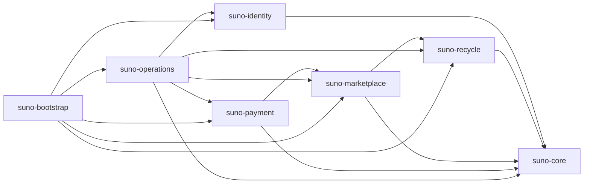
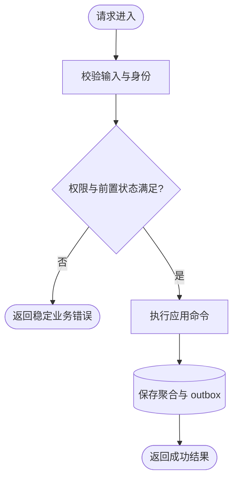
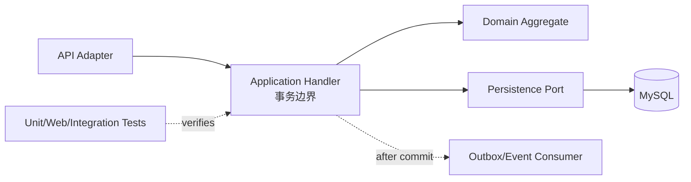
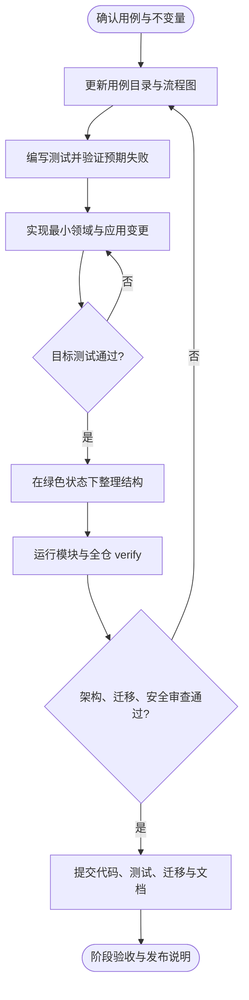

# Suno Mall 专业化重构设计

**日期：** 2026-07-29

**状态：** 已批准（含逐功能需求与开发流程文档要求）

**目标分支：** `codex/professional-rearchitecture`

## 1. 目标

把当前不可编译、边界混乱且存在严重安全与并发缺陷的 Spring Boot 单体，重构为可持续演进的领域化模块单体。最终系统仍以一个应用部署，但代码、事务、数据库和测试均按业务边界隔离，未来可在不重写领域逻辑的前提下拆分独立服务。

本次重构覆盖全部模块，优先保证：

1. 构建、数据库迁移和自动化测试可重复执行。
2. 认证、支付、库存、积分和订单状态具备数据库级一致性保证。
3. 所有用户身份来自认证上下文，禁止信任客户端自报的用户标识。
4. 外部调用、长任务和重放任务不占用长数据库事务。
5. 模块边界可由构建和架构测试自动验证。
6. 现有 HTTP 路径和主要响应结构继续兼容；已存在的越权、错误状态迁移和不安全默认行为不视为兼容契约。

## 2. 非目标

- 不在本阶段拆成微服务，不引入服务发现、分布式事务或消息中间件。
- 不重做前端页面视觉设计。
- 不新增与现有业务无关的营销、推荐或结算功能。
- 不保留公开密钥、明文生产凭据、匿名写接口或客户端自报身份等危险行为。
- 不用缓存掩盖低效查询；先保证查询正确，再决定是否缓存。

## 3. 当前基线与必须解决的问题

当前 `main` 的 `mvn test` 在主源码编译阶段失败，测试执行数为 0。首批阻断包括错误实现 Spring 事务配置接口、把 `Optional<RecycleOrderEntity>` 当作实体返回，以及后续仍会出现的过期测试 API。

只读审查确认的最高风险包括：

- 固定 JWT 密钥允许伪造管理员 Token，授权规则以 `permitAll` 兜底并匿名暴露写接口。
- 支付回调使用公开默认密钥，签名未覆盖 `payStatus`，可伪造或篡改支付成功状态。
- 多个商城接口信任请求中的 `userId`，存在水平越权。
- Refresh Token 轮换、支付幂等、库存变更和任务领取均采用非原子的“先查后改”。
- 订单状态可倒退，迟到支付可重新激活已取消订单，退款可能重复恢复库存。
- 评价创建必然抛出 `UnsupportedOperationException`。
- JPA 实体使用 `suno_*` 表名，而初始化 SQL 使用无前缀表名；默认数据库不可可靠启动。
- 大型服务混合查询、命令、调度、审计和事务职责，导致代理调用路径改变事务语义。
- README 引用不存在的测试脚本和 CI，源码目录还提交了 `.class` 文件。

## 4. 总体架构决策

采用 Maven 多模块的领域化模块单体。模块通过 Java 编译依赖和 ArchUnit 规则隔离，运行时由一个 Spring Boot 组合根装配。

```text
suno-parent
├── suno-core
├── suno-identity
├── suno-recycle
├── suno-marketplace
├── suno-payment
├── suno-operations
├── suno-test-support
└── suno-bootstrap
```

### 4.1 模块职责

| Maven 模块 | 职责 | 允许依赖 |
|---|---|---|
| `suno-core` | 业务无关的值对象、领域错误、事件接口、分页契约、时钟与当前操作者端口 | JDK 与小型无框架库 |
| `suno-identity` | 用户、RBAC、Access Token、Refresh Session、会话撤销、安全事件入口 | `suno-core` |
| `suno-recycle` | 商品回收、图片审核编排、SN 解析、估值、物流、积分流水 | `suno-core` |
| `suno-marketplace` | 二销上架、库存、收藏、订单、履约、评价与举报 | `suno-core`、`suno-recycle` 的公开 API |
| `suno-payment` | 回调认证、支付事件账本、幂等处理、重放队列 | `suno-core`、`suno-marketplace` 的公开支付端口 |
| `suno-operations` | 审计、配置中心、导出任务、后台任务状态和运维查询 | `suno-core` 及各模块公开事件 |
| `suno-test-support` | Testcontainers、固定时钟、测试数据工厂和 HTTP/数据库测试辅助 | 测试范围依赖各模块公开 API |
| `suno-bootstrap` | Spring Boot 启动、模块装配、全局 Web/Security 配置和部署配置 | 全部运行时模块 |

依赖方向固定为：



模块不得访问其他模块的 `domain`、`infrastructure` 或 Repository。跨模块只允许使用对方 `api` 包中的应用端口、只读查询契约和事件类型。

### 4.2 模块内部结构

每个业务模块采用端口与适配器结构：

```text
com.suno.mall.<module>
├── api
│   ├── web             # Controller、请求/响应 DTO
│   ├── command         # 对外命令端口
│   ├── query           # 对外查询端口
│   └── event           # 可跨模块订阅的稳定事件
├── application
│   ├── command         # 用例处理器、事务边界
│   ├── query           # 查询处理器
│   └── port            # Repository、外部服务、时钟等端口
├── domain
│   ├── model           # 聚合和值对象
│   ├── policy          # 无副作用规则
│   └── error           # 领域错误
└── infrastructure
    ├── persistence     # JPA 模型、Spring Data、映射器
    ├── client          # 外部 HTTP 适配器
    ├── scheduling      # 调度入口
    └── config          # 模块配置
```

领域层不依赖 Spring、JPA、Jackson 或 Servlet API。需要维护状态不变量的聚合与 JPA 实体分离；简单只读投影可以直接由 Repository 映射为 record，避免无价值的实体转换。

## 5. 请求与数据流

### 5.1 同步命令

```text
HTTP Controller
  → 解析并校验 DTO
  → 从 CurrentActor 获取身份
  → Application Command Handler（唯一事务边界）
  → 加载聚合 / 原子条件更新
  → 聚合执行业务状态迁移
  → 保存状态与 outbox 事件
  → 提交事务
  → 返回类型化结果
```

Controller 不开启事务、不直接访问 Repository，也不拼装领域状态。应用命令处理器每次只处理一个明确用例；跨聚合操作通过数据库约束、短事务和事务后事件协调。

### 5.2 查询

查询采用 CQRS-lite：查询处理器直接使用分页投影和数据库聚合，不加载完整聚合，不在 Java 内执行全表筛选、排序或计数。所有公开列表必须有稳定排序和最大页大小。

### 5.3 可靠异步工作

成功业务事件与业务状态在同一事务写入 `suno_outbox_event`。调度器使用原子 claim 领取事件或任务，每条任务在独立短事务中执行。失败按有上限的指数退避重试，达到上限进入 `DEAD`，并保留失败阶段、错误码和下次执行时间。

`suno-core` 只定义 `DomainEvent` 与 `EventOutbox` 端口；`suno-operations` 提供数据库实现，`suno-bootstrap` 完成装配。业务模块因此不依赖 Operations 实现，但 outbox 写入仍参与发起命令的同一数据库事务。

当前阶段使用数据库 outbox/job，不引入 Kafka 或 RabbitMQ。若未来拆服务，公开事件契约和 dispatcher 可平移到消息中间件。

## 6. 核心领域设计

### 6.1 身份与会话

- `UserAccount` 保存状态、角色和账户级 `tokenVersion`。
- `RefreshSession` 只保存随机 Token 的 SHA-256/HMAC 摘要、设备、签发时间、到期时间、撤销时间和轮换链标识。
- Access Token 使用带 `kid` 的非对称签名和 `Instant`，必须校验签名算法、issuer、audience、subject、jti、tokenVersion 和账户状态。非 `dev` 环境的私钥只从外部密钥材料加载，并允许验证当前及上一把公钥以完成无停机轮换。
- Refresh 轮换使用锁或单条条件更新保证旧 Token 只能消费一次；检测重放时在独立安全事件事务中撤销同一轮换链。
- 设备下线和全量下线同时推进账户或设备失效版本，使已签发 Access Token 立即失效。
- JWT、数据库和第三方密钥在非 `dev` profile 缺失或仍为占位值时启动失败。
- 密码使用 Spring Security `DelegatingPasswordEncoder` 管理并以 BCrypt 作为当前写入格式；`{noop}` 仅允许存在于隔离的 dev 测试数据中。
- Security 配置采用显式公开清单，其他请求默认要求认证；管理员能力同时校验角色与资源归属。

### 6.2 回收、估值与积分

- `RecycleOrder` 是回收状态聚合，显式状态为 `SUBMITTED → AUDITED → VALUED → QUALITY_CONFIRMED → LISTED`，拒绝状态单独记录原因。
- 图片审核、SN 解析和物流查询在数据库事务外执行，均配置连接超时、读取超时、有限重试和类型化失败。
- `ValuationPolicy` 根据带版本和优先级的规则生成估值快照；重叠规则以显式 priority、effectiveAt 和 id 稳定排序。
- `PointsLedger` 使用业务幂等键唯一约束；积分在质量确认后发放，客户端不能提交回收次数或积分加成。
- 账户余额使用原子增量更新或版本锁；流水与余额在同一事务提交。
- 同一回收单只允许生成一个二销上架记录，数据库对 `recycle_order_id` 建唯一约束。

### 6.3 二销、库存与评价

- `ResaleListing` 管理可售状态与库存版本；创建订单时原子预占库存，取消或支付超时只允许释放一次。
- `ResaleOrder` 集中维护支付与履约状态机。所有状态迁移由聚合方法验证，禁止 Controller 或重放服务直接赋值状态字符串。
- 已取消或已超时订单收到迟到支付事件时返回稳定的拒绝/忽略结果，不重新激活订单。
- 退款仅允许配置的可退款状态，库存恢复和退款状态写入同一事务，并受幂等键保护。
- 调度查询直接按 `closeDueAt`、`confirmDueAt` 和状态筛选，不扫描第 0 页后提前退出。
- 当前用户身份始终取自 `CurrentActor`；普通接口不接受 `userId`、`buyerUserId` 或 `operator` 作为授权依据。
- `Review` 只允许已完成订单的买家创建一次；追评、投票、举报均有数据库唯一约束。商家回复、隐藏内容和举报处置只由管理员端口执行。

### 6.4 支付与重放

- `PaymentCallbackAuthenticator` 对规范化信封验签，签名至少覆盖 `eventId`、订单号、金额、币种、支付状态、网关时间戳和 nonce，并使用常量时间比较。
- `PaymentEventLedger` 保存原始请求摘要、验证状态、应用状态、稳定 ack 和失败阶段；相同 eventId 或幂等键与不同请求摘要冲突时返回 409。
- `PaymentEventProcessor` 是实时回调和人工/自动重放的唯一业务入口。它先原子占用事件，再调用 Marketplace 的支付端口以条件更新订单。
- 只有已验证且业务状态允许的事件可进入重放。验签失败、字段篡改或非成功事件不能通过后台重放绕过验证。
- `ReplayTask` 使用 CAS 或数据库锁原子领取；活动任务具有数据库唯一约束，多实例调度不会重复处理。
- 回调日志或审计写入失败不得覆盖已经持久化的稳定网关 ack。

### 6.5 审计、配置和后台任务

- 成功操作通过事务 outbox 在提交后生成审计记录，避免业务回滚后留下“成功”日志。
- 拒绝、登录失败和重放攻击等安全事件通过独立的 `SecurityIncidentRecorder` 持久化，不依赖随后会回滚的业务事务。
- 审计字段至少包含 actor、subject、action、target、requestId、IP、发生时间、结果和结构化摘要。
- 安全事件统计由带时间范围的数据库聚合查询完成，禁止逐 action 全表加载。
- 导出任务使用 `PENDING → RUNNING → SUCCEEDED/FAILED/DEAD` 状态机、请求摘要幂等键和原子 claim；HTTP 请求只创建任务，不同步执行导出。
- 配置中心改为类型化、可校验、带版本的配置快照；更新失败不改变当前有效版本。

## 7. 数据库与迁移

### 7.1 权威来源

Flyway 是唯一 schema 权威来源。删除运行时 `schema.sql`、`data.sql` 和 `ddl-auto=update` 依赖；JPA 在所有正式 profile 使用 `ddl-auto=validate`。

采用 `suno_*` 作为规范表名，因为当前 JPA 运行时映射已经使用该命名。平台迁移 `V0001__Normalize_legacy_table_names.java` 通过 `DatabaseMetaData` 检查固定白名单中的旧无前缀表：仅旧表存在时，按探测到的 H2/MySQL 方言把它原地重命名为规范 `suno_*` 表；旧表与规范表同时存在且旧表有数据时，以包含冲突表名和修复动作的消息中止迁移，绝不自动合并或覆盖；两者都不存在或仅规范表存在时不执行操作。后续功能基线迁移负责创建仍缺失的规范表并补齐索引和约束，且必须兼容由 `V0001` 重命名得到的表。

### 7.2 迁移版本范围

- `V0001–V0999`：平台基线与旧 schema 兼容迁移；当前由 `V0001__Normalize_legacy_table_names.java` 执行固定白名单、元数据驱动、方言感知的原地重命名与碰撞拒绝，不复制或合并数据。
- `V1000–V1999`：Identity。
- `V2000–V2999`：Recycle。
- `V3000–V3999`：Marketplace。
- `V4000–V4999`：Payment。
- `V5000–V5899`：Operations 与 outbox/job 功能基线。
- `V5900–V5999`：平台拥有的规范 schema reconciliation；`V5900__Reconcile_canonical_schema.java` 依据固定 schema manifest 和 `DatabaseMetaData`，按 H2/MySQL 方言仅补齐缺失列、索引、唯一约束和外键。

每个业务模块在自己的 resources 目录拥有对应版本段，`suno-bootstrap` 按固定顺序配置 Flyway locations。

五个功能基线先以 `CREATE TABLE IF NOT EXISTS` 建立缺失表，随后 `V5900` 让空库和由 `V0001` 重命名得到的旧库收敛到同一 manifest。对需要改为非空的旧列，reconciliation 必须先执行 manifest 中逐列声明的确定性回填表达式，验证不存在剩余 `NULL`，再添加非空约束；没有已批准回填规则时迁移以可操作错误中止，不猜测业务值。禁止依赖跨数据库不一致的 SQL 条件 DDL。

### 7.3 强制不变量

数据库必须包含：

- Refresh Token 摘要唯一约束和轮换状态版本。
- 支付 eventId、幂等键与请求摘要唯一约束。
- 每个回调最多一个活动重放任务的约束。
- 回收单到二销上架的一对一唯一约束。
- 收藏、评价、投票、举报和积分业务键的复合唯一约束。
- 订单、库存、账户、任务的版本列或条件更新字段。
- 所有状态、金额、数量、到期时间和外键的非空、检查与索引约束。

MySQL 是生产与集成测试的权威数据库。H2 仅用于本地快速启动，并通过独立 H2 迁移保证语法兼容；关键持久化测试必须使用 Testcontainers MySQL。

## 8. API、校验与错误模型

- 保留现有 URL 和 `ApiResponse` 外层结构，内部不再使用无类型 `Map<String,Object>` 传递命令或领域结果。
- 支付回调是唯一主动收紧的请求契约：同一路径要求 `signatureVersion`、`eventId`、金额和币种参与签名。旧的不完整请求返回稳定 400，绝不进入兼容性降级处理；开发文档提供新的签名示例和迁移说明。
- 请求 DTO 使用 Bean Validation，并设置与数据库一致的长度、范围、金额精度和集合大小上限。
- 普通用户请求中的旧 `userId` 字段可在兼容期接受但忽略，身份以 JWT 为准；若字段与 JWT 不一致，返回明确 403 并记录安全事件。
- 领域错误使用稳定错误码映射到 HTTP：校验 400、未认证 401、越权 403、不存在 404、幂等或并发冲突 409、外部依赖暂时失败 503。
- 所有错误响应包含 `requestId`；日志记录内部异常，响应不暴露堆栈、SQL 或第三方原始密钥。
- 分页统一采用零基页码、最大 100 条、稳定次级排序；非法排序字段在 Web 层拒绝。

## 9. 配置、缓存与外部适配器

- 使用 `@ConfigurationProperties` record 集中校验配置，禁止在业务类中散落带危险 fallback 的 `@Value`。
- `dev` profile 可以启用 Mock Provider 和演示账户；`mysql`、`staging`、`prod` profile 启用 Mock 或占位密钥时启动失败。
- Redis 配置使用 Spring Boot 3.5 的 `spring.data.redis` 前缀；Redis 不可用时，非关键查询缓存可以降级为无缓存，不能阻塞核心交易。
- 在查询正确性恢复前移除当前无调用方或失效不完整的缓存。重新引入时，缓存键包含资源版本与用户维度，写操作在事务提交后精确失效。
- 外部 HTTP 客户端通过注入的客户端工厂配置超时、连接池、请求 ID、有限重试和可观测指标；禁止在适配器内直接 `new RestTemplate()`。

## 10. 可观测性与运行保障

- 引入 Actuator 与 Micrometer，暴露健康、构建信息和受保护的指标端点。
- 每个请求建立或透传 requestId/traceId，并写入结构化日志 MDC。
- 核心指标包括：登录失败率、Refresh 重放、支付验签失败、支付应用冲突、重放任务积压与死信、订单状态冲突、库存释放失败、Provider 延迟与错误率、导出任务耗时。
- readiness 必须验证数据库迁移完成；Redis 和非关键 Provider 采用独立 health component，不把可降级依赖误判为应用完全不可用。
- 调度任务记录 claim 数、成功数、重试数、死信数和单批耗时，不输出敏感请求正文。

## 11. 测试体系与质量门禁

所有行为变更采用测试先行。每个阶段必须先出现能够证明缺陷的失败测试，再做最小实现并保持全量测试通过。

### 11.1 测试层次

1. **领域单元测试**：状态机、估值排序、积分边界、重试退避和错误码；不启动 Spring。
2. **应用用例测试**：使用真实领域对象和内存端口，验证授权、事务意图和事件输出。
3. **Web 切片测试**：验证 DTO、401/403 路由矩阵、Principal 绑定和兼容响应。
4. **持久化集成测试**：Testcontainers MySQL 验证 Flyway、约束、锁、条件更新、分页和查询计划。
5. **并发测试**：使用 barrier 同时触发 Refresh、支付、库存释放、积分入账和任务 claim，断言只产生一次状态变化。
6. **Provider 契约测试**：本地 HTTP stub 验证超时、错误映射、重试上限和降级。
7. **端到端冒烟测试**：登录、回收、上架、下单、支付、履约、评价和后台审计完整链路。
8. **架构测试**：ArchUnit 验证模块依赖、领域层无框架依赖、Controller 不访问 Repository、跨模块只访问 `api`。

### 11.2 构建门禁

根目录提供 Maven Wrapper。`./mvnw verify` 必须完成：

- 编译与单元测试。
- Checkstyle/格式检查和 `-Xlint` 警告审查。
- ArchUnit 模块规则。
- Testcontainers 集成测试。
- JaCoCo 覆盖率检查；领域和应用包行覆盖率不低于 80%，分支覆盖率不低于 70%。
- 禁止提交 `.class`、构建产物、明文密钥和已知占位生产凭据的扫描。

GitHub Actions 在 pull request 和 `main` push 上运行相同的 `./mvnw verify`，不维护与本地不同的隐藏测试入口。

## 12. 需求与开发文档体系

文档与代码同等受版本控制。每个公开 HTTP 用例、后台任务和跨模块事件都必须有唯一用例 ID、需求说明、业务流程图、开发调用链和测试映射，禁止只在 README 中维护无法验证的接口列表。

### 12.1 文档结构

```text
docs/
├── requirements/
│   ├── README.md                 # 用例索引、角色与状态词典
│   ├── use-cases.yaml            # 可机器校验的用例目录
│   ├── identity.md               # 身份、会话、安全事件
│   ├── recycle.md                # 回收、估值、积分、物流
│   ├── marketplace.md            # 上架、库存、订单、收藏、评价
│   ├── payment.md                # 回调、账本、重放与自动处置
│   └── operations.md             # 审计、配置、导出与调度
├── development/
│   ├── workflow.md               # 统一开发、评审、发布与回滚流程
│   ├── testing.md                # 测试层次、命名和并发测试规范
│   └── migrations.md             # Flyway 版本、兼容迁移和回滚规则
└── architecture/
    ├── modules.md                # 模块边界和依赖图
    └── decisions/                # 关键架构决策记录
```

### 12.2 每个功能的必备内容

每个用例章节必须包含：

1. 用例 ID、名称、参与角色和业务目标。
2. HTTP 方法与路径，或调度器/事件入口。
3. 前置条件、输入约束、权限与资源归属规则。
4. 主成功路径、幂等语义和稳定返回。
5. 所有可预期异常分支及对应错误码。
6. 聚合状态变化、数据库不变量、锁或条件更新方式。
7. 发布和消费的领域事件、审计要求及敏感字段处理。
8. Mermaid 需求流程图。
9. 使用 Phase 0 真实存在符号绘制的当前开发调用链图；不得把 `CurrentActor`、`PaymentEventProcessor` 或其他未来处理器画成当前实现。
10. 当当前实现与批准目标不同时，额外提供目标架构调用链图和显式差距清单，目标图标明计划阶段。
11. 对应的已实现测试或计划测试与验收场景；计划映射必须明确标注，不能表述为当前可执行。

需求流程图使用统一语义：圆角节点表示入口/结束，菱形表示业务判断，矩形表示业务动作，数据库形状表示持久化，虚线表示异步事件。当前开发调用链图必须只引用 Phase 0 代码中可解析的真实符号并诚实显示现有事务边界；目标架构调用链图必须显示目标事务起止位置和跨模块公开端口，并与差距清单一起出现。

示例结构如下：





### 12.3 机器校验与持续同步

`docs/requirements/use-cases.yaml` 为用例目录的权威索引。每项至少记录 `id`、`kind`、`owner`、`actor`、`trigger`、`permission`、`invariants`、`errors`、`requirementDoc`、`requirementAnchor`、`developmentAnchor`、`implementationStatus`、`currentSymbols` 和 `targetPhase`，并以 `implementedTests` 与 `plannedTests` 取代含混的 `tests` 字段。HTTP 项额外记录 `method` 和 `path`，调度器项额外记录 `scheduledMethod` 和 `scheduleProperty`。

`implementedTests` 中每个 `Class#method` 必须解析到当前存在的测试类和方法并严格执行校验。`plannedTests` 中每项必须记录精确的未来 `Class#method` 与其 `targetPhase`；校验器只检查格式、阶段和值域，不声称它当前可执行。每个用例至少包含一个非空的 `implementedTests` 或 `plannedTests` 列表，需求文档必须把计划映射直白标为计划项。

`docs/requirements/public-events.yaml` 是公开及计划公开事件的权威、版本化注册源，每项记录 `id`、`eventType`、`version` 和 `owner`。用例目录中的 `EVENT` 项必须与该注册源精确一一对应。未来实际事件类型统一实现 `DocumentedDomainEvent` 或标注 `@UseCaseId`；ArchUnit/反射测试扫描代码事件类型并与注册源比对，使新增、删除或改名事件不能只改文档而绕过登记。

阶段 0 建立 `scripts/verify-docs.sh`，在 CI 中验证：

- 每个 Controller mapping、Scheduler，以及 `public-events.yaml` 中每个公开/计划公开事件都存在且仅存在一个用例目录项；未来实际 `DocumentedDomainEvent`/`@UseCaseId` 类型还必须与注册源一致。
- 每个目录项指向存在的 Markdown 章节；`implementedTests` 指向存在的方法，`plannedTests` 只按格式和目标阶段校验。
- 每个用例章节包含需求流程图和使用 `currentSymbols` 的当前开发流程；当前实现与目标不同时还包含目标架构流程和差距清单。
- README 中的接口和测试命令指向真实文件与可执行命令。
- 删除或重命名功能时，同一提交同步更新目录、流程图、OpenAPI 和测试。

功能代码、迁移或权限语义发生变化时，文档更新属于同一任务的完成条件，不允许作为后续补充工作。

### 12.4 统一开发流程

所有功能遵循以下开发流程，并在 `docs/development/workflow.md` 中维护：



## 13. 实施拆分

本设计拆成六个可独立验收的子项目，每个子项目拥有自己的实施计划和提交序列。

### 阶段 0：工程与数据库基线

- 建立 Maven 多模块骨架、Wrapper、CI 和架构测试。
- 修复现有编译错误并迁移可用测试。
- 建立 Flyway 基线、规范表名和最小启动测试。
- 移除源码 `.class`、失效脚本说明和重复事务包装器。
- 建立需求文档目录、完整用例索引、统一开发流程和文档校验脚本；为当前所有公开入口绘制基线流程图。

验收：空库与旧开发库均可迁移；`./mvnw verify` 通过；应用使用 dev profile 可启动并完成健康检查。

### 阶段 1：Identity

- 默认拒绝授权、身份上下文、密钥外置、Token 服务和 Refresh Session 原子轮换。
- 修复时区、账户停用、设备撤销、跨用户登出和安全事件记录。

验收：授权矩阵、伪造 Token、重放、并发轮换和立即下线测试全部通过。

### 阶段 2：Payment

- 建立支付信封、验证器、事件账本、统一处理器、稳定 ack 和安全重放。
- 重构任务 claim、自动处置幂等和支付相关数据库约束。

验收：字段篡改、重复回调、并发回调、迟到回调、多实例任务和日志失败测试全部通过。

### 阶段 3：Marketplace

- 重构上架、库存、订单状态机、收藏、评价、举报和调度查询。
- 消除水平越权、匿名写入口、状态倒退、重复发布和调度饥饿。

验收：所有状态迁移、资源归属、库存并发、评价权限和到期任务测试通过。

### 阶段 4：Recycle

- 重构图片审核、SN、估值、物流、积分和回收状态机。
- 外部调用移出事务，建立 Provider 契约和积分数据库不变量。

验收：Provider 失败、规则冲突、积分幂等/并发、事务回滚和发布一对一测试通过。

### 阶段 5：Operations 与收尾

- 重构审计、配置中心、导出任务、查询投影、缓存和可观测性。
- 补齐端到端测试、运行手册、OpenAPI、迁移说明和真实测试命令。
- 校验所有功能的需求流程、开发调用链、测试映射和实现保持一致。

验收：全链路冒烟、后台任务、缓存一致性、指标、文档命令和生产配置启动校验通过。

## 14. 提交与交付策略

- 所有工作保留在 `codex/professional-rearchitecture` 本地分支，未经用户明确要求不推送、不创建 PR。
- 每个提交只包含一个可独立审查的行为或结构变化，并带对应测试。
- 每个行为先在本地运行并确认新测试以预期原因失败；实现最小修复并恢复绿色后，再把测试与实现一起提交。结构整理使用后续独立绿色提交。
- 每阶段结束提供：变更摘要、风险关闭清单、迁移说明、验证命令与完整输出、剩余风险。
- 若某阶段发现必须改变公开 API，先提供兼容适配或版本化路径；只有无法安全兼容时才单独记录并请求决策。

## 15. 完成标准

只有同时满足以下条件，整体重构才算完成：

1. 六个子项目全部完成，当前审查中的 P0/P1 问题均有回归测试并关闭。
2. `./mvnw verify` 在干净检出和 CI 中通过，没有跳过测试。
3. 空 MySQL 与旧开发 schema 均可通过 Flyway 迁移并通过启动测试。
4. 认证、支付、库存、积分和任务 claim 的并发测试证明每个业务事件只应用一次。
5. ArchUnit 证明模块依赖符合本设计，领域层无 Spring/JPA/Web 依赖。
6. 非 dev profile 不含演示账户、默认密钥、明文数据库密码或 Mock Provider。
7. README、开发文档、OpenAPI 和运维说明中的命令均在 CI 验证存在且可执行。
8. Git 工作树仅包含预期源码、迁移、测试和文档，不包含构建产物。
9. 用例目录覆盖全部公开 API、调度器和事件；每个 HTTP、scheduler 和 event 至少有 requirement flow 与真实 current development flow，且 `implementationStatus` 不是 `implemented` 时还必须有 target architecture flow 与 explicit gaps；已实现和计划测试映射被明确区分，文档校验在 CI 中通过。
